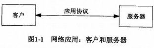
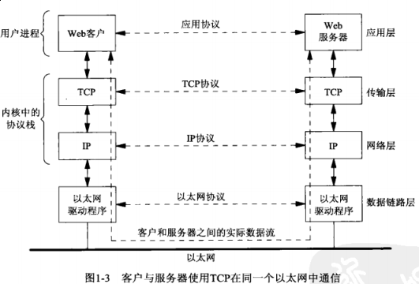

## 第一章 简介

#### 1.1 概述





#### 1.2 [一个简单的时间获取客户程序](daytimetcpcli.c)

```c
#include <arpa/inet.h>
#include <errno.h>
#include <netinet/in.h>
#include <stdio.h>
#include <stdlib.h>
#include <strings.h>
#include <sys/socket.h>
#include <unistd.h>
#include "../lib/error.h"

#define MAXLINE 4096    /* max text line length */

int main(int argc, char **argv)
{
    int                 sockfd, n;
    char                recvline[MAXLINE + 1];
    struct sockaddr_in  servaddr;

    if (argc != 2) {
        err_quit("usage: daytimetcpcli <IPaddress>");
    }

    if ((sockfd = socket(AF_INET, SOCK_STREAM, 0)) < 0) {
        err_sys("socket error");
    }

    bzero(&servaddr, sizeof(servaddr));
    servaddr.sin_family = AF_INET;
    /* /etc/services 中查看端口对应的服务 */
    servaddr.sin_port = htons(13);      /* daytime server */
    if (inet_pton(AF_INET, argv[1], &servaddr.sin_addr) <= 0) {
        err_quit("inet_pton error for %s", argv[1]);
    }

    if (connect(sockfd, (struct sockaddr *) &servaddr, sizeof(servaddr)) < 0) {
        err_sys("connect error, errno = %d", errno);
    }

    while ((n = read(sockfd, recvline, MAXLINE)) > 0) {
        recvline[n] = 0;        /* null terminate */
        if (fputs(recvline, stdout) == EOF) {
            err_sys("fputs error");
        }
    }
    if (n < 0) {
        err_sys("read error");
    }
    exit(0);
}
```

#### 1.3 协议无关性

```c
#include <arpa/inet.h>
#include <errno.h>
#include <netinet/in.h>
#include <stdio.h>
#include <stdlib.h>
#include <strings.h>
#include <sys/socket.h>
#include <unistd.h>
#include "../lib/error.h"

#define MAXLINE 4096    /* max text line length */

int main(int argc, char **argv)
{
    int                 sockfd, n;
    char                recvline[MAXLINE + 1];
    struct sockaddr_in6 servaddr;

    if (argc != 2) {
        err_quit("usage: daytimetcpcli6 <IPaddress>");
    }

    if ((sockfd = socket(AF_INET6, SOCK_STREAM, 0)) < 0) {
        err_sys("socket error");
    }

    bzero(&servaddr, sizeof(servaddr));
    servaddr.sin6_family = AF_INET6;
    /* /etc/services 中查看端口对应的服务 */
    servaddr.sin6_port = htons(13);      /* daytime server */
    if (inet_pton(AF_INET6, argv[1], &servaddr.sin6_addr) <= 0) {
        err_quit("inet_pton error for %s", argv[1]);
    }

    if (connect(sockfd, (struct sockaddr *) &servaddr, sizeof(servaddr)) < 0) {
        err_sys("connect error, errno = %d", errno);
    }

    while ((n = read(sockfd, recvline, MAXLINE)) > 0) {
        recvline[n] = 0;        /* null terminate */
        if (fputs(recvline, stdout) == EOF) {
            err_sys("fputs error");
        }
    }
    if (n < 0) {
        err_sys("read error");
    }
    exit(0);
}
```

以上两个函数的不足之处：

- 与具体协议相关（IPv4或IPv6），更好的做法是编写协议无关函数（如稍后提到的 *getadrinfo* 函数）

- 输入为点分格式（如：127.0.0.1），而不是人们常用的 `www.unpbook.com`

#### 1.5 [一个简单的时间获取服务器程序](daytimetcpsrv.c)

```c
#include <arpa/inet.h>
#include <errno.h>
#include <netinet/in.h>
#include <stdio.h>
#include <string.h>
#include <strings.h>
#include <sys/socket.h>
#include <time.h>
#include <unistd.h>
#include "../lib/error.h"

#define MAXLINE 4096    /* max text line length */
#define LISTENQ 1024    /* 2nd argument to listen() */

int main(int argc, char **argv)
{
    int                 err, n;
    int                 listenfd, connfd;
    struct sockaddr_in  servaddr;
    char                buff[MAXLINE];
    time_t              ticks;

    if ((listenfd = socket(AF_INET, SOCK_STREAM, 0)) < 0) {
        err_sys("socket error");
    }

    bzero(&servaddr, sizeof(servaddr));
    servaddr.sin_family = AF_INET;
    servaddr.sin_addr.s_addr = htonl(INADDR_ANY);
    /* /etc/services */
    servaddr.sin_port = htons(13);      /* daytime server */

    if ((err = bind(listenfd, (struct sockaddr *) &servaddr, sizeof(servaddr))) < 0) {
        err_sys("bind error");
    }
    //if ((err = listen(listenfd, 2)) < 0) {        # 1
    if ((err = listen(listenfd, LISTENQ)) < 0) {  //  # 0
        err_sys("listen error");
    }

    for ( ; ; ) {
again:
        if ((connfd = accept(listenfd, (struct sockaddr *) NULL, NULL)) < 0) {
#ifdef EPROTO
            if (errno == EPROTO || errno == ECONNABORTED) {
#else
            if (errno == ECONNABORTED) {
#endif
                goto again;
            } else {
                err_sys("accept error");
            }
        }
        ticks = time(NULL);
        snprintf(buff, sizeof(buff), "%.24s\r\n", ctime(&ticks));
        /* 忽略2个strlen问题 */
        if ((n = write(connfd, buff, strlen(buff))) != strlen(buff)) {
            err_sys("write error");
        }
        close(connfd);
    }
}
```

```sh
# IPv4服务端
$ gcc daytimetcpsrv.c ../lib/error.c -o daytimetcpsrv
$ sudo ./daytimesrv     # 绑定13(daytime)端口需要特权操作

# IPv4客户端
$ ./daytimetcpcli 127.0.0.1
Wed Dec 13 18:07:02 2017

# IPv6客户端
$ ./daytimetcpcli6 0::0
connect error, errno = 111: Connection refused
```

我们写的这个程序需要注意到以下几点：

- 此服务器也与IPv4协议相关，只能处理IPv4客户端请求

- 本服务一次只能处理一个客户。多个客户连接需要排入队列，每次返回给 *accept* 函数一个客户端

- 不能以守护进程方式长时间运行

图片来源：[UNP](https://www.amazon.cn/UNIX%E7%BD%91%E7%BB%9C%E7%BC%96%E7%A8%8B-%E5%A5%97%E6%8E%A5%E5%AD%97%E8%81%94%E7%BD%91API-%E5%8F%B2%E8%92%82%E6%96%87%E6%96%AF/dp/B011S72JB6/ref=sr_1_3?ie=UTF8&qid=1512463174&sr=8-3&keywords=unix+network+programming)
