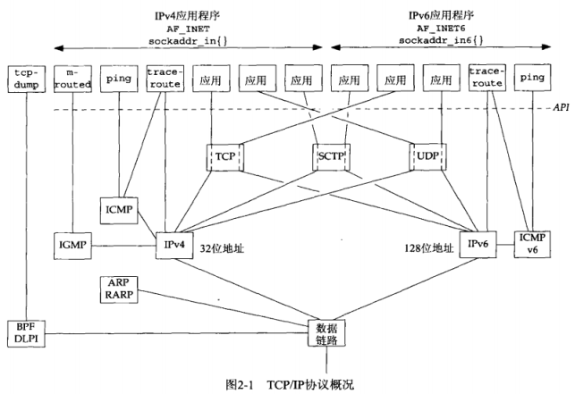
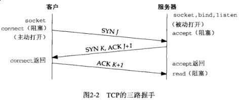
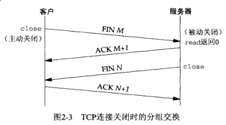
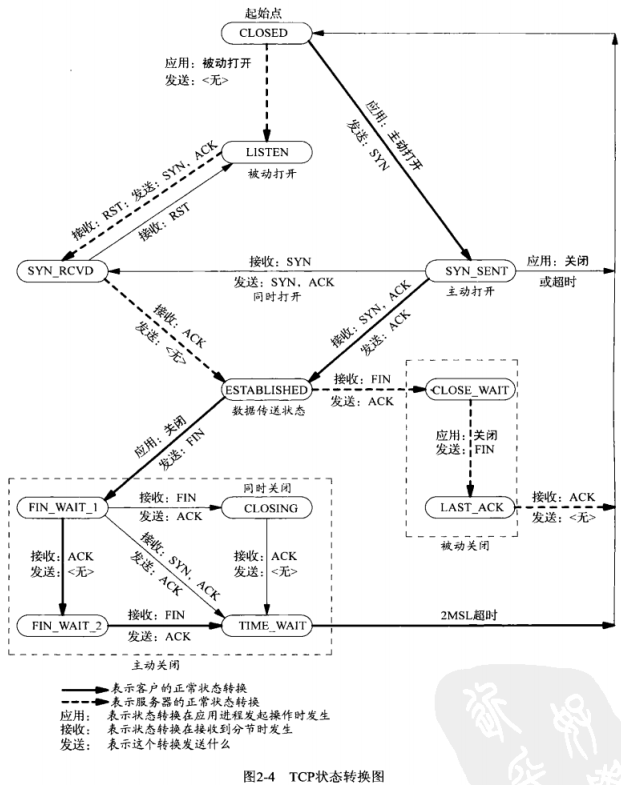
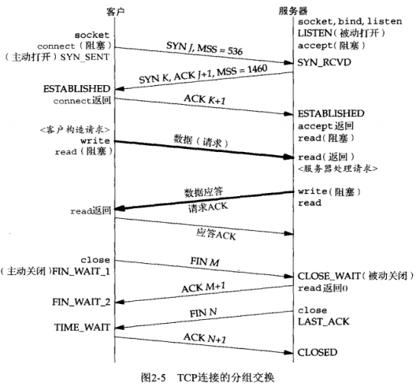
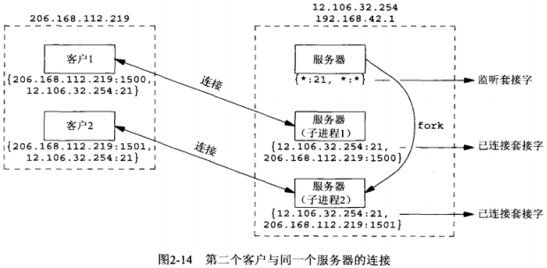
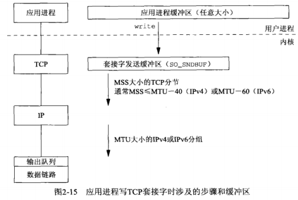
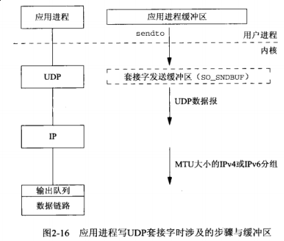
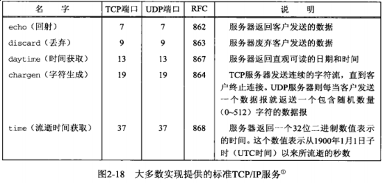

## 第二章 传输层：TCP，UDP和SCTP

#### 2.1 概述

本章主要关注一下几点：

- TCP的三路握手，TCP的连接终止序列和TCP的 *TIME_WAIT* 状态

- SCTP的四路握手和SCTP的连接终止

- 套接字层提供的TCP，UDP和SCTP缓冲机制

#### 2.2 总图

#### 2.6 TCP连接的建立和终止

2.6.1 三路握手

建立一个TCP连接时会发生下述情形：

- 被动打开：*socket* -> *bind* *-> listen*，准备接受外来的连接

- 主动打开：客户通过调用 *connect* 发起，这将导致客户TCP发送一个 *SYN* （同步）分节，它告诉服务器客户将在连接中发送的数据初始序列号。通常 *SYN* 分节不携带数据，其所在IP数据报只含有一个IP首部，一个TCP首部及可能有的TCP选项

- 服务器必须确认（*ACK*）客户的 *SYN*，同时自己也得发送一个 *SYN* 分节，它含有服务器将在同一连接中发送的数据的初始序列号。服务器在单个分节中发送 *SYN* 和对客户 *SYN* 的 *ACK*（确认）

- 客户必须确认服务器的 *SYN*

这种交换至少需要3个分组，因此称之为三路握手。

2.6.2 TCP选项

常用TCP选项

- MSS选项：发送 *SYN* 的TCP一端使用本选项通告对端它的最大分节大小

- 窗口规模选项

- 时间戳选项

后两个选项有时称为“RFC 1323选项”，因为它们在 *RFC 1323* 中说明的。既然高带宽或长延迟的网络被称为“长胖管道”，这两个选项也称为“长胖管道选项”。

2.6.3 TCP连接终止

TCP连接终止需要4个分节

- 某个应用进程首先调用 *close*，我们称该端主动关闭，该端的TCP于是发送一个 *FIN* 分节，表示数据发送完毕

- 接收到这个 *FIN* 的对端执行被动关闭，这个 *FIN* 由TCP确认。它的接收也作为一个文件结束符传递给接收端应用进程

- 一段时间后，接收到这个文件结束符的应用进程将调用 *close* 关闭它的套接字。此时也会导致TCP发送一个 *FIN*

- 接收到这个最终 *FIN* 的原发送端TCP（执行主动关闭一端）确认这个 *FIN*

每个方向需要一个 *FIN* 和一个 *ACK*，因此通常需要4个分节。

2.6.4 TCP状态转换图

2.6.5 观察分组

下图展示了一个完整的TCP连接所发生的实际分组交换情况，包括连接建立，数据传送和连接终止3个阶段。

#### 2.7 TIME\_WAIT 状态

#### 2.8 SCTP关联的建立和终止

**TODO**: 跳过 *SCTP* 协议相关内容，实际遇到时再补知识点。

#### 2.9 端口号

端口号划分：

- 众所周知的端口为0 ~ 1023，由IANA分配和控制

- 已登记的端口为1024 ~ 49151

- 49152 ~ 65535是动态或私用端口

#### 2.10 TCP端口号与并发服务器

多宿主机的TCP连接

#### 2.11 缓冲区大小及限制

**本小节需熟读原书内容**

2.11.1 TCP输出

若 *write* 写入的内容套接字发送缓冲区已满，*write* 将阻塞。

写一个TCP套接字的 *write* 调用成功仅仅表示我们可以重新使用原来的应用进程缓冲区，并不表明对端的TCP或应用进程已接收到数据。

这一端的TCP提取套接字发送缓冲区中的数据并把它发送给对端TCP，对端必须确认已收到的数据，伴随 *ACK* 的不断到达，本端TCP才能从套接字发送缓冲区中丢弃已确认的数据。

本端TCP以MSS大小或更小的块把数据传递给IP，同时给每个数据块安上一个TCP首部已构成TCP分节，其中MSS或是由对端通告的值，或是536（若对端未发送一个MSS选项，536是IPv4最小重组缓冲区字节数576减去IPv4首部20字节和TCP首部20字节的结果）。

2.11.2 UDP输出

UDP是不可靠的，它不必保存应用进程数据的一个副本，因此无需一个真正的发送缓冲区（应用进程的数据在沿着协议栈向下传递时，通常被复制到某种格式的一个内核缓冲区中，然而当该数据被发送之后，这个副本就被数据链路层丢弃了）。

写一个UDP套接字的 *write* 调用成功返回表示所写的数据报或其所有片段已被加入数据链路层的输出队列。

2.11.3 SCTP输出

**TODO**: 跳过 *SCTP* 协议相关内容，实际遇到时再补知识点。

#### 2.12 标准因特网服务

为了应付针对它们的拒绝服务攻击和其他资源使用攻击，在如今的系统中，这些简单的服务通常被禁用。

#### 2.13 常见因特网应用的协议使用

#### 2.14 小结
