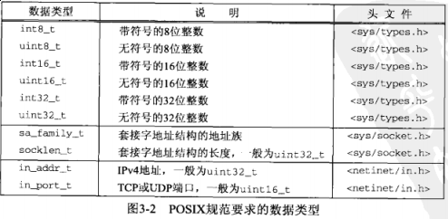
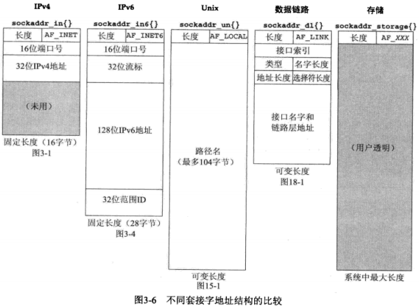
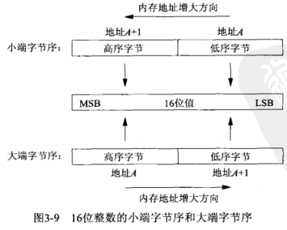
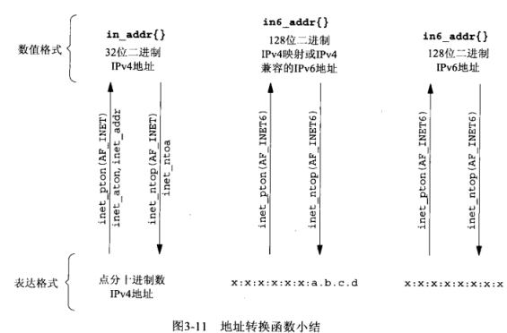

## 第三章 套接字编程简介

#### 3.1 概述

#### 3.2 套接字地址结构

3.2.1 IPv4 套接字地址结构

```c
#include <netinet/in.h>

struct in_addr {
    in_addr_t s_addr;   // 32-bit IPv4 address - [network byte ordered]
};

struct sockaddr_in {
    uint8_t         sin_len;        // length of structure[16]
    sa_family_t     sin_family;     // AF_INET
    in_port_t       sin_port;       // 16-bit TCP or UDP port number - [network byte ordered]
    struct in_addr  sin_addr;       // 32-bit IPv4 address - [network byte ordered]
    char            sin_zero[8];    // unused;
};
```



3.2.2 通用套接字地址结构

```c
#include <sys/socket.h>

struct sockaddr {
    uint8_t     sa_len;
    sa_family_t sa_family;  // address family: AF_XXX value
    char        sa_data[4]; // protocol-specific address
};
```

3.2.3 IPv6套接字地址结构

```c
#include <netinet/in.h>

struct in6_addr {
    uint8_t s6_addr[16];    // 128-bit IPv6 address - [network byte ordered]
};

#define SIN6_LEN            // required for compile-time tests

struct sockaddr_in6 {
    uint8_t         sin6_len;       // length of this struct (28)
    sa_family_t     sin6_family;    // AF_INET6
    in_port_t       sin6_port;      // transport layer port# - [network byte ordered]
    uint32_t        sin6_flowinfo;  // flow information, undefined
    struct in6_addr sin6_addr;      // IPv6 address - [network byte ordered]
    uint32_t        sin6_scope_id;  // set of interfaces for a scope
};
```

3.2.4 新的通用套接字地址结构

```c
#include <netinet/in.h>

struct sockaddr_storage {
    uint8_t     ss_len;     // length of this struct (implementation dependent)
    sa_family_t ss_family;  // address family: AF_XXX value
}
```

*sockaddr_storage* 类型提供的通用套接字地址结构相比 *sockaddr* 存在一下两点差别

- 如果系统支持的任何套接字地址结构有对齐需要，那么 *sockaddr_storage* 能够满足最苛刻的对齐要求

- *sockaddr_storage* 足够大，能够容纳系统支持的任何套接字地址结构

3.2.5 套接字地址结构的比较



#### 3.3 值-结果参数

- 从进程到内核传递套接字地址结构的函数有3个：*bind*, *connect*, *sendto*

- 从内核到进程传递套接字地址结构的函数有4个：*accept*, *recvfrom*, *getsockname*, *getpeername*

#### 3.4 字节排序函数



我们可编写一个简单的函数来实现查看当前系统的主机字节序

```c
#include <stdio.h>
#include <stdlib.h>

int main(int argc, char **argv)
{
    union {
        short   s;
        char    c[sizeof(short)];
    } un;
    un.s = 0x0102;
    // printf("%s: ", CPU_VENDOR_OS); /* autoconf 生成 */
    if (sizeof(short) == 2) {
        if (un.c[0] == 1 && un.c[1] == 2) {
            printf("big-endian\n");
        } else if (un.c[0] == 2 && un.c[1] == 1) {
            printf("little-endian\n");
        } else {
            printf("unknown\n");
        }
    } else {
        printf("sizeof(short) = %d\n", (int)sizeof(short));
    }
    exit(0);
}
```

```sh
$ gcc byteorder.c -o byteorder
$ ./byteorder
little-endian
```

我们需要关注如何在主机字节序和网络字节序之间相互转换

```c
#include <netinet/in.h>

uint16_t htons(uint16_t host16bitvalue);
uint32_t htonl(uint32_t host32bitvalue);    // 返回：网络字节序

uint16_t ntohs(uint16_t net16bitvalue);
uint32_t ntohl(uint32_t net32bitvalue);     // 返回：主机字节序
```

#### 3.5 字节操纵函数

```c
// 4.2BSD
#include <strings.h>
void bzero(void *dest, size_t nbytes);
void bcopy(const void *srv, void *dest, size_t nbytes);
int bcmp(const void *ptr1, const void *ptr2, size_t nbytes);

// ANSI C
#include <string.h>
void *memset(void *dest, int c, size_t len);
void *memcpy(void *dest, const void *srv, size_t nbytes);
int memcpy(const void *ptr1, const void *ptr2, size_t nbytes);
```

#### 3.6 *inet_aton*, *inet_addr*, *inet_ntoa* 函数

地址转换函数，ASCII字符串与网络字节序的二进制之间转换网际地址

- *inet_aton*, *inet_addr*, *inet_ntoa* 在点分十进制字符串（"127.0.0.1"）与长度为32位的网络字节序二进制之间转换IPv4地址

- 两个比较新的函数 *inet_pton* 和 *inet_ntop* 对于IPv4地址和IPv6地址都适用

#### 3.7 *inet_pton*, *inet_ntop* 函数

p: presentation，表达

n: numeric，数值



示例：

若系统不支持IPv6，可以采用如下措施定义只支持IPv4的 *inet_pton* 函数，及 *inet_ntop* 函数

```c
#include <arpa/inet.h>
#include <errno.h>
#include <netinet/in.h>
#include <string.h>
#include <sys/socket.h>

int inet_pton(int family, const char *strptr, void *addrptr)
{
    if (family == AF_INET) {        /* 仅支持IPv4 */
        struct in_addr in_val;

        if (inet_aton(strptr, &in_val)) {
            memcpy(addrptr, &in_val, sizeof(struct in_addr));
            return(1);
        }
        return(0);
    }
    errno = EAFNOSUPPORT;
    return(-1);
}
```

```c
#include <stdio.h>
#include <string.h>
#include <errno.h>
#include <netinet/in.h>

const char *inet_ntop(int family, const void *addrptr, char *strptr, size_t len)
{
    const u_char *p = (const u_char *)addrptr;
    if (family == AF_INET) {        /* 仅支持IPv4 */
        char temp[INET_ADDRSTRLEN];
        snprintf(temp, sizeof(temp), "%d.%d.%d.%d", p[0], p[1], p[2], p[3]);
        if (strlen(temp) >= len) {
            errno = ENOSPC;
            return(NULL);
        }
        strcpy(strptr, temp);
        return(strptr);
    }
    errno = EAFNOSUPPORT;
    return(NULL);
}
```

#### 3.8 [sock_ntop](sock_ntop.c) 和相关函数

若使用 *inet_ntop*，它要求调用者传递一个指向某个二进制地址的指针，而通常代码会如下编写：

```c
// IPv4
struct sockaddr_in addr;
inet_ntop(AF_INET, &addr.sin_addr, str, sizeof(str));

// IPv6
struct sockaddr_in6, addr6;
inet_ntop(AF_INET6, &addr6.sin6_addr, str, sizeof(str));
```

这样书写会让我们写的代码与协议相关，为了解决这样一个问题，自行编写一个名为 *sock_ntop* 的函数

```c
#include <arpa/inet.h>
#include <netinet/in.h>
#include <stdio.h>
#include <string.h>

char *sock_ntop(const struct sockaddr *sa, socklen_t salen)
{
    char        portstr[8];
    static char str[128];   /* Unix domain is largest */

    switch (sa->sa_family) {
        case AF_INET: {
            struct sockaddr_in *sin = (struct sockaddr_in *) sa;

            if (inet_ntop(AF_INET, &sin->sin_addr, str, sizeof(str)) == NULL) {
                return(NULL);
            }
            if (ntohs(sin->sin_port) != 0) {
                snprintf(portstr, sizeof(portstr), ":%d", ntohs(sin->sin_port));
                strcat(str, portstr);
            }
            return(str);
        }
    }
    return(NULL);
}
```

#### 3.9 [readn](readn.c), [writen](writen.c) 和 [readline](readline.c) 函数

#### 3.10 小结
