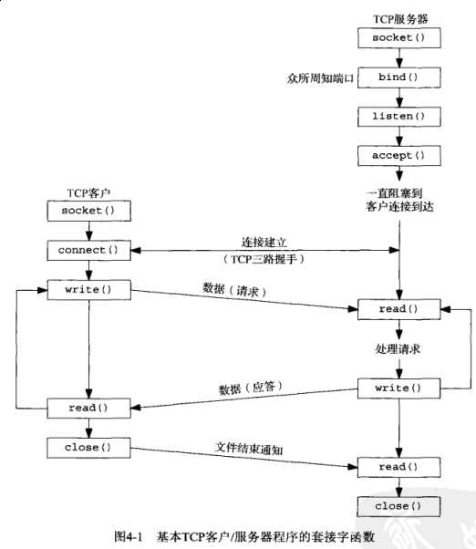
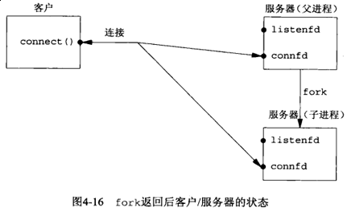

## 第四章 基本TCP套接字编程

#### 4.1 概述

#### 4.2 [socket](http://man7.org/linux/man-pages/man2/socket.2.html) 函数



#### 4.3 [connect](http://man7.org/linux/man-pages/man2/connect.2.html) 函数

若是TCP套接字，调用 *connect* 函数将触发TCP的三路握手过程，而且仅在连接建立成功或出错时才返回，其中错误有以下几种：

- 若TCP客户没有受到 *SYN* 分节的响应，则返回 *ETIMEDOUT* 错误（内核默认最长等待75s）

- 若对客户的 *SYN* 的响应是 *RST* （表示复位），则表明该服务器主机在我们指定的端口上没有进程在等待与之连接（如：服务器进程未运行）。这是种 **硬件错误**，客户接收到 *RST* 就马上返回 *ECONNREFUSED* 错误

-　客户发出的 *SYN* 在中间的某个路由器上引发了"destination unreachable"（目的地不可达）ICMP错误，这认为是一种 **软错误**。超过内核规定时间后（75s），把保存的消息作为 *EHOSTUNREACH* 或 *ENETUNREACH* 错误返回给进程

#### 4.4 [bind](http://man7.org/linux/man-pages/man2/bind.2.html) 函数

#### 4.5 [listen](http://man7.org/linux/man-pages/man2/listen.2.html) 函数

**本章节需要详细看原书内容**

```c
#include <sys/socket.h>
int listen(int sockfd, int backlog);
```

为了理解其中 *backlog* 参数，我们必须认识到内核为任何一个给定的监听套接字维护两个队列：

- 未完成连接队列：每个这样的 *SYN* 分节对于其中一项，已由某个客户发出并到达服务器，而服务器正在等待完成相应的ＴＣＰ三路握手过程。这些套接字处于 *SYN_RCVD* 状态

－ 已完成连接队列：每个已完成TCP三路握手过程的客户对应其中一项。这些套接字处于 *ESTABLISHED* 状态。


每当在未完成连接队列中创建一项时，来自监听套接字的参数就复制到即将建立的连接中。连接的创建机制是完全自动的，无需服务器进程插手。


如今的繁忙服务器可能每天要处理几百万个连接，*backlog*　过小的话根本不满足实际需求，*backlog* 我们可以自己指定，也可配置环境变量来指定，避免重新编译应用。

```c
#include <sys/socket.h>
#include <stdlib.h>
#include "../lib/error.h"

void Listen(int fd, int backlog) {
    char *ptr;

    if ((ptr = getenv("LISTENQ")) != NULL) {
        backlog = atoi(ptr);
    }
    if (listen(fd, backlog) < 0) {
        err_sys("listen error");
    }
}
```

#### 4.6 [accept](http://man7.org/linux/man-pages/man2/accept.2.html) 函数

*accept* 函数由TCP服务器调用，用于从已完成连接队列队头返回下一个已完成连接。若已完成连接队列为空，那么进程被投入睡眠。（假定套接字为默认的阻塞方式）

例子：值－结果参数

```c
#include <arpa/inet.h>
#include <errno.h>
#include <netinet/in.h>
#include <stdio.h>
#include <string.h>
#include <strings.h>
#include <sys/socket.h>
#include <time.h>
#include <unistd.h>
#include "../lib/error.h"

#define MAXLINE 4096    /* max text line length */
#define LISTENQ 1024    /* 2nd argument to listen() */

int main(int argc, char **argv)
{
    int                 err, n;
    int                 listenfd, connfd;
    socklen_t           len;
    struct sockaddr_in  servaddr, cliaddr;
    char                buff[MAXLINE];
    time_t              ticks;
    const char          *ptr;

    if ((listenfd = socket(AF_INET, SOCK_STREAM, 0)) < 0) {
        err_sys("socket error");
    }

    bzero(&servaddr, sizeof(servaddr));
    servaddr.sin_family = AF_INET;
    servaddr.sin_addr.s_addr = htonl(INADDR_ANY);
    servaddr.sin_port = htons(13);  /* daytime server */

    if ((err = bind(listenfd, (struct sockaddr *) &servaddr, sizeof(servaddr))) < 0) {
        err_sys("bind error");
    }

    if ((err = listen(listenfd, LISTENQ)) < 0) {
        err_sys("listen error");
    }

    for ( ; ; ) {
again:
        len = sizeof(cliaddr);
        if ((connfd = accept(listenfd, (struct sockaddr *) &cliaddr, &len)) < 0) {
#ifdef EPROTO
            if (errno == EPROTO || errno == ECONNABORTED) {
#else
            if (errno == ECONNABORTED) {
#endif
                goto again;
            } else {
                err_sys("accept error");
            }
        }
        if ((ptr = inet_ntop(AF_INET, &cliaddr.sin_addr, buff, sizeof(buff))) == NULL) {
            err_sys("inet_ntop error"); /* sets errno */
        }
        printf("connection from %s, port %d\n", ptr, ntohs(cliaddr.sin_port));
        ticks = time(NULL);
        snprintf(buff, sizeof(buff), "%.24s\r\n", ctime(&ticks));
        if ((n = write(connfd, buff, strlen(buff))) != strlen(buff)) {
            err_sys("write error");
        }
        close(connfd);
    }
}
```

```sh
# 服务端
$ gcc daytimetcpsrv1.c ../lib/error.c -o daytimetcpsrv1
$ sudo ./daytimetcpsrv1
connection from 127.0.0.1, port 54504

# 客户端
$ gcc ../Chapter01/daytimetcpcli.c ../lib/error.c -o daytimetcpcli
$ ./daytimetcpcli 127.0.0.1
Fri Dec 15 11:47:34 2017
```

#### 4.7 [fork](http://man7.org/linux/man-pages/man2/fork.2.html) 和 [exec](http://man7.org/linux/man-pages/man3/exec.3.html) 函数

父进程中调用 *fork* 之前打开的所有描述符在 *fork* 返回之后由子进程分享。

*fork* 有两个典型的用法：

- 一个进程创建一个自身的副本，这样每个副本都可以在另一个副本执行其他任务的同时处理各自的某个操作。

- 一个进程想要执行另一个程序。*fork* -> *exec*


进程在调用 *exec* 之前打开着的描述符通常跨 *exec* 继续保持打开。但也可以使用 *fcntl* 设置 *FD_CLOEXEC* 描述符标志禁止掉。

#### 4.8 并发服务器

若父进程没有关闭 *connfd*（引用计数为2），连接状态如下：



#### 4.9 [close](http://man7.org/linux/man-pages/man2/close.2.html) 函数

通常的Unix *close* 函数也用来关闭套接字，并终止TCP连接。（参看7.5.6小节）

#### 4.10 [getsockname](http://man7.org/linux/man-pages/man2/getsockname.2.html) 和 [getpeername](http://man7.org/linux/man-pages/man2/getpeername.2.html) 函数

例子：[获取套接字的地址族](sockfd_to_family.c)

```c
#include <sys/socket.h>

/* 返回套接字的地址族 */
int sockfd_to_family(int sockfd)
{
    struct sockaddr_storage ss;
    socklen_t               len;

    len = sizeof(ss);
    if (getsockname(sockfd, (struct sockaddr *) &ss, &len) < 0) {
        return(-1);
    }
    return(ss.ss_family);
}
```

#### 4.10 小结

图片来源：[UNP](https://www.amazon.cn/UNIX%E7%BD%91%E7%BB%9C%E7%BC%96%E7%A8%8B-%E5%A5%97%E6%8E%A5%E5%AD%97%E8%81%94%E7%BD%91API-%E5%8F%B2%E8%92%82%E6%96%87%E6%96%AF/dp/B011S72JB6/ref=sr_1_3?ie=UTF8&qid=1512463174&sr=8-3&keywords=unix+network+programming)
