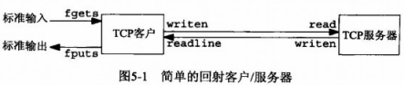
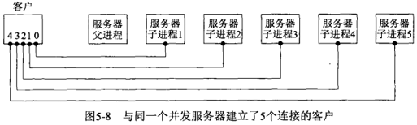
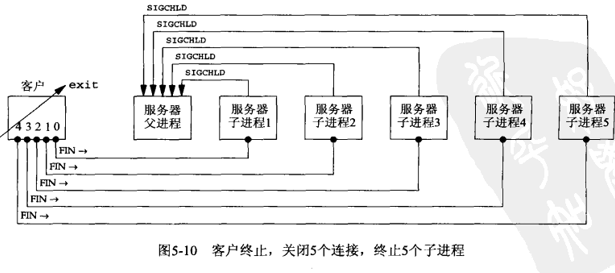
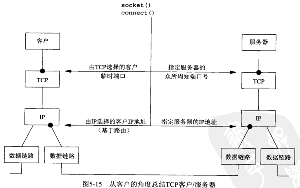
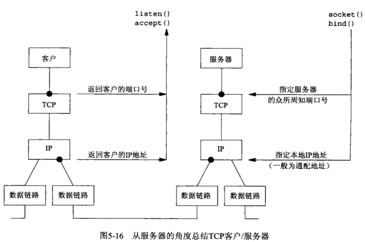

## 第五章 TCP客户/服务器程序示例

#### 5.1 概述

通过一个简单的样例，我们讨论一下客户服务器之间的关系，及各种可能出现的问题。



- 客户和服务器启动时发生了什么？

- 客户正常终止时发生了什么？

- 若服务器进程在客户之前终止，则客户会发生什么？

- 若服务器主机崩溃，则客户发生什么？

- 等。。。。

#### 5.2 TCP回射服务器程序：[main](tcpserv01.c) 函数

```c
#include <arpa/inet.h>      /* htonl, htons */
#include <errno.h>          /* errno */
#include <netinet/in.h>     /* sockaddr_in */
#include <stdio.h>
#include <stdlib.h>         /* exit */
#include <strings.h>        /* bzero */
#include <sys/socket.h>     /* socklen_t */
#include <unistd.h>         /* fork, read, write */
#include "../lib/error.h"

#define SERV_PORT   9877    /* TCP and UDP client-servers */
#define LISTENQ     1024    /* 2nd argument to listen() */
#define MAXLINE     4096    /* max text line length */

void str_echo(int sockfd);

int main(int argc, char **argv)
{
    int                 err;
    int                 listenfd, connfd;
    pid_t               childpid;
    socklen_t           clilen;
    struct sockaddr_in  cliaddr, servaddr;

    if ((listenfd = socket(AF_INET, SOCK_STREAM, 0)) < 0) {
        err_sys("socket error");
    }

    bzero(&servaddr, sizeof(servaddr));
    servaddr.sin_family = AF_INET;
    servaddr.sin_addr.s_addr = htonl(INADDR_ANY);
    servaddr.sin_port = htons(SERV_PORT);

    if ((err = bind(listenfd, (struct sockaddr *) &servaddr, sizeof(servaddr))) < 0) {
        err_sys("bind error");
    }

    if ((err = listen(listenfd, LISTENQ)) < 0) {
        err_sys("listen error");
    }

    for ( ; ; ) {
again:
        clilen = sizeof(cliaddr);
        if ((connfd = accept(listenfd, (struct sockaddr *) &cliaddr, &clilen)) < 0) {
#ifdef EPROTP
            if (errno == EPROTO || errno == ECONNABORTED) {
#else
            if (errno == ECONNABORTED) {
#endif
                goto again;
            } else {
                err_sys("accept error");
            }
        }
        if ((childpid = fork()) == -1) {
            err_sys("fork error");
        } else if (childpid == 0) {         /* child process */
            if (close(listenfd) == -1) {    /* close listening socket */
                err_sys("close error");
            }
            str_echo(connfd);               /* process the request */
            exit(0);
        }
        if (close(connfd) == -1) {
            err_sys("close error");
        }
    }
}
```

#### 5.3 TCP回射服务器程序：[str_echo](str_echo.c) 函数

```c
#include <unistd.h>     /* ssize_t, read, write */
#include <errno.h>      /* errno */
#include "../lib/error.h"

#define MAXLINE 4096    /* max text line length */

void str_echo(int sockfd)
{
    ssize_t n;
    char    buf[MAXLINE];
again:
    while ((n = read(sockfd, buf, MAXLINE)) > 0) {
        if (write(sockfd, buf, n) != n) {
            err_sys("write error");
        }
    }
    if (n < 0 && errno == EINTR) {
        goto again;
    } else if (n < 0) {
        err_sys("str_echo: read error");
    }
}
```

结合 *5.2*, *5.3* 我们做一个小测试，查看基本功能。

```sh
# 服务端
$ gcc tcpserv01.c str_echo.c ../lib/error.c -o tcpserv01
$ ./tcpserv01

# 客户端
$ nc -vt localhost 9877
localhost [127.0.0.1] 9877 open
hello
hello

# 进程树状态
$ pstree
systemd─┬
        ...
        ├─st───zsh───tcpserv01───tcpserv01
        ...
```

#### 5.4 TCP回射客户程序：[main](tcpcli01.c) 函数

```c
#include <sys/socket.h>     /* socket */
#include <netinet/in.h>     /* sockaddr_in */
#include <arpa/inet.h>      /* inet_pton */
#include <strings.h>         /* bzero */
#include <errno.h>          /* errno */
#include <stdlib.h>         /* exit */
#include <stdio.h>
#include "../lib/error.h"

#define SERV_PORT   9877    /* TCP and UDP client-servers */
#define MAXLINE     4096    /* max text line length */

void str_cli(FILE *fp, int sockfd);

int main(int argc, char **argv)
{
    int                 n;
    int                 sockfd;
    struct sockaddr_in  servaddr;

    if (argc != 2) {
        err_quit("usage: tcpcli <IPaddress>");
    }

    if ((sockfd = socket(AF_INET, SOCK_STREAM, 0)) < 0) {
        err_sys("socket error");
    }

    bzero(&servaddr, sizeof(servaddr));
    servaddr.sin_family = AF_INET;
    servaddr.sin_port = htons(SERV_PORT);
    if ((n = inet_pton(AF_INET, argv[1], &servaddr.sin_addr)) < 0) {
        err_sys("inet_pton error for %s", argv[1]); /* errno set */
    } else if (n == 0) {
        err_quit("inet_pton error for %s", argv[1]);
    }

    if (connect(sockfd, (struct sockaddr *) &servaddr, sizeof(servaddr)) < 0)
    {
        err_sys("connect error, errno = %d", errno);
    }

    str_cli(stdin, sockfd); /* do it all */
    exit(0);
}
```

#### 5.5 TCP回射客户程序：[str_cli](str_cli.c) 函数

```c
#include <stdio.h>      /* FILE */
#include <string.h>     /* strlen */
#include <unistd.h>     /* write */
#include "../lib/error.h"

#define MAXLINE     4096    /* max text line length */

// Chapter03/readline.c
ssize_t readline(int fd, void *vptr, size_t maxlen);

void str_cli(FILE *fp, int sockfd)
{
    char sendline[MAXLINE], recvline[MAXLINE];

    while (fgets(sendline, MAXLINE, fp) != NULL) {
        if (write(sockfd, sendline, strlen(sendline)) != strlen(sendline)) {
            err_sys("write error");
        }
        if (readline(sockfd, recvline, MAXLINE) == 0) {
            err_quit("str_cli: serve terminate permaturely");
        }
        if (fputs(recvline, stdout) == EOF) {
            err_sys("fputs error");
        }
    }
}
```

结合 *5.2*, *5.3*, *5.4*, *5.5* 我们拥有了一对TCP客户服务程序，查看基本功能。

```sh
# 服务端
$ gcc tcpserv01.c str_echo.c ../lib/error.c -o tcpserv01
$ ./tcpserv01

# 客户端
$ gcc tcpcli01.c str_cli.c ../lib/error.c ../Chapter03/readline.c -o tcpcli01
$ ./tcpcli01 127.0.0.1
hello
hello
```

#### 5.6 正常启动

服务器，*socket* -> *bind* -> *listen* -> *accept*，并阻塞等待 *accept* 调用。

```sh
$ ./tcpserv01 &

# 查看端口占用情况
$ lsof -i
COMMAND     PID   USER   FD   TYPE   DEVICE SIZE/OFF NODE NAME
tcpserv01  3159 fanbin    3u  IPv4 52420503      0t0  TCP *:9877 (LISTEN)
...

$ ./tcpcli01 127.0.0.1
```

客户调用 *socket* 和 *connect* （此调用引起三路握手操作），当三路握手完成后，连接建立。

- 客户阻塞至 *str_cli* 函数的 *fgets* 调用。

- 服务器阻塞至 *accept*，当有连接时，父进程 *fork* 出子进程，让子进程回射客户数据

- 父进程继续提供服务，阻塞在 *accept* 上。

#### 5.7 正常终止

- 键入 *EOF* 字符，按客户流程 *main* 调用 *exit* 终止（*exit* 调用会关闭所有已打开文件描述服，其中的 *socket* 连接断开）。客户TCP发送 *FIN* 给服务器，服务器TCP则以 *ACK* 响应，这是TCP连接终止序列的前半部分。此时服务器套接字处于 *CLOSE_WAIT* 状态，客户套接字则处于 *FIN_WAIT_2* 状态

- 服务器TCP接收 *FIN*, 服务器子进程调用 *exit* 终止

- 服务器子进程中打开的所有描述符关闭，关闭的已连接套接字会引发TCP连接终止序列的最后两个分节。

可能出现的问题

- 僵死子进程：通过捕获SIGCHLD信号并使用waitpid来处理；

- 服务器进程终止，客户进程没有被告知：第六章 select，poll函数处理；

- 服务器主机崩溃，客户端发送了数据才能检测：第七章 SO_KEEPALIVE 套接字选项来解决；

- 发送数值数据大小端问题。

#### 5.8 POSIX信号处理

[signal](http://man7.org/linux/man-pages/man2/signal.2.html) 函数

自定义 *signal* 函数

```c
#include <signal.h> /* sigemptyset */

typedef void Sigfunc(int);      /* for signal handlers */

Sigfunc *Signal(int signo, Sigfunc *func)
{
    struct sigaction act, oact;

    act.sa_handler = func;
    sigemptyset(&act.sa_mask);
    act.sa_flags = 0;
    if (signo == SIGALRM) {
#ifdef SA_INTERRUPT
        act.sa_flags |= SA_INTERRUPT;   /* SunOS 4.x */
#endif
    } else {
#ifdef SA_RESTART
        act.sa_flags |= SA_RESTART;     /* SVR4, 4.4BSD */
#endif
    }
    if (sigaction(signo, &act, &oact) < 0) {
        return(SIG_ERR);
    }
    return(oact.sa_handler);
}
```

#### 5.9 处理 *SIGCHLD* 信号

设置僵死(zombie)状态的目的是维护子进程的信息，以便父进程在以后某个时候获取。

处理僵死进程

我们显然不愿意留存僵死进程。它们占用内核中的空间，最终可能导致我们耗尽进程资源。

无论何时我们 *fork* 子进程都得 *wait*　它们，以防它们变成僵死进程。

[sigchildwait.c](sigchildwait.c)：调用 *wait* 的 *SIGCHLD* 信号处理函数

```c
#include <stdio.h>
#include <sys/wait.h>

void sig_child(int signo)
{
    pid_t   pid;
    int     stat;

    pid = wait(&stat);
    printf("child %d terminated\n", pid);
    return;
}
```

打开 [tcpserv01.c](tcpserv01.c) 中的**#2**功能，重新编译并测试：

```sh
# 服务端
$ gcc tcpserv01.c str_echo.c ../lib/error.c sigchildwait.c -o tcpserv02
$ ./tcpserv02
child 6004 terminated

# 客户端
$ nc -vt 127.0.0.1 9877
localhost [127.0.0.1] 9877 open
hello
hello
^CExiting.
```

#### 5.10 [wait](http://man7.org/linux/man-pages/man2/wait.2.html) 和 [waitpid](http://man7.org/linux/man-pages/man2/waitpid.2.html) 函数

函数 *wait* 和 *waitpid* 的区别

建立了5个连接的TCP客户端: [tcpcli04.c](tcpcli04.c)

```c
#include <arpa/inet.h>
#include <errno.h>
#include <netinet/in.h>
#include <stdio.h>
#include <stdlib.h>
#include <strings.h>
#include <sys/socket.h>
#include "../lib/error.h"

#define SERV_PORT   9877    /* TCP and UDP client-servers */

void str_cli(FILE *fp, int sockfd);

int main(int argc, char **argv)
{
    int                 i, n, sockfd[5];
    struct sockaddr_in  servaddr;

    if (argc != 2) {
        err_quit("usage: tcpcli <IPaddress>");
    }

    for (i = 0; i < 5; i++) {
        if ((sockfd[i] = socket(AF_INET, SOCK_STREAM, 0)) < 0) {
            err_sys("socket error");
        }
        bzero(&servaddr, sizeof(servaddr));
        servaddr.sin_family = AF_INET;
        servaddr.sin_port = htons(SERV_PORT);
        if ((n = inet_pton(AF_INET, argv[1], &servaddr.sin_addr)) < 0) {
            err_sys("inet_pton error for %s", argv[1]);
        } else if (n == 0) {
            err_quit("inet_pton error for %s", argv[1]);
        }
        if (connect(sockfd[i], (struct sockaddr *) &servaddr, sizeof(servaddr)) < 0) {
            err_sys("connect error, errno = %d", errno);
        }
    }
    str_cli(stdin, sockfd[0]); /* do it all */
    // 5个客户端连接同时终止
    exit(0);
}
```





```sh
# 服务端：打开tcpserv01.c #2
$ gcc tcpserv01.c str_echo.c ../lib/error.c sigchildwait.c -o tcpserv03
$ ./tcpserv03
child 26487 terminated
child 26488 terminated

# 客户端
$ gcc tcpcli04.c str_cli.c ../lib/error.c ../Chapter03/readline.c -o tcpcli04
$ ./tcpcli04 127.0.0.1
hello
hello
^C

# 进程状态
$ ps aux | grep tcpserv03
fanbin   26286  0.0  0.0   4276   824 pts/7    S+   15:16   0:00 ./tcpserv03
fanbin   26489  0.0  0.0      0     0 pts/7    Z+   15:16   0:00 [tcpserv03] <defunct>
fanbin   26490  0.0  0.0      0     0 pts/7    Z+   15:16   0:00 [tcpserv03] <defunct>
fanbin   26491  0.0  0.0      0     0 pts/7    Z+   15:16   0:00 [tcpserv03] <defunct>
```

同时产生了5个信号，从上述结果来看，仅有2个子进程正常终止，剩余3个子进程变成僵死进程。若服务器进程长时间运行，此种状况频繁发生，那么系统中会存在大量僵死进程，同时消耗掉系统相关资源，服务器进程最终不可使用。

多个连接同时断开时，信号处理机制是没有排队功能，同时只能处理一个 *SIGCHLD* 信号。

因此仅调用 *wait* 不足以防止出现僵死进程，我们需要一个方法来处理所有的子进程终止信号，*waitpid* 函数能够等待处理每一个子进程终止信号。

*waitpid* 实现的 *sig_chld* 信号处理函数：[sigchildwaitpid.c](sigchildwaitpid.c)

```c
#include <stdio.h>
#include <sys/wait.h>

void sig_chld(int signo)
{
    pid_t   pid;
    int     stat;

    while ((pid = waitpid(-1, &stat, WNOHANG)) > 0) {
        printf("child %d terminated\n", pid);
    }
    return;
}
```

以下实现给出了我们服务器的最终版实现：

```c
#include <arpa/inet.h>
#include <errno.h>
#include <netinet/in.h>
#include <stdlib.h>
#include <strings.h>
#include <sys/socket.h>
#include <unistd.h>
#include <signal.h>
#include "../lib/error.h"

#define SERV_PORT   9877    /* TCP and UDP client-servers */
#define LISTENQ     1024    /* 2nd argument to listen() */
#define MAXLINE     4096    /* max text line length */

void str_echo(int sockfd);
void sig_chld(int signo);

int main(int argc, char **argv)
{
    int                 err;
    int                 listenfd, connfd;
    pid_t               childpid;
    socklen_t           clilen;
    struct sockaddr_in  cliaddr, servaddr;

    if ((listenfd = socket(AF_INET, SOCK_STREAM, 0)) < 0) {
        err_sys("socket error");
    }

    bzero(&servaddr, sizeof(servaddr));
    servaddr.sin_family = AF_INET;
    servaddr.sin_addr.s_addr = htonl(INADDR_ANY);
    servaddr.sin_port = htons(SERV_PORT);

    if ((err = bind(listenfd, (struct sockaddr *) &servaddr, sizeof(servaddr))) < 0) {
        err_sys("bind error");
    }

    if ((err = listen(listenfd, LISTENQ)) < 0) {
        err_sys("listen error");
    }

    signal(SIGCHLD, sig_chld);

    for ( ; ; ) {
again:
        clilen = sizeof(cliaddr);
        if ((connfd = accept(listenfd, (struct sockaddr *) &cliaddr, &clilen)) < 0) {
#ifdef EPROTP
            if (errno == EPROTO || errno == ECONNABORTED) {
#else
            if (errno == ECONNABORTED) {
#endif
                goto again;
            } else {
                err_sys("accept error");
            }
        }
        if ((childpid = fork()) == -1) {
            err_sys("fork error");
        } else if (childpid == 0) {         /* child process */
            if (close(listenfd) == -1) {    /* close listening socket */
                err_sys("close error");
            }
            str_echo(connfd);               /* process the request */
            exit(0);
        }
        if (close(connfd) == -1) {          /* parent closes connected socket */
            err_sys("close error");
        }
    }
}
```

```sh
# 服务器
$ gcc tcpserv04.c str_echo.c sigchildwaitpid.c ../lib/error.c -o tcpserv04
$ ./tcpserv04
child 15500 terminated
child 15497 terminated
child 15498 terminated
child 15499 terminated
child 15501 terminated

# 客户端
$ gcc tcpcli04.c str_cli.c ../lib/error.c ../Chapter03/readline.c -o tcpcli04
$ ./tcpcli04 127.0.0.1
hello
hello
^C

# 进程状态
$ ps aux | grep tcpserv04
fanbin   15365  0.0  0.0   4276   740 pts/7    S+   15:33   0:00 ./tcpserv04
```

本节的目的是示范我们在网络编程时可能会遇到的三种情况：

- 当 *fork* 子进程是，必须捕获 *SIGCHLD* 信号

- 当捕获信号时，必须处理被中断的系统调用

- *SIGCHLD* 的信号处理函数必须正确编写，应使用 *waitpid* 函数以避免留下僵死进程

#### 5.11 [accept](http://man7.org/linux/man-pages/man2/accept.2.html) 返回前连接中止

#### 5.12 服务器进程终止

#### 5.13 *SIGPIPE* 信号

原 *str_cli* 更改 [str_cli11.c](str_cli11.c) 的实现

```c
#include <unistd.h>
#include "../lib/error.h"

#define MAXLINE 4096    /* max text line length */

// Chapter03/readline.c
ssize_t readline(int fd, void *vptr, size_t maxlen);

void str_cli(FILE *fp, int sockfd)
{
    char sendline[MAXLINE], recvline[MAXLINE];

    while (fgets(sendline, MAXLINE, fp) != NULL) {
        /* 引发RST */
        if (write(sockfd, sendline, 1) != 1) {
            err_sys("write error");
        }
        sleep(1);
        /* 产生SIGPIPE */
        if (write(sockfd, sendline + 1, strlen(sendline) - 1) != strlen(sendline) - 1) {
            err_sys("write error");
        }
        if (readline(sockfd, recvline, MAXLINE) == 0) {
            err_quit("str_cli: server terminated prematurely");
        }
        if (fputs(recvline, stdout) == EOF) {
            err_sys("fputs error");
        }
    }
}
```

然后我们再次测试

```sh
# 服务器
$ gcc tcpserv04.c str_echo.c sigchildwaitpid.c ../lib/error.c -o tcpserv04
$ ./tcpserv04
child 11578 terminated  # kill child

# 客户端
$ gcc tcpcli01.c str_cli11.c ../lib/error.c ../Chapter03/readline.c -o tcpcli11
$ ./tcpcli11 127.0.0.1
hi there
hi there
                        # kill server child
$                       # 本shell(oh-my-zsh)没有显示任何提示
```

#### 5.14 服务器主机崩溃

如果我们不主动向服务端发送数据也想检测出服务器主机的崩溃，那么需要采用另外一个技术，也就是我们将在7.5节讨论的 *SO_KEEPALIVE* 套接字选项

#### 5.15 服务器主机崩溃后重启

#### 5.16 服务器主机关机

#### 5.17 TCP程序例子小结





#### 5.18 数据格式

一般来说，我们必须关心在客户和服务器之间进行交换的数据的格式

5.18.1 例子：在客户与服务器之间传递文本串, [str_echo08.c](str_echo08.c)

```c
#include <stdio.h>
#include <unistd.h>
#include <string.h>
#include <errno.h>
#include "../lib/error.h"

#define MAXLINE 4096    /* max text line length */

// Chapter03/readline.c
ssize_t readline(int fd, void *vptr, size_t maxlen);

/* 客户端与服务端之间传递文本字符串 */
void str_echo(int sockfd)
{
    long    arg1, arg2;
    ssize_t n;
    char    line[MAXLINE];

    for ( ; ; ) {
        if ((n = readline(sockfd, line, MAXLINE)) == 0) {
            return;     /* connection closed by other end */
        }
        if (sscanf(line, "%ld%ld", &arg1, &arg2) == 2) {
            snprintf(line, sizeof(line), "%ld\n", arg1 + arg2);
        } else {
            snprintf(line, sizeof(line), "input error\n");
        }
        n = strlen(line);
        if (write(sockfd, line, n) != n) {
            err_sys("write error");
        }
    }
}
```

5.18.2 例子：在客户与服务器之间传递二进制结构

[sum.h](sum.h), [str_cli09.c](str_cli09.c), [str_echo09.c](str_echo09.c)

若在相同体系结构的两台主机之间能够很好的运行，但是在不同体系结构的主机之间就无法工作（大小端字节序问题）

#### 5.19 小结

- 僵死进程 -> 捕获 *SIGCHLD*，用 *waitpid* 解决而不是 *wait* 来解决，Unix信号是不排队的

- 服务器进程终止时客户端没有被告知 -> 第六章 *select* 和 *poll* 函数来处理此类问题

- 服务器主机崩溃的情形要等到客户想服务器发送了数据才能检测到 -> 第七章7.5节利用 *SO_KEEPALIVE* 解决

- 客户与服务器之间发送数值数据 -> 不同主机之间的体系结构等其他问题（大小端等）

图片来源：[UNP](https://www.amazon.cn/UNIX%E7%BD%91%E7%BB%9C%E7%BC%96%E7%A8%8B-%E5%A5%97%E6%8E%A5%E5%AD%97%E8%81%94%E7%BD%91API-%E5%8F%B2%E8%92%82%E6%96%87%E6%96%AF/dp/B011S72JB6/ref=sr_1_3?ie=UTF8&qid=1512463174&sr=8-3&keywords=unix+network+programming)
