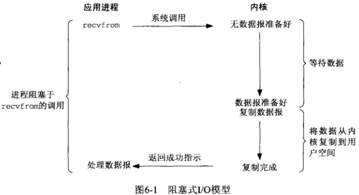
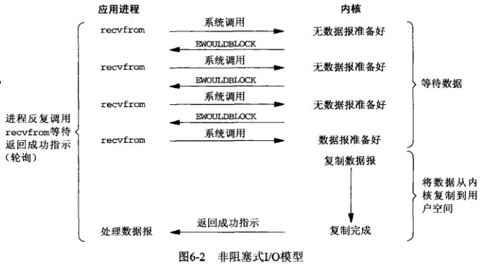
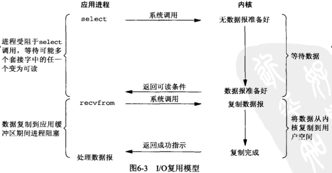
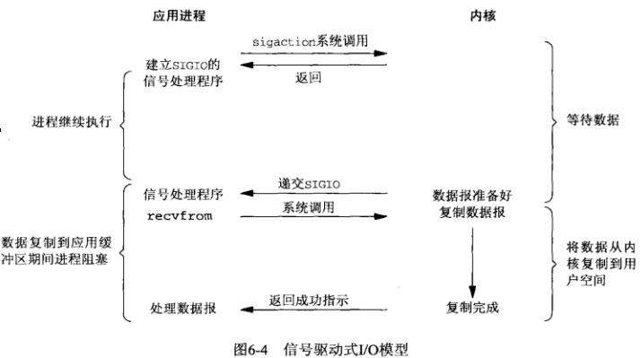

## 第六章 I/O复用：select和poll函数

#### I/O模型

**1. 阻塞式I/O**



**2. 非阻塞式I/O**



**3. I/O复用(select和poll)**



6.3 select 函数

```c
#include <sys/select.h>

int select(int nfds,                        // 最大文件描述符 **+ 1**
        fd_set *restrict readfds,           // 可读fd
        fd_set *restrict writefds,          // 可写fd
        fd_set *restrict errorfds,          // 异常fd
        struct timeval *restrict timeout);  // 定时：[1] - NULL, 挂起等待
                                            //       [2] - !NULL, 等待指定时间
                                            //       [2.1] - 时间值为0时，不等待，立即返回（轮询）

// /usr/include/bits/types/struct_timeval.h
struct timeval
{
    __time_t tv_sec;        /* seconds. */
    __suseconds_t tv_usec;  /* microseconds. */
}
// 当select函数的fd_set均为NULL时，select可提供了一个比sleep更精确的毫秒级的定时器

// 以下宏提供访问fd_set的操作
void FD_ZERO(fd_set *fdset);
void FD_SET(int fd, fd_set *fdset);
void FD_CLR(int fd, fd_set *fdset);
void FD_ISSET(int fd, fd_set *fdset);

// 每次重新调用select都需要重新FD_SET相应描述符
```

6.3.1 描述符就绪条件

套接字准备好读&写均有4个条件，详细请看UNP 6.3.1小节

有两个概念需要理解，**接受低水位标记** 和发送低水位标记，设置此标记目的在于：允许应用进程控制在 *select* 返回可读或可写条件之前有多少数据可读或有多大空间可用于写。

举例来说：若我们知道除非至少存在64个字节的数据（自定义头或自定义结构体），否则我们的应用进程没有任何有效工作可做时，我们可以把 *接受低水位标记* 设置为64，以防少于64个字节的数据准备好读时 *select* 唤醒进程处理。

6.4 str\_cli函数（修订版）

[strcli\_select01.c](strcli_select01.c)

**4. 信号驱动式I/O(SIGIO)**



**5. 异步I/O(POSIX的aio_系列函数)**


#### 5中I/O模型比较


图片来源：[UNP](https://www.amazon.cn/UNIX%E7%BD%91%E7%BB%9C%E7%BC%96%E7%A8%8B-%E5%A5%97%E6%8E%A5%E5%AD%97%E8%81%94%E7%BD%91API-%E5%8F%B2%E8%92%82%E6%96%87%E6%96%AF/dp/B011S72JB6/ref=sr_1_3?ie=UTF8&qid=1512463174&sr=8-3&keywords=unix+network+programming)
