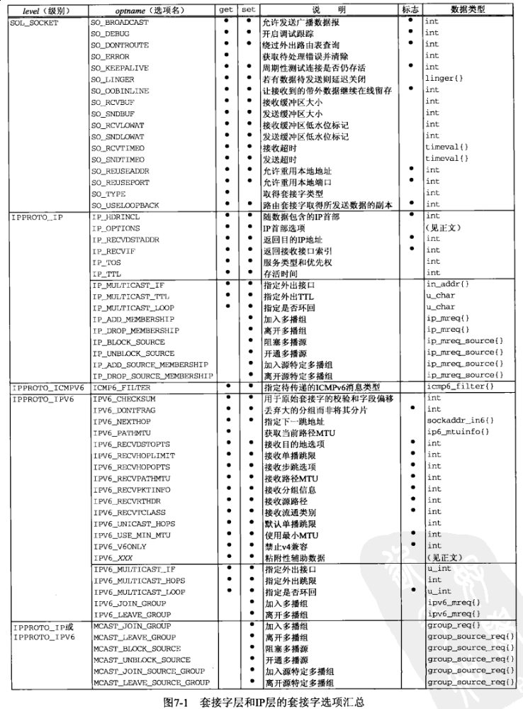
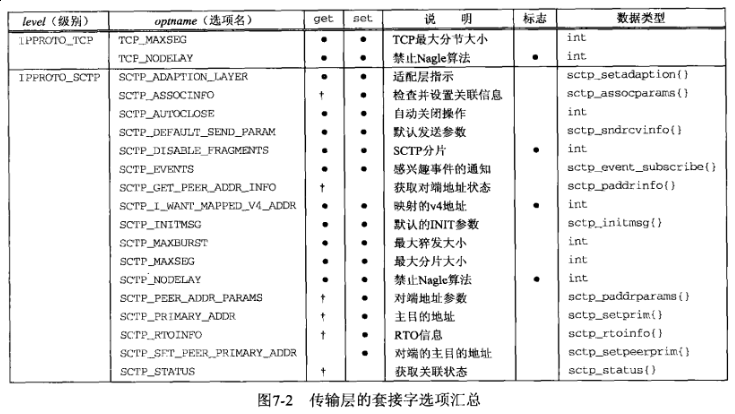
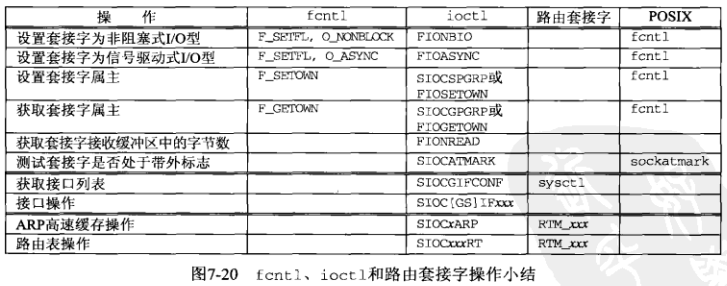

## 第七章 套接字选项

#### 7.2 *getsockopt* 和 *setsockopt* 函数

```c
#include <sys/socket.h>

int getsockopt(int sockfd, int level, int optname, void *optval, socklen_t *optlen);

int setsockopt(int sockfd, int level, int optname, const void *optval, socklen_t optlen);
```





7.3 检查选项是否受支持并获取默认值

[checkopts.c](checkopts.c)

7.4 套接字状态

**7.5 通用套接字选项**

[setsockopt](http://man7.org/linux/man-pages/man2/getsockopt.2.html), [getsockopt](http://man7.org/linux/man-pages/man2/setsockopt.2.html)

对于某些套接字选项，设置或获取是有时序上的考虑。

**7.5.6 SO_LINGER 套接字选项**

**本小节需仔细研究，多看几遍**

7.6 IPv4 套接字选项

7.7 ICMPv6 套接字选项

7.8 IPv6 套接字选项

7.9 TCP 套接字选项

7.10 SCTP 套接字选项

7.11 [fcntl](http://man7.org/linux/man-pages/man2/fcntl.2.html) 函数



本小节研究 *fcntl* 函数如何影响套接字

```c
#include <fcntl.h>

int fcntl(int filds, int cmd, ...);
```

其中影响套接字描述符的两个标志是：

- O\_NONBLOCK - 非阻塞式I/O
- O\_ASYNC - 信号驱动式I/O

设置非阻塞I/O的典型代码为：

```c
int flag;
// #1 先获取原有flag
if ((flags = fcntl(fd, F_GETFL, 0)) < 0) {
    err_sys("F_GETFL error");
}
// #2 新增O_NONBLOCK标志并重新设置fd
flag |= O_NONBLOCK;
if (fcntl(fd, F_SETFL, flags) < 0) {
    err_sys("F_SETFL error")
}
// 不可直接fcntl(fd, F_SETFL, O_NONBLOCK)，会清除原fd的flag
```

小结

常用选项：`SO_KEEPALIVE, SO_RCVBUF, SO_SNDBUF, SO_REUSEADDR`

`SO_LINGER` 套接字选项使得我们能够更好的控制 *close* 函数返回的时机

图片来源：[UNP](https://www.amazon.cn/UNIX%E7%BD%91%E7%BB%9C%E7%BC%96%E7%A8%8B-%E5%A5%97%E6%8E%A5%E5%AD%97%E8%81%94%E7%BD%91API-%E5%8F%B2%E8%92%82%E6%96%87%E6%96%AF/dp/B011S72JB6/ref=sr_1_3?ie=UTF8&qid=1512463174&sr=8-3&keywords=unix+network+programming)
