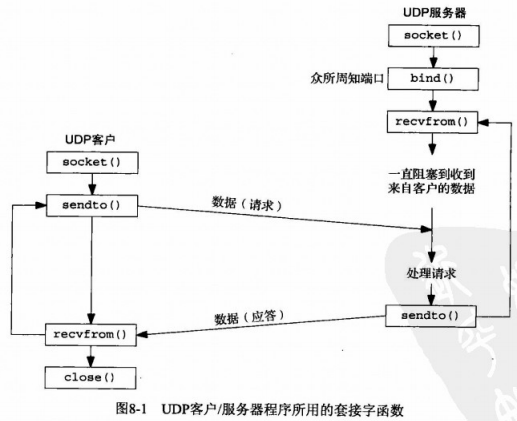
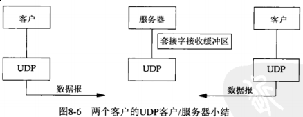
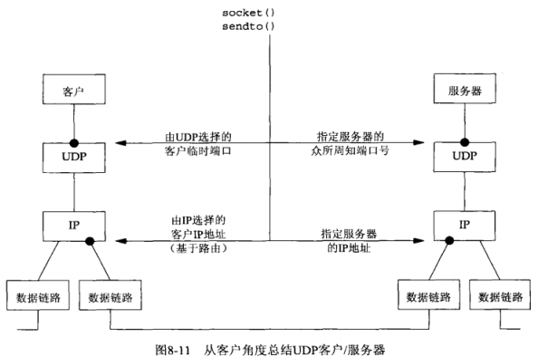
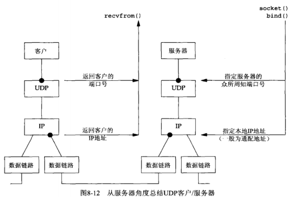
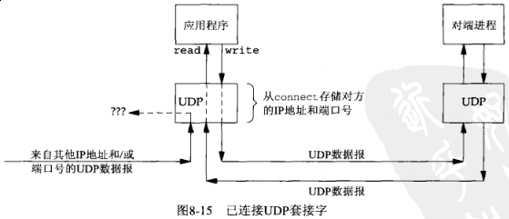

## 第八章 基本UDP套接字编程

[sock_ntop.c](sock_ntop.c): 确认socket的地址（IPv4，IPv6，Unix Socket，AF_LINK）



8.2 [recvfrom](http://man7.org/linux/man-pages/man2/recvfrom.2.html) 和 [sendto](http://man7.org/linux/man-pages/man2/sendto.2.html) 函数

```c
// man recvfrom; man sendto
#include <sys/socket.h>

ssize_t recvfrom(int socket,
                 void *restrict buffer,
                 size_t length,
                 int flags,
                 struct sockaddr *restrict address,
                 socklen_t *restrict address_len);

ssize_t sendto(int socket,
               const void *message,
               size_t length,
               int flags,
               const struct sockaddr *dest_addr,
               socklen_t dest_len);
```

8.3 UDP 回射服务器程序：[main](udpserv01.c) 函数

8.4 UDP 回射服务器程序：[dg_echo](dg_echo.c) 函数



8.5 UDP 回射服务器程序：[main](udpcli01.c) 函数

8.6 UDP 回射服务器程序：[dg_cli](dg_cli.c) 函数

8.7 数据包丢失

8.8 验证接收到的响应

修改 [udpcli01.c](udpcli01.c)，用 **#2** 编译

如果服务器运行在一个只有单个IP地址的主机上，此版本仍然正常工作。然而如果服务器主机是多宿的，该客户就有可能失败。

有两个解决办法：

(a) 得到由 *recvfrom* 返回的IP地址后。客户端通过在DNS中查找服务器主机的名字来验证该主机的域名（而不是它的IP）

(b) UDP服务器给服务器主机上配置的每个IP地址创建一个套接字，用 *bind* 捆绑每个IP地址到各自的套接字，然后在所有这些套接字上使用 *select* （等待其中任何一个变得可读），再从可读的套接字给出应答。

[网络字节序转换成IP地址](http://beej-zhtw.netdpi.net/09-man-manual/9-14-inet_ntop-inet_pton)

8.9 服务器进程未运行

8.10 UDP程序例子小节





8.11 UDP的 [connect](http://man7.org/linux/man-pages/man2/connect.2.html) 函数



使用 *connect* 连接的UDP套接字可用 *read*, *write* 来读写socket，不必用 *sendto*, *recvmsg*， 这个做法的好处在于，我们可以用通用的 *read*, *write* 函数读写文件描述符，而不必关系此描述符是否为 *socket* 套接字。此外还能正确的捕获到部分 *recvfrom* 所不能获取的错误（详见 8.9小节）

本小节，我们可以说UDP客户进程或服务器进程只在使用自己的UDP套接字与确定的唯一对端进行通信时，才可以调用 *connect*。

8.11.1 给一个UDP套接字多次调用 *connect*

拥有一个已连接UDP套接字的进程可出于下列两个目的之一再次调用 *connect* （**对于TCP套接字，connect只能调用一次**）:

- 指定新的IP地址和端口号
- 断开套接字

8.11.2 性能

未连接UDP套接字：*sendto*

- 连接套接字
- 输出第一个数据报
- 断开套接字连接
- 连接套接字
- 输出第二个数据报
- 断开套接字连接

内核复制**两次**目的IP地址和端口号的套接字地址结构

连接套接字：*write*

- 连接套接字
- 输出第一个数据报
- 输出第二个数据报

内核复制**一次**目的IP地址和端口号的套接字地址结构

8.12 [dg_cli](dg_cliconnect.c) 函数（修订版）

修改 [udpcli01.c](udpcli01.c)，用 **#3** 编译

8.13 UDP缺乏流量控制

[dg_cliloop1.c](dg_cliloop1.c), [dg_echoloop1.c](dg_echoloop1.c)

修改 [udpcli01.c](udpcli01.c)，用 **#4** 编译

修改 [udpserv01.c](udpserv01.c), 用 **#2** 编译，（尽可能然服务端运行在慢速服务器上）

**UDP套接字接受缓冲区**

我们先利用第七章所说内容，写个小程序测试一下 *SO_RCVBUF* 对应的值为多少[so_rcvbuf.c](so_rcvbuf.c)。

我们增大服务端套接字接受队列大小[dg_echoloop2.c](dg_echoloop2.c)，然后再进行测试。

修改 [udpserv01.c](udpserv01.c), 用 **#3** 编译

TODO: 本小节需要理解内容（当前测试环境下没有测试出文章内容所描述现象）

本小节测试说明两件事：1. UDP没有流量控制; 2. UDP是不可靠传输（可能会有丢包）

8.14 UDP 中的外出接口的确定

已连接UDP套接字还可用来确定用于某个特定目的地的外出接口, [udp_cli09.c](udp_cli09.c)。

*connect* -> *getsockname*

8.15 使用 *select* 函数的TCP和UDP回射服务器程序

[udpserv_select01.c](udpserv_select01.c)

图片来源：[UNP](https://www.amazon.cn/UNIX%E7%BD%91%E7%BB%9C%E7%BC%96%E7%A8%8B-%E5%A5%97%E6%8E%A5%E5%AD%97%E8%81%94%E7%BD%91API-%E5%8F%B2%E8%92%82%E6%96%87%E6%96%AF/dp/B011S72JB6/ref=sr_1_3?ie=UTF8&qid=1512463174&sr=8-3&keywords=unix+network+programming)
