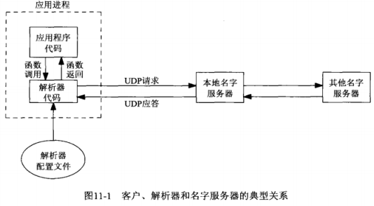
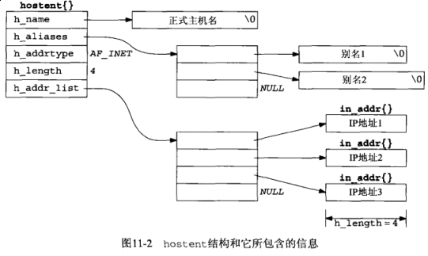
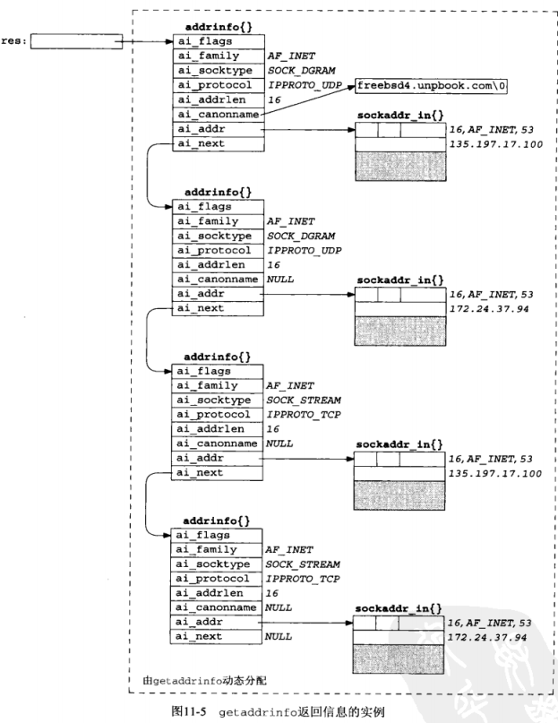

## 第十一章 名字与地址转换

### 11.2 域名系统



### 11.3 [gethostbyname](http://man7.org/linux/man-pages/man3/gethostbyname.3.html) 函数

```c
// $ man gethostbyname
struct hostent {
    char  *h_name;            /* official name of host */
    char **h_aliases;         /* alias list */
    int    h_addrtype;        /* host address type */
    int    h_length;          /* length of address */
    char **h_addr_list;       /* list of addresses */
}
#define h_addr h_addr_list[0] /* for backward compatibility */
```



*hostent* 的用法参考 [hostent.c](hostent.c)

```c
#include <netdb.h>
#include <sys/socket.h>
#include <arpa/inet.h>
#include <stdlib.h>
#include <stdio.h>
#include "../lib/error.h"

#ifndef INET_ADDRSTRLEN
#define INET_ADDRSTRLEN 16  /* "ddd.ddd.ddd.ddd\0"
                                1234567890123456 */
#endif

int main(int argc, char **argv) {
    char           *ptr, **pptr;
    char            str[INET_ADDRSTRLEN];
    struct hostent *hptr;

    while (--argc > 0) {
        ptr = *++argv;
        if ((hptr = gethostbyname(ptr)) == NULL) {
            err_msg("gethostbyname error for host: %s: %s", ptr, hstrerror(h_errno));
            continue;
        }
        printf("official hostname: %s\n", hptr->h_name);

        for (pptr = hptr->h_aliases; *pptr != NULL; pptr++) {
            printf("\talias: %s\n", *pptr);
        }

        switch (hptr->h_addrtype) {
            case AF_INET:
                pptr = hptr->h_addr_list;
                for (; *pptr != NULL; pptr++) {
                    printf("\t address: %s\n", inet_ntop(hptr->h_addrtype, *pptr, str, sizeof(str)));
                }
            default:
                err_ret("unknown address type");
                break;
        }
    }
    exit(0);
}
```

```sh
$ gcc hostent.c ../lib/error.h ../lib/error.c -o hostent
$ ./hostent www.baidu.com
official hostname: www.a.shifen.com
         address: 220.181.112.244
         address: 220.181.111.188
unknown address type: Success
```

此函数和 *gethostbyaddr* 通常涉及以下三个文件( `$ man gethostbyname` )

- /etc/host.conf
- /etc/hosts
- /etc/nsswitch.conf

#### 11.4 [gethostbyaddr](http://man7.org/linux/man-pages/man3/gethostbyaddr.3.html) 函数

#### 11.5 [getservbyname](http://man7.org/linux/man-pages/man3/getservbyname.3.html) 和 [getservbyport](http://man7.org/linux/man-pages/man3/getservbyport.3.html) 函数

在程序中我们通常通过端口或名称来指代一个服务，名字到端口的映射文件通常是 */etc/services*，当端口发生变动是我们仅修改 */etc/services* 即可，而不必重新编译应用程序。

```c
// $ man getservbyname
struct servent {
    char  *s_name;       /* official service name */
    char **s_aliases;    /* alias list */
    int    s_port;       /* port number */
    char  *s_proto;      /* protocol to use */
}
```

让我们来查看一下我们系统的 *echo* 服务的众所周知的端口

```sh
$ grep '^echo ' /etc/services
echo                7/tcp
echo                7/udp
$ grep 514 /etc/services        # 相同端口号，不同协议，不同服务
shell             514/tcp
syslog            514/udp
```

本函数的常用用法为

```c
struct servent *sptr;

sptr = getservbyname("echo", "tcp");
// 此port必须为网络字节序
sptr = getservbyport(htons(7), "tcp");
```

我们写一个例子来看一下实际用法

```c
#include <arpa/inet.h>
#include <netdb.h>
#include <netinet/in.h>
#include <stdio.h>
#include <string.h>
#include <strings.h>
#include <sys/socket.h>
#include <unistd.h>
#include "../lib/error.h"

#define MAXLINE 4096 /* max text line length */

char *Sock_ntop(const struct sockaddr *sa, socklen_t salen);

int main(int argc, char **argv) {
    int                  sockfd, n;
    char                 recvline[MAXLINE + 1];
    struct sockaddr_in   servaddr;
    struct in_addr     **pptr;
    struct in_addr      *inetaddrp[2];
    struct in_addr       inetaddr;
    struct hostent       *hp;
    struct servent       *sp;

    if (argc != 3) {
        err_quit("usage: daytimedaycli1 <hostname> <service>");
    }
    // 通过主机或IP地址获取 struct in_addr 结构数据
    if ((hp = gethostbyname(argv[1])) == NULL) {
        // a.b.c.d
        if (inet_aton(argv[1], &inetaddr) == 0) {
            err_quit("hostname error for %s: %s", argv[1], hstrerror(h_errno));
        } else {
            inetaddrp[0] = &inetaddr;
            inetaddrp[1] = NULL;
            pptr = inetaddrp;
        }
    } else {
        pptr = (struct in_addr **) hp->h_addr_list;
    }

    // 根据服务名称查找对应端口（找到的端口为网络字节序，无需再次转换）
    if ((sp = getservbyname(argv[2], "tcp")) == NULL) {
        err_quit("getservbyname error for %s", argv[2]);
    }

    // 从已知的主机列表中绑定一个TCP连接
    for (; *pptr != NULL; pptr++) {
        if ((sockfd = socket(AF_INET, SOCK_STREAM, 0)) == -1) {
            err_sys("socket error");
        }
        bzero(&servaddr, sizeof(servaddr));
        servaddr.sin_family = AF_INET;
        servaddr.sin_port = sp->s_port;
        memcpy(&servaddr.sin_addr, *pptr, sizeof(struct in_addr));
        printf("trying %s\n", Sock_ntop((struct sockaddr *) &servaddr, sizeof(servaddr)));

        if (connect(sockfd, (struct sockaddr *) &servaddr, sizeof(servaddr)) == 0) {
            break; /* success */
        }
        err_ret("connect error");
        close(sockfd);
    }
    if (*pptr == NULL) {
        err_quit("unable to connect");
    }
    while ((n = read(sockfd, recvline, MAXLINE)) > 0) {
        recvline[n] = 0; /* null terminate */
        fputs(recvline, stdout);
    }
}
```

**Note**: *gethostbyname* 和 *gethostbyaddr* 这两个仅支持IPv4。

#### 11.6 [getaddrinfo](http://man7.org/linux/man-pages/man3/getaddrinfo.3.html) 函数

```c
// $ man getaddrinfo
int getaddrinfo(const char *node,
                const char *service,
                const struct addrinfo *hints,
                struct addrinfo **res); // 返回结果

struct addrinfo {
    int              ai_flags;
    int              ai_family;
    int              ai_socktype;
    int              ai_protocol;
    socklen_t        ai_addrlen;
    struct sockaddr *ai_addr;
    char            *ai_canonname;
    struct addrinfo *ai_next;
};
```

在 *addrinfo* 结构中返回的信息可现成用于 *socket* 调用，随后现成用于适合客户的 *connect* 或 *sendto* 调用，或者是适合服务器的 *bind* 调用。

*socket* 函数的参数就是 *addrinfo* 结构中的 *ai_family*, *ai_socktype*, *ai_addr* 成员。

*connect* 或 *bind* 函数的第二个和第三个参数就是该结构中的 *ai_addr* 和 *ai_addrlen* 成员。

通常用法如下：

```c
struct addrinfo  hints;
struct addrinfo *res;

bzero(&hints, sizeof(hints));
hints.ai_flags = AI_CANONNAME;
hints.ai_family = AF_INET;

getaddrinfo("localhost", "domain", &hints, &res);
```



我们来看一下一些常用的操作。

(1) 指定 *hostname* 和 *service*

这是TCP或UDP客户进程调用 *getaddrinfo* 的常规输入。

TCP客户: 循环尝试（`socket->connect`）返回的每个地址，直到成功。

UDP客户: 将 *getaddrinfo* 提供的结构用于 *sendto* 或 *connect*

如果客户清楚自己处理哪种类型套接字，那么应该把 *hints.ai_socktype* 设成 *SOCK_STREAM* 或 *SOCK_DGRAM*

(2) 典型的服务器进程只指定 *service* 而不指定 *hostname*，同时在 *hints* 结构中指定 *AI_PASSIVE* 标志

TCP服务器: `socket->bind->listen` 后，若要从 *accept* 获取客户端地址，那么返回的 *ai_addrlen* 提供了这个套接字地址结构的大小（参见 [tcp_listen.c](tcp_listen.c) 例子）

UDP服务器: `socket->bind->recvfrom`，若服务器想要从 *recvfrom* 获取客户端地址，那么返回的 *ai_addrlen* 提供了这个套接字地址结构的大小（参见 [udp_client.c](udp_client.c) 例子）

同上，如果服务清楚自己处理哪种类型套接字，那么应该把 *hints.ai_socktype* 设成 *SOCK_STREAM* 或 *SOCK_DGRAM*

(3) 多个套接字

TCP/UDP服务器通过 *select* 或 *poll* 处理多个套接字，可直接利用返回中的 *addrinfo*

**Note**: *getaddrinfo* 解决了把主机名和服务器名转换成套接字地址结构的问题。

我们利用 `$ man 3 getaddrinfo` 提供的 **EXAMPLE** 来结算本小节的内容

[getaddrinfo_srv.c](getaddrinfo_srv.c), [getaddrinfo_cli.c](getaddrinfo_cli.c)

TODO: 没有成功运行起来

#### 11.7 [gai_strerror](http://man7.org/linux/man-pages/man3/gai_strerror.3.html) 函数

#### 11.8 [freeaddrinfo](http://man7.org/linux/man-pages/man3/freeaddrinfo.3.html) 函数

*getaddrinfo* 返回的所有存储空间都是动态分配的，我们需要手动调用 *freeaddrinfo* 释放其消耗的内存空间。

#### 11.9 [getaddrinfo](http://man7.org/linux/man-pages/man3/getaddrinfo.3.html) 函数：IPv6

#### 11.10 [getaddrinfo](http://man7.org/linux/man-pages/man3/getaddrinfo.3.html) 函数：例子

#### 11.11 [host_serv](host_serv.c) 函数

```c
#include <netdb.h>
#include <stdio.h>
#include <strings.h>
#include <sys/socket.h>
#include <sys/types.h>

struct addrinfo *host_serv(const char *host, const char *serv, int family, int socktype)
{
    int              n;
    struct addrinfo  hints;
    struct addrinfo *res;

    // memset(&hints, 0, sizeof(struct addrinfo)); // or this
    bzero(&hints, sizeof(struct addrinfo));
    hints.ai_flags = AI_CANONNAME; // always return canonical name
    hints.ai_family = family;      // AF_UNSPEC, AF_INET, AF_INET6, etc.
    hints.ai_socktype = socktype;  // 0, SOCK_STREAM, SOCK_DGRAM, etc.
    if ((n = getaddrinfo(host, serv, &hints, &res)) != 0) {
        return(NULL);
    }
    return(res);
}
```

#### 11.12 [tcp_connect](tcp_connect.c) 函数

```c
#include <netdb.h>
#include <stdio.h>
#include <strings.h>
#include <sys/socket.h>
#include <sys/types.h>
#include <stdlib.h>
#include <unistd.h>

int tcp_connect(const char *host, const char *serv)
{
    int              sockfd, n;
    struct addrinfo  hints;
    struct addrinfo *res;
    struct addrinfo *ressave;

    // memset(&hints, 0, sizeof(struct addrinfo)); // or this
    bzero(&hints, sizeof(struct addrinfo));
    hints.ai_family = AF_UNSPEC;
    hints.ai_socktype = SOCK_STREAM;

    if ((n = getaddrinfo(host, serv, &hints, &res)) != 0) {
        fprintf(stderr, "tcp_connect error for %s, %s: %s", host, serv, gai_strerror(n));
        exit(EXIT_FAILURE);
    }
    ressave = res;
    do {
        if ((sockfd = socket(res->ai_family, res->ai_socktype, res->ai_protocol)) < 0) {
            continue; // ignore this one
        }
        if (connect(sockfd, res->ai_addr, res->ai_addrlen) == 0) {
            break; // success
        }
        close(sockfd);
    } while ((res = res->ai_next) != NULL);
    if (res == NULL) {
        fprintf(stderr, "tcp_connect error for %s, %s", host, serv);
        exit(EXIT_FAILURE);
    }
    freeaddrinfo(ressave);
    return(sockfd);
}
```

例子：时间获取客户程序[daytimetcpcli.c](daytimetcpcli.c)

```c
#include <errno.h>
#include <stdio.h>
#include <stdlib.h>
#include <string.h>
#include <sys/socket.h>
#include <unistd.h>

#define MAXLINE 4096 /* max text line length */

int tcp_connect(const char *host, const char *serv);

int main(int argc, char **argv)
{
    int                     sockfd, n;
    char                    recvline[MAXLINE + 1];
    socklen_t               len;
    struct sockaddr_storage ss;

    if (argc != 3) {
        fprintf(stderr, "usage: daytimetcpcli <hostname/IPaddress> <service/port#>\n");
        exit(EXIT_FAILURE);
    }
    sockfd = tcp_connect(argv[1], argv[2]);
    len = sizeof(ss);
    if (getpeername(sockfd, (struct sockaddr *) &ss, &len) == -1) {
        fprintf(stderr, "getpeername error: %s\n", strerror(errno));
        exit(EXIT_FAILURE);
    }
    while ((n = read(sockfd, recvline, MAXLINE)) > 0) {
        recvline[n] = 0; // null terminate
        fputs(recvline, stdout);
    }
    exit(EXIT_SUCCESS);
}
```

TODO: 未运行起来

#### 11.13 [tcp_listen](tcp_listen.c) 函数

```c
#include <netdb.h>
#include <stdio.h>
#include <strings.h>
#include <sys/socket.h>
#include <sys/types.h>
#include <stdlib.h>
#include <unistd.h>
#include <errno.h>
#include <string.h>

#define LISTENQ 1024

int tcp_listen(const char *host, const char *serv, socklen_t *addrlenp)
{
    int              listenfd, n;
    const int        on = 1;
    struct addrinfo  hints;
    struct addrinfo *res;
    struct addrinfo *ressave;

    // memset(&hints, 0, sizeof(struct addrinfo)); // or this
    bzero(&hints, sizeof(struct addrinfo));
    hints.ai_flags = AI_PASSIVE;
    hints.ai_family = AF_UNSPEC;
    hints.ai_socktype = SOCK_STREAM;

    if ((n = getaddrinfo(host, serv, &hints, &res)) != 0) {
        fprintf(stderr, "tcp_listen error for %s, %s: %s", host, serv, gai_strerror(n));
        exit(EXIT_FAILURE);
    }
    ressave = res;
    do {
        if ((listenfd = socket(res->ai_family, res->ai_socktype, res->ai_protocol)) < 0) {
            continue; // error, try next one
        }
        if (setsockopt(listenfd, SOL_SOCKET, SO_REUSEADDR, &on, sizeof(on)) == -1) {
            fprintf(stderr, "setsockopt error, %s", strerror(errno));
            freeaddrinfo(ressave);
            exit(EXIT_FAILURE);
        }
        if (bind(listenfd, res->ai_addr, res->ai_addrlen) == 0) {
            break;
        }
        close(listenfd);
    } while ((res = res->ai_next) != NULL);

    if (res == NULL) {
        fprintf(stderr, "tcp_listen error for %s, %s", host, serv);
        exit(EXIT_FAILURE);
    }
    if (listen(listenfd, LISTENQ) == -1) {
        freeaddrinfo(ressave);
        exit(EXIT_FAILURE);
    }
    if (addrlenp) {
        *addrlenp = res->ai_addrlen; // return size of protocol address
    }
    freeaddrinfo(ressave);

    return(listenfd);
}
```

11.13.1 例子：[时间获取服务器程序](daytimetcpsrv1.c)

```c
#include <errno.h>
#include <stdio.h>
#include <stdlib.h>
#include <string.h>
#include <sys/socket.h>
#include <time.h>
#include <unistd.h>

#define MAXLINE 4096 /* max text line length */

char *Sock_ntop(const struct sockaddr *sa, socklen_t salen);
int tcp_listen(const char *host, const char *serv, socklen_t *addrlenp);

int main(int argc, char **argv)
{
    int                     listenfd, connfd;
    socklen_t               len;
    char                    buf[MAXLINE];
    time_t                  ticks;
    struct sockaddr_storage cliaddr;

    if (argc != 2) {
        fprintf(stderr, "usage: daytimetcpsrv1 <service or port#>\n");
        exit(EXIT_FAILURE);
    }

    listenfd = tcp_listen(NULL, argv[1], NULL);

    for (;;) {
        len = sizeof(cliaddr);
        if ((connfd = accept(listenfd, (struct sockaddr *) &cliaddr, &len)) == -1) {
            fprintf(stderr, "accept error: %s\n", strerror(errno));
            close(listenfd);
            exit(EXIT_FAILURE);
        }
        printf("connection from %s\n", Sock_ntop((struct sockaddr *) &cliaddr, len));

        ticks = time(NULL);
        snprintf(buf, sizeof(buf), "%.24s\r\n", ctime(&ticks));
        if (write(connfd, buf, strlen(buf)) == -1) {
            fprintf(stderr, "write error: %s\n", strerror(errno));
            close(listenfd);
            close(connfd);
            exit(EXIT_FAILURE);
        }
        close(connfd);
    }
    exit(EXIT_SUCCESS);
}
```

```sh
# 服务端
$ sudo vim /etc/services    # add services
$ tail -n 2 /etc/services
unpv13e         58888/tcp
unpv13e         58888/udp
$ gcc daytimetcpsrv1.c tcp_listen.c ../lib/sock_ntop.c -o daytimetcpsrv1
$ ./daytimetcpsrv1 unpv13e

# 客户端
$ gcc daytimetcpcli1.c ../lib/error.h ../lib/error.c ../lib/sock_ntop.c -o daytimetcpcli1
$ ./daytimetcpcli1 localhost unpv13e
Sat Dec  9 15:01:58 2017
```

11.13.2 例子：[可指定协议的时间获取服务器程序](daytimetcpsrv2.c)

上边的例子存在个问题：*tcp_listen* 的第一个参数是空指针，而且由 *tcp_listen* 内部指定的地址族为 *AF_UNSPEC*，两者结合可能导致 *getaddrinfo* 返回非期望地址族的套接字地址结构。

例：在双栈主机上，返回的第一个套接字地址结构可能是IPv6族的套接字地址结构，但我们可能希望该服务器仅仅处理IPv4。

这里有一个简单的技巧允许我们强制服务器使用某个指定的协议 - 或为IPv4，或为IPv6。

```c
inet_pton(AF_INET, "0.0.0.0", &foo);    // success
inet_pton(AF_INET, "0::0", &foo);       // fails
inet_pton(AF_INET6, "0.0.0.0", &foo);   // fails
inet_pton(AF_INET6, "0::0", &foo);      // success
```

因此我们利用这个技巧重新修改一下上述例子, [daytimetcpsrv2.c](daytimetcpsrv2.c)

```c
#include <errno.h>
#include <stdio.h>
#include <stdlib.h>
#include <string.h>
#include <sys/socket.h>
#include <time.h>
#include <unistd.h>

#define MAXLINE 4096 /* max text line length */

char *Sock_ntop(const struct sockaddr *sa, socklen_t salen);
int tcp_listen(const char *host, const char *serv, socklen_t *addrlenp);

int main(int argc, char **argv)
{
    int                     listenfd, connfd;
    socklen_t               len;
    char                    buf[MAXLINE];
    time_t                  ticks;
    struct sockaddr_storage cliaddr;

    if (argc == 2) {
        listenfd = tcp_listen(NULL, argv[1], NULL);
    } else if (argc == 3) {
        listenfd = tcp_listen(argv[1], argv[2], NULL);
    } else {
        fprintf(stderr, "usage: daytimetcpsrv2 [ <host> ] <service or port#>\n");
        exit(EXIT_FAILURE);
    }

    for (;;) {
        len = sizeof(cliaddr);
        if ((connfd = accept(listenfd, (struct sockaddr *) &cliaddr, &len)) == -1) {
            fprintf(stderr, "accept error: %s\n", strerror(errno));
            close(listenfd);
            exit(EXIT_FAILURE);
        }
        printf("connection from %s\n", Sock_ntop((struct sockaddr *) &cliaddr, len));

        ticks = time(NULL);
        snprintf(buf, sizeof(buf), "%.24s\r\n", ctime(&ticks));
        if (write(connfd, buf, strlen(buf)) == -1) {
            fprintf(stderr, "write error: %s\n", strerror(errno));
            close(listenfd);
            close(connfd);
            exit(EXIT_FAILURE);
        }
        close(connfd);
    }
    exit(EXIT_SUCCESS);
}
```

```sh
$ sudo vim /etc/services # add services
$ tail -n 2 /etc/services
unpv13e         58888/tcp
unpv13e         58888/udp

# 服务端
$ gcc daytimetcpsrv2.c tcp_listen.c ../lib/sock_ntop.c -o daytimetcpsrv2
$ ./daytimetcpsrv2 192.168.1.42 unpv13e # 本机IPv4
# $ ./daytimetcpsrv2 0.0.0.0 unpv13e # 本机IPv4
connection from 192.168.1.42:55062

# 客户端
$ nc -vt 192.168.1.42 unpv13e
ArchLinux [192.168.1.42] 58888 (unpv13e) open
Sat Dec  9 15:44:15 2017
```

#### 11.14 [udp_client](udp_client.c) 函数

```c
#include <netdb.h>
#include <stdio.h>
#include <stdlib.h>
#include <string.h>
#include <strings.h>
#include <sys/socket.h>
#include <sys/types.h>

int udp_client(const char *host, const char *serv, struct sockaddr **saptr, socklen_t *lenp)
{
    int              sockfd, n;
    struct addrinfo  hints;
    struct addrinfo *res;
    struct addrinfo *ressave;

    // memset(&hints, 0, sizeof(struct addrinfo)); // or this
    bzero(&hints, sizeof(struct addrinfo));
    hints.ai_family = AF_UNSPEC;
    hints.ai_socktype = SOCK_DGRAM;

    if ((n = getaddrinfo(host, serv, &hints, &res)) != 0) {
        fprintf(stderr, "udp_client error for %s, %s: %s", host, serv, gai_strerror(n));
        exit(EXIT_FAILURE);
    }
    ressave = res;

    do {
        if ((sockfd = socket(res->ai_family, res->ai_socktype, res->ai_protocol)) > 0) {
            break; // success
        }
    } while ((res = res->ai_next) != NULL);

    if (res == NULL) { // errno set from final socket()
        fprintf(stderr, "udp_client error for %s, %s", host, serv);
        exit(EXIT_FAILURE);
    }
    *saptr = (struct sockaddr *) malloc(res->ai_addrlen);
    memcpy(*saptr, res->ai_addr, res->ai_addrlen);
    *lenp = res->ai_addrlen;

    freeaddrinfo(ressave);
    return(sockfd);
}
```

例子：协议无关时间获取客户程序[daytimeudpcli1.c](daytimeudpcli1.c)

```c
#include <sys/socket.h>
#include <stdio.h>
#include <stdlib.h>
#include <errno.h>
#include <string.h>

#define MAXLINE 4096 /* max text line length */

char *Sock_ntop_host(const struct sockaddr *sa, socklen_t salen);
int udp_client(const char *host, const char *serv, struct sockaddr **saptr, socklen_t *lenp);

int main(int argc, char **argv)
{
    int              sockfd, n;
    char             recvline[MAXLINE + 1];
    socklen_t        salen;
    struct sockaddr *sa;

    if (argc != 3) {
        fprintf(stderr, "usage: daytimeudpcli1 <hostname/IPaddress> <service/port#>\n");
        exit(EXIT_FAILURE);
    }

    sockfd = udp_client(argv[1], argv[2], &sa, &salen);

    printf("sending to %s\n", Sock_ntop_host(sa, salen));

    if (sendto(sockfd, "", 1, 0, sa, salen) == -1) {
        fprintf(stderr, "sendto error: %s", strerror(errno));
        exit(EXIT_FAILURE);
    }

    if ((n = recvfrom(sockfd, recvline, MAXLINE, 0, NULL, NULL)) == -1) {
        fprintf(stderr, "recvfrom error: %s", strerror(errno));
        exit(EXIT_FAILURE);
    }
    recvline[n] = '\0'; // null terminal
    fputs(recvline, stdout);
    exit(EXIT_SUCCESS);
}
```

```sh
$ gcc daytimeudpcli1.c udp_client.c ../lib/sock_ntop_host.c -o daytimeudpcli1
```

TODO: 没能运行起来

#### 11.15 [udp_connect](udp_connect.c) 函数

```c
#include <netdb.h>
#include <stdio.h>
#include <stdlib.h>
#include <unistd.h>
#include <strings.h>
#include <sys/socket.h>
#include <sys/types.h>

int udp_connect(const char *host, const char *serv)
{
    int              sockfd, n;
    struct addrinfo  hints;
    struct addrinfo *res;
    struct addrinfo *ressave;

    // memset(&hints, 0, sizeof(struct addrinfo)); // or this
    bzero(&hints, sizeof(struct addrinfo));
    hints.ai_family = AF_UNSPEC;
    hints.ai_socktype = SOCK_DGRAM;

    if ((n = getaddrinfo(host, serv, &hints, &res)) != 0) {
        fprintf(stderr, "udp_connect error for %s, %s: %s", host, serv, gai_strerror(n));
        exit(EXIT_FAILURE);
    }
    ressave = res;

    do {
        if ((sockfd = socket(res->ai_family, res->ai_socktype, res->ai_protocol)) < 0) {
            continue;
        }
        if (connect(sockfd, res->ai_addr, res->ai_addrlen) == 0) {
            break; // success
        }
        close(sockfd);
    } while ((res = res->ai_next) != NULL);

    if (res == NULL) {
        fprintf(stderr, "udp_connect error for %s, %s", host, serv);
        exit(EXIT_FAILURE);
    }
    freeaddrinfo(ressave);
    return(sockfd);
}
```

本函数几乎等同于 *tcp_connect*。两者的差别之一是UDP套接字上的 *connect* 调用不会发送任何东西到对端。如果存在错误（譬如对端不可达或所指定端口上没有服务器），**调用者就得等到向对端发送一个数据报之后才能发现。**

#### 11.16 [udp_server](udp_server.c) 函数

```c
#include <netdb.h>
#include <stdio.h>
#include <stdlib.h>
#include <unistd.h>
#include <strings.h>
#include <sys/socket.h>
#include <sys/types.h>

int udp_server(const char *host, const char *serv, socklen_t *addrlenp)
{
    int              sockfd, n;
    struct addrinfo  hints;
    struct addrinfo *res;
    struct addrinfo *ressave;

    // memset(&hints, 0, sizeof(struct addrinfo)); // or this
    bzero(&hints, sizeof(struct addrinfo));
    hints.ai_flags = AI_PASSIVE;
    hints.ai_family = AF_UNSPEC;
    hints.ai_socktype = SOCK_DGRAM;

    if ((n = getaddrinfo(host, serv, &hints, &res)) != 0) {
        fprintf(stderr, "udp_server error for %s, %s: %s", host, serv, gai_strerror(n));
        exit(EXIT_FAILURE);
    }
    ressave = res;

    do {
        if ((sockfd = socket(res->ai_family, res->ai_socktype, res->ai_protocol)) < 0) {
            continue;
        }
        if (bind(sockfd, res->ai_addr, res->ar_addrlen) == 0) {
            break; // sucess
        }
        close(sockfd); // bind error - close and try next one
    } while ((res = res->ai_next) != NULL);

    if (res == NULL) { // errno from final socket() or bind()
        fprintf(stderr, "udp_server error for %s, %s", host, serv);
        exit(EXIT_FAILURE);
    }
    if (addrlenp) {
        *addrlenp = res->ai_addrlen; // return size of protocol address
    }
    freeaddrinfo(ressave);
    return(sockfd);
}
```

例子：协议无关时间获取服务器程序[daytimeudpsrv2.c](daytimeudpsrv2.c)

```c
#include <errno.h>
#include <stdio.h>
#include <stdlib.h>
#include <string.h>
#include <sys/socket.h>
#include <time.h>
#include <unistd.h>

#define MAXLINE 4096 /* max text line length */

char *Sock_ntop(const struct sockaddr *sa, socklen_t salen);
int udp_server(const char *host, const char *serv, socklen_t *addrlenp);

int main(int argc, char **argv)
{
    int                     sockfd;
    ssize_t                 n;
    char                    buff[MAXLINE];
    time_t                  ticks;
    socklen_t               len;
    struct sockaddr_storage cliaddr;

    if (argc == 2) {
        sockfd = udp_server(NULL, argv[1], NULL);
    } else if (argc == 3) {
        sockfd = udp_server(argv[1], argv[2], NULL);
    } else {
        fprintf(stderr, "usage: daytimeudpsrv2 [ <host> ] <service or port#>\n");
        exit(EXIT_FAILURE);
    }

    for (;;) {
        len = sizeof(cliaddr);
        if ((n = recvfrom(sockfd, buff, MAXLINE, 0, (struct sockaddr *) &cliaddr, &len)) == -1) {
            fprintf(stderr, "recvfrom error: %s", strerror(errno));
            exit(EXIT_FAILURE);
        }
        printf("datagram from %s\n", Sock_ntop((struct sockaddr *) &cliaddr, len));

        ticks = time(NULL);
        snprintf(buff, sizeof(buff), "%.24s\r\n", ctime(&ticks));
        if (sendto(sockfd, buff, strlen(buff), 0, (struct sockaddr *) &cliaddr, len) == -1) {
            fprintf(stderr, "sendto error: %s", strerror(errno));
            exit(EXIT_FAILURE);
        }
    }
    exit(EXIT_SUCCESS);
}
```

```sh
$ sudo vim /etc/services # add services
$ tail -n 2 /etc/services
unpv13e         58888/tcp
unpv13e         58888/udp

# 服务端
$ gcc daytimeudpsrv2.c udp_server.c ../lib/sock_ntop.c -o daytimeudpsrv2
$ ./daytimeudpsrv2 localhost unpv13e

# 客户端
$ gcc daytimeudpcli1.c udp_client.c ../lib/sock_ntop_host.c -o daytimeudpcli1
$ ./daytimeudpcli1 localhost unpv13e
ArchLinux [192.168.1.42] 58888 (unpv13e) open
Sat Dec  9 15:44:15 2017
```

#### 11.17 [getnameinfo](http://man7.org/linux/man-pages/man3/getnameinfo.3.html) 函数

```c
// man getnameinfo
#include <sys/socket.h>
#include <netdb.h>

int getnameinfo(const struct sockaddr *addr,
                socklen_t addrlen,
                char *host, socklen_t hostlen,
                char *serv, socklen_t servlen,
                int flags);
```

*sockaddr*, *addrlen* 通常由 *accept*, *recvfrom*, *getsockname* 或 *getpeername* 返回。

若不想返回主机字符串，指定 *hostlen* 为0

若不想返回服务名称，则指定 *servlen* 为0

调用此函数时，通常涉及以下文件

```
/etc/hosts
/etc/nsswitch.conf
/etc/resolv.conf
```

#### 11.18 可重入函数

#### 11.19 [gethostbyname_r](http://man7.org/linux/man-pages/man3/gethostbyname_r.3.html) 和 [gethostbyaddr_r](http://man7.org/linux/man-pages/man3/gethostbyaddr_r.3.html) 函数

有两种办法可以把诸如 *gethostbyname* 之类不可重入的函数改为可重入函数。

(1) 把由不可重入函数填写并返回静态结构的做法改为由调用者分配再由可重入函数填写结构。（特点：自定义结构--结构复杂--及内存分配，内存释放）

(2) 由可重入函数调用 *malloc* 以动态分配内存空间。（特点：主动调用 *freeaddrinfo* 函数）

#### 11.21 其他网络相关信息

| 信息 | 数据文件       | 结构     | 键值查找函数                     |
| ---- | -------------- | -------- | -------------------------------- |
| 主机 | /etc/hosts     | hostent  | gethostbyaddr, gethostbyname     |
| 网络 | /etc/networks  | netent   | getnetbyaddr, getnetbyname       |
| 协议 | /etc/protocols | protoent | getprotobyname, getprotobynumber |
| 服务 | /etc/services  | servent  | getservbyname, getservbyport     |

#### 11.22 小结

*getaddrinfo*, *getnamebyinfo* 更为有用，既能解析IPv6地址，有符合线程安全调用约定。
