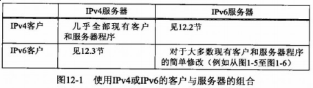
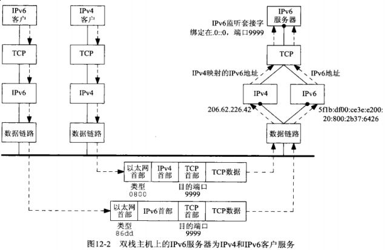
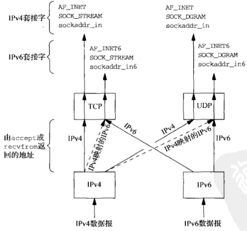
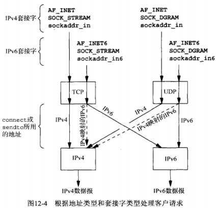

## 第十二章 IPv4与IPv6的互操作性

#### 12.1 概述

双栈(dual stacks) 意指一个IPv4协议栈和一个IPv6协议栈。

#### 12.2 IPv4客户与IPv6服务器

双栈主机的一个基本特性是其上的IPv6服务器既能处理IPv4客户，又能处理IPv6客户。这是通过使用Ipv4映射的IPv6地址实现的。

#### 12.3 IPv6客户与IPv4服务器

考虑运行在一个双栈主机上的IPv6的TCP客户端。

#### 12.4 IPv6地址测试宏

#### 12.5 源代码可移植性

#### 12.6 小结

**双栈**主机上的IPv6服务器既能服务于IPv4客户，又能服务于IPv6客户。

**双栈**主机上的IPv6客户能够和IPv4服务器通信。

图片来源：[UNP](https://www.amazon.cn/UNIX%E7%BD%91%E7%BB%9C%E7%BC%96%E7%A8%8B-%E5%A5%97%E6%8E%A5%E5%AD%97%E8%81%94%E7%BD%91API-%E5%8F%B2%E8%92%82%E6%96%87%E6%96%AF/dp/B011S72JB6/ref=sr_1_3?ie=UTF8&qid=1512463174&sr=8-3&keywords=unix+network+programming)
