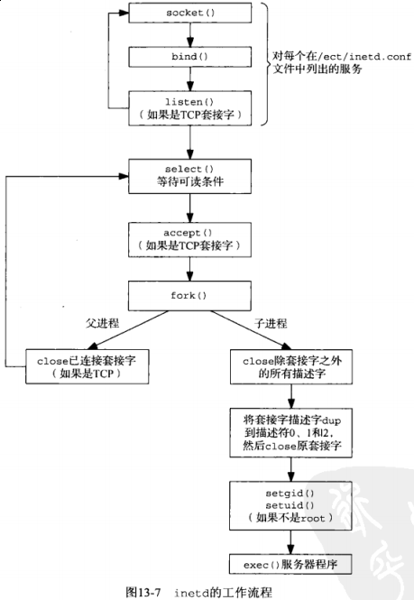

## 第十三章 守护进程和inetd超级服务器

#### 13.2 syslogd 守护进程

启动步骤：

(1) 读取配置文件

(2) 创建一个Unix域数据报套接字，并捆绑路径名 */var/run/log* （某些系统上是 */dev/log*）

(3) 创建一个UDP套接字，捆绑端口514（*syslog* 服务使用的端口号）

(4) 打开路径名 */dev/klog*

此后 *syslogd* 守护进程在一个无限循环中运行：调用 *select* 以等待它的3个描述符（步骤2,3,4）之一变为刻度，读入日志消息，并按照配置文件进行处理。

若守护进程受到 *SIGHUP* 信号，那么重新读取配置文件。

#### 13.3 [syslog](http://man7.org/linux/man-pages/man2/syslog.2.html) 函数

日志消息也可由 *logger* 命令产生。

#### 13.4 [daemon_init](daemon_init.c) 函数

可参考APUE第九章

```c
#include <syslog.h>
#include <unistd.h>
#include <sys/types.h>
#include <signal.h>
#include <stdlib.h>
#include <errno.h>
#include <string.h>
#include <sys/stat.h>
#include <fcntl.h>

#define MAXFD 64

extern int daemon_proc; // defined in error.c

int daemon_init(const char *pname, int facility)
{
    int i;
    pid_t pid;

    if ((pid = fork()) < 0) {
        return(-1);
    } else if (pid) { // parent
        _exit(0);
    }
    // child 1
    // #1 子进程脱离父进程，有自己的进程ID，但继承了父进程的进程组ID

    // #2 创建新会话，当前进程变为新会话的会话头进程以及新进程组的进程组头，不再有控制终端。
    if (setsid() < 0) { // become session leader
        return(-1);
    }
    signal(SIGHUP, SIG_IGN);
    if ((pid = fork()) < 0) {
        return(-1);
    } else if (pid) {
        _exit(0); // child 1 terminates
    }
    // child 2
    daemon_proc = 1;
    chdir("/"); // change working directory

    // close off file descriptors
    for (i = 0; i < MAXFD; i++) {
        close(i);
    }
    // redirect stdin, stdout and stderr to /dev/null
    open("/dev/null", O_RDONLY);
    open("/dev/null", O_RDWR);
    open("/dev/null", O_RDWR);

    openlog(pname, LOG_PID, facility);
    return(0);
}
```

代码层面分析请看原书内容。

例子：作为守护进程运行的时间获取服务器程序

```c
#include <errno.h>
#include <stdio.h>
#include <stdlib.h>
#include <string.h>
#include <sys/socket.h>
#include <time.h>
#include <unistd.h>
#include "../lib/error.h"

#define MAXLINE 4096 /* max text line length */

int daemon_init(const char *pname, int facility);
char *Sock_ntop(const struct sockaddr *sa, socklen_t salen);
int tcp_listen(const char *host, const char *serv, socklen_t *addrlenp);

int main(int argc, char **argv)
{
    int              listenfd, connfd;
    socklen_t        addrlen, len;
    struct sockaddr *cliaddr;
    char             buf[MAXLINE];
    time_t           ticks;

    if (argc < 2 || argc > 3) {
        err_quit("usage: daytimetcpsrv2 [ <host> ] <service or port>");
    }

    daemon_init(argv[0], 0);

    if (argc == 2) {
        listenfd = tcp_listen(NULL, argv[1], &addrlen);
    } else {
        listenfd = tcp_listen(argv[1], argv[2], &addrlen);
    }

    cliaddr = (struct sockaddr *) malloc (addrlen);

    for (;;) {
        len = addrlen;
        if ((connfd = accept(listenfd, (struct sockaddr *) &cliaddr, &len)) == -1) {
            err_sys("accept error");
        }
        err_msg("connection from %s\n", Sock_ntop((struct sockaddr *) &cliaddr, len));

        ticks = time(NULL);
        snprintf(buf, sizeof(buf), "%.24s\r\n", ctime(&ticks));
        if (write(connfd, buf, strlen(buf)) == -1) {
            err_sys("write error");
        }
        close(connfd);
    }
}
```

```sh
$ sudo vim /etc/services # add services
$ tail -n 2 /etc/services
unpv13e         58888/tcp
unpv13e         58888/udp

# 服务端
$ gcc daytimetcpsrv2.c daemon_init.c ../Chapter11/tcp_listen.c ../lib/sock_ntop.c ../lib/error.c -o daytimetcpsrv2
$ ./daytimetcpsrv2 192.168.1.42 unpv13e
$ ps aux | grep daytimetcpsrv2
fanbin    3129  0.0  0.0   6400  1556 ?        S    14:37   0:00 ./daytimetcpsrv2 192.168.1.42 unpv13e

# 客户端
$ nc -vt 192.168.1.42 unpv13e
$ ArchLinux [192.168.1.42] 58888 (unpv13e) open
$ Mon Dec 11 14:53:19 2017

# syslogd 日志
$ strings user-1000.journal | tail -n 10
~hHX9
3xq?
r`a[p
MESSAGE=connection from 192.168.1.42:35810      # here
_SOURCE_REALTIME_TIMESTAMP=1512976247709692
1'_>q)
)`V9
~hHX9
3xq?
r`a[p
```

#### 13.5 inetd 守护进程



#### 13.6 [daemon_inetd](daemon_inetd.c) 函数

```c
#include <syslog.h>
#include "../lib/error.h"

extern int daemon_proc; // default in error.c

void daemon_inetd(const char *pname, int facility)
{
    daemon_proc = 1;
    openlog(pname, LOG_PID, facility);
}
```

可用于已知由 *inetd* 启动的服务器程序中

例子：由 *inetd* 作为守护进程启动的时间获取服务器程序

```c
#include <time.h>
#include <sys/socket.h>
#include <stdlib.h>
#include <unistd.h>
#include <stdio.h>
#include <string.h>
#include "../lib/error.h"

#define MAXLINE 4096 /* max text line length */

void daemon_inetd(const char *pname, int facility);
char *Sock_ntop(const struct sockaddr *sa, socklen_t salen);

int main(int argc, char **argv)
{
    socklen_t        len;
    struct sockaddr *cliaddr;
    char             buff[MAXLINE];
    time_t           ticks;

    daemon_inetd(argv[0], 0);

    cliaddr = (struct sockaddr *) malloc (sizeof(struct sockaddr_storage));
    len = sizeof(struct sockaddr_storage);
    if (getpeername(0, cliaddr, &len) == -1) {
        err_sys("getpeername error");
    }
    err_msg("connection from %s", Sock_ntop(cliaddr, len));

    ticks = time(NULL);
    snprintf(buff, sizeof(buff), "%.24s\r\n", ctime(&ticks));
    write(0, buff, strlen(buff));

    close(0);
    exit(0);
}
```

```sh
$ sudo vim /etc/services # add services
$ tail -n 2 /etc/services
unpv13e         58888/tcp
unpv13e         58888/udp

$ sudo vim /etc/inet.conf    # not found (ArchLinux)
unpv13e stream tcp nowait fanbin /home/fanbin/github/learn/unpv13e/Chapter13/daytimetcpsrv3 daytimetcpsrv3

$ gcc daytimetcpsrv3.c daemon_inetd.c ../lib/sock_ntop.c ../lib/error.c -o daytimetcpsrv3
```

TODO: 未运行

#### 13.7 小结

启动任意一个程序并让它作为守护进程需要以下步骤：

(1) 调用 *fork* 以转到后台运行

(2) 调用 *setsid* 建立一个新的 *POSIX* 会话并成为会话头

(3) 再次 *fork* 以避免无意中获得新的控制终端

(4) 改变工作目录和文件创建默认掩码

(5) 关闭所有非必要的描述符
