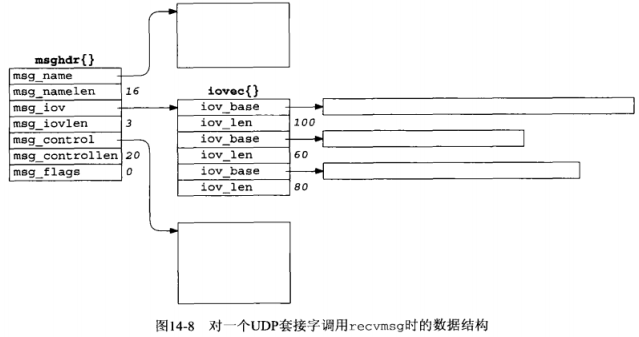
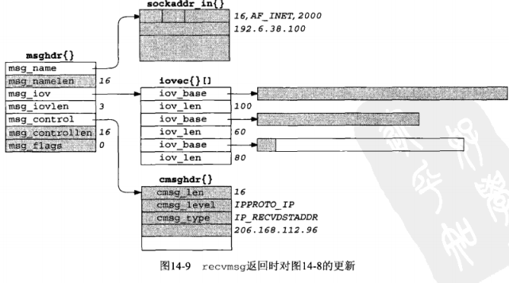
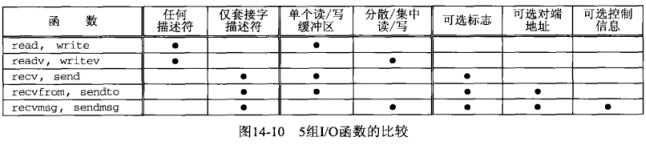
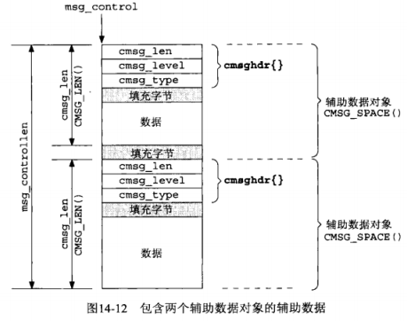
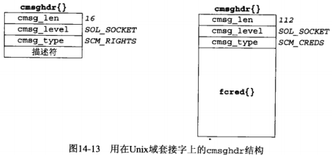

## 第十四章 高级I/O函数

#### 14.1 概述

*read*, *write* 函数的三个变体

- *readv*, *writev*：允许指定往其中输入数据或从其中输出数据的缓冲区向量

- *recv*, *send*：允许通过第四个参数从进程到内核传递标志

- *recvmsg*, *sendmsg*：结合了其他I/O函数的所有特性，并具备接受和发送辅助数据的新能力

本章还考虑如何确定套接字接收缓冲区的数据量，如何在套接字上使用C的标准I/O函数库，并讨论等待事件的一些高级方法。

#### 14.2 套接字超时

在涉及套接字的I/O操作上设置超时的方法有以下3种：

- 调用 *alarm*，在指定的超时期满时产生 *SIGALRM* 信号。（信号处理方法，可能干扰进程中现有的 *alarm* 调用）

- 在 *select* 中阻塞等待I/O，用此替代直接阻塞在 *read* 或 *write* 调用上

- 使用教新的 *SO_RCVTIMEO* 和 *SO_SNDTIMEO* 套接字选项。（并非所有实现都支持）

14.2.1 使用 *SIGALRM* 为 *connect* 设置超时

```c
#include <errno.h>
#include <signal.h>
#include <sys/socket.h>
#include <unistd.h>
#include "../lib/error.h"

static void connect_alarm(int);

typedef void Sigfunc(int);

int connect_timeo(int sockfd, const struct sockaddr *saptr, socklen_t salen, int nsec)
{
    Sigfunc *sigfunc;
    int      n;

    // 设置新的信号中断处理函数，并保留原有中断处理函数
    sigfunc = signal(SIGALRM, connect_alarm);
    if (alarm(nsec) != 0) {
        err_msg("connect_timeo: alarm was already set");
    }
    if ((n = connect(sockfd, saptr, salen)) < 0) {
        close(sockfd);
        if (errno == EINTR) { // 产生中断错误
            errno = ETIMEDOUT;
        }
    }
    alarm(0); // turn off the alarm
    signal(SIGALRM, sigfunc); // restore previous signal handler
    return(n);
}

static void connect_alarm(int signo)
{
    return; // just interrupt the connect()
}
```

我们能减少 *connect* 的超时时间，但是无法延长内核现有的超时。源自Berkeley的内核中 *connect* 的超时通常为75s。

本例子建议只在未线程化或单线程的程序中使用本技术，多线程中正确使用信号非常困难。

14.2.2 使用 *SIGALRM* 为 *recvfrom* 设置超时

[dgclitimeo3.c](dgclitimeo3.c)

```c
#include <errno.h>
#include <netinet/in.h>
#include <signal.h>
#include <stdio.h>
#include <string.h>
#include <unistd.h>
#include "../lib/error.h"

#define MAXLINE 4096 /* max text line length */

static void sig_alrm(int);

void dg_cli(FILE *fp, int sockfd, const struct sockaddr *pservaddr, socklen_t servlen)
{
    int  n;
    char sendline[MAXLINE], recvline[MAXLINE + 1];

    signal(SIGALRM, sig_alrm);

    while (fgets(sendline, MAXLINE, fp) != NULL) {
        if (sendto(sockfd, sendline, strlen(sendline), 0, pservaddr, servlen) == -1) {
            err_sys("sendto error");
        }
        alarm(5);
        if ((n = recvfrom(sockfd, recvline, MAXLINE, 0, NULL, NULL)) == -1) {
            if (errno == EINTR) {
                fprintf(stderr, "socket timeout\n");
            } else {
                err_sys("recvfrom error");
            }
        } else {
            alarm(0);
            recvline[0] = '\0';
            fputs(recvline, stdout);
        }
    }
}

static void sig_alrm(int signo)
{
    return; // just interrupt the recvfrom()
}
```

14.2.3 使用 *select* 为 *recvfrom* 设置超时

[readable_timeo.c](readable_timeo.c)

```c
#include <stdio.h>
#include <sys/select.h>

int readable_timeo(int fd, int sec)
{
    fd_set rset;
    struct timeval tv;

    FD_ZERO(&rset);
    FD_SET(fd, &rset);
    tv.tv_sec = sec;
    tv.tv_usec = 0;
    return(select(fd + 1, &rset, NULL, NULL, &tv));
}
```

[dgclitimeo1.c](dgclitimeo1.c)

```c
#include <sys/socket.h>
#include <stdio.h>
#include <string.h>
#include "../lib/error.h"

#define MAXLINE 4096 /* max text line length */

int readable_timeo(int fd, int sec);

void dg_cli(FILE *fp, int sockfd, const struct sockaddr *pservaddr, socklen_t servlen)
{
    int n;
    char sendline[MAXLINE], recvline[MAXLINE + 1];

    while (fgets(sendline, MAXLINE, fp) != NULL) {
        if (sendto(sockfd, sendline, strlen(sendline), 0, pservaddr, servlen) == -1) {
            err_sys("sendto error");
        }
        if (readable_timeo(sockfd, 5) == 0) {
            fprintf(stderr, "socket timeout\n");
        } else {
            if ((n = recvfrom(sockfd, recvline, MAXLINE, 0, NULL, NULL)) == -1) {
                err_sys("recvfrom error");
            }
            recvline[n] = '\0';
            fputs(recvline, stdout);
        }
    }
}
```

14.2.4 使用 *SO_RECVTIMEO* 套接字选项为 *recvfrom* 设置超时

```c
#include <sys/socket.h>
#include <stdio.h>
#include <string.h>
#include <sys/time.h>
#include <errno.h>
#include "../lib/error.h"

#define MAXLINE 4096 /* max text line length */

void dg_cli(FILE *fp, int sockfd, const struct sockaddr *pservaddr, socklen_t servlen)
{
    int            n;
    char           sendline[MAXLINE];
    char           recvline[MAXLINE + 1];
    struct timeval tv;

    tv.tv_sec = 5;
    tv.tv_usec = 0;
    if (setsockopt(sockfd, SOL_SOCKET, SO_RCVTIMEO, &tv, sizeof(tv)) == -1) {
        err_sys("setsockopt error");
    }

    while (fgets(sendline, MAXLINE, fp) != NULL) {
        if (sendto(sockfd, sendline, strlen(sendline), 0, pservaddr, servlen) == -1) {
            err_sys("sendto error");
        }
        if ((n = recvfrom(sockfd, recvline, MAXLINE, 0, NULL, NULL)) < 0) {
            if (errno == EWOULDBLOCK) {
                fprintf(stderr, "socket timeout\n");
                continue;
            } else {
                err_sys("recvfrom error");
            }
        }
        recvline[n] = '\0';
        fputs(recvline, stdout);
    }
}
```

#### 14.3 [recv](http://man7.org/linux/man-pages/man2/recv.2.html) 和 [send](http://man7.org/linux/man-pages/man2/send.2.html) 函数

#### 14.4 [readv](http://man7.org/linux/man-pages/man2/readv.2.html) 和 [writev](http://man7.org/linux/man-pages/man2/writev.2.html) 函数

```c
#include <sys/uio.h>

struct iovec {
    void    *iov_base; // starting address of buffer
    size_t   iov_len; // size of buffer
};
```

*readv* 和 *writev* 这两个函数可用于任何描述符，而不仅限与套接字。

另：*writev* 是一个原子操作，意味着对于一个基于记录的协议（例如UDP）而言，一次 *writev* 调用只产生单个UDP数据报。

#### 14.5 [recvmsg](http://man7.org/linux/man-pages/man2/recvmsg.2.html) 和 [sendmsg](http://man7.org/linux/man-pages/man2/sendmsg.2.html) 函数

这两个函数是最通用的I/O函数。

实际上我们可以把所有 *read*, *readv*, *recv* 和 *recvfrom* 调用替换成 *recvmsg* 调用。

类似的，各种输出函数调用也可以替换成 *sendmsg* 调用。

```c
#include <sys/socket.h>

ssize_t recvmsg(int sockfd, struct msghdr *msg, int flags);
ssize_t sendmsg(int sockfd, struct msghdr *msg, int flags);

struct msghdr {
    void        *msg_name;          // optional address
    socklen_t    msg_namelen;       // size of address
    struct iove *msg_iov;           // scatter/gatter array
    int          msg_iovlen;        // members in msg_iov
    void        *msg_control;       // ancillary data (cmsghdr)
    socklen_t    msg_controllen;    // ancillary data buffer len
    int          msg_flags;         // flags on received message
}

struct cmsghdr {
    socklen_t cmsg_len;     // data byte count, include the cmsghdr
    int       cmsg_level;   // origination protocol
    int       cmsg_type;    // protocol-specific type
}
```





阴影部分为修改内容。



#### 14.6 辅助数据

```c
#include <sys/socket.h>
struct cmsghdr {
    socklen_t cmsg_len;     // data byte count, include the cmsghdr
    int       cmsg_level;   // origination protocol
    int       cmsg_type;    // protocol-specific type
}
```





在头文件 `<sys/socket.h>` 中定义了5个宏，用于操作辅助数据，简化代码处理。

```c
#include <sys/socket.h>
#include <sys/param.h>

struct msghdr   msg;
struct cmsghdr *cmsgptr;

// fill in msg struct

// call recvmsg()

for (cmsgptr = CMSG_FIRSTHDR(&msg); cmsgptr != NULL; cmsgptr = CMSG_NEXTDR(&msg, cmsgptr)) {
    if (cmsgptr->cmsg_level == ... && cmsgptr->cmsg_type == ...) {
        u_char *ptr;
        ptr = CMSG_DATA(cmsgptr);
        // process data pointed to by ptr
    }
}
```

#### 14.7 排队的数据量

如何知道一个套接字上已有多少数据排队等着读取。

有3个技术可用于获悉以排队的数据量。

(1) ...

(2) ...

(3) ...

#### 14.8 套接字和标准I/O

流与文件描述服的转换: *fileno*

缓冲区问题：读，写同一个描述符

例子：使用标准I/O的[str_echo](str_echo.c)函数

```c
#include <stdio.h>

#define MAXLINE 4096 /* max text line length */

void str_echo(int sockfd)
{
    char  line[MAXLINE];
    FILE *fpin, *fpout;

    fpin = fdopen(sockfd, "r");
    fpout = fdopen(sockfd, "w");

    while (fgets(line, MAXLINE, fpin) != NULL) {
        // 标准I/O中函数有读写buffer问题（完全缓冲，参考APUE相关章节）
        // fputs先写buffer，buffer未满前数据并没有实际写入fpout
        //
        // 当我们关闭server时，exit函数会关闭所有已打开文件描述符
        // 此时数据才从标准IO的缓冲区写至fpout（buffer未满情况下）
        fputs(line, fpout);
    }
}
```

标准I/O函数库执行一下三类缓冲：

(1) 完全缓冲（fully buffering）：缓冲区满，显示调用 *fflush*，或进程调用 *exit* 终止。此时才发生实际的I/O操作。（标准I/O缓冲区通常大小为8192字节）

(2) 行缓冲（line buffering）：碰到换行符，显示调用 *fflush*，或进程调用 *exit* 终止。

(3) 不缓冲（unbuffering）：每次调用标准I/O输出都实际发生I/O操作。

使用规则：

- 标准错误输出总是不缓冲

- 标准输入和标准输出完全缓冲，除非它们指代终端设备（此时行缓冲）

- 所有其他I/O流都是完全缓冲，除非它们指代终端设备（此时行缓冲）

虽然能够调用其他函数（如：*fflush*, *setvbuf*）来解决问题，但可能与7.9小节的[Nagle算法](https://en.wikipedia.org/wiki/Nagle%27s_algorithm)交互出现问题。因此在 *socket* 套接字上尽可能避免使用标准I/O函数。

#### 14.9 高级轮询技术

14.9.1 /dev/poll 接口 - Solaris

*select* 和 *poll* 存在一个问题是：每次调用它们都得传递待查询的文件描述符。

```c
#include <sys/devpoll.h> // for Solaris
#include <stdio.h>
#include <sys/types.h>
#include <sys/stat.h>
#include <fcntl.h>
#include <unistd.h>
#include "../lib/error.h"

#define MAXLINE 4096 /* max text line length */

void str_cli(FILE *fp, int sockfd)
{
    int             stdineof;
    char            buf[MAXLINE];
    int             n;
    int             wfd;
    struct pollfd   pollfd[2];
    struct dvpoll   dopoll;
    int             i;
    int             result;

    wfd = open("/dev/poll", O_RDWR, 0);

    pollfd[0].fd = fileno(fp);
    pollfd[0].events = POLLIN;
    pollfd[0].revents = 0;

    pollfd[1].fd = sockfd;
    pollfd[1].events = POLLIN;
    pollfd[1].revents = 0;

    write(wfd, pollfd, sizeof(struct pollfd) * 2);

    stdineof = 0;
    for (;;) {
        // block until /dev/poll says something is ready
        dopoll.dp_timeout = -1;
        dopoll.dp_nfds = 2;
        dopoll.dp_fds = pollfd;

        // loop through ready file descriptors
        for (i = 0; i < result; i++) {
            if (dopoll.dp_fds[i].fd == sockfd) {
                // socket is readable
                if ((n = read(sockfd, buf, MAXLINE)) == 0) {
                    if (stdineof == 1) {
                        return; // normal termination
                    } else {
                        err_quit("str_cli: server terminated prematurely");
                    }
                }
                write(fileno(stdout), buf, n);
            } else {
                // input is readable
                if ((n = read(fileno(fp), buf, MAXLINE)) == 0) {
                    stdineof = 1;
                    shutdown(sockfd, SHUT_WR); // send FIN
                    continue;
                }
                write(sockfd, buf, n);
            }
        }
    }
}
```

14.9.2 kqueue接口 - FreeBSD4.1

```c
#include <sys/types.h>
#include <sys/event.h>
#include <sys/time.h>

int kqueue(void);
int kevent(int kq,
           const struct kevent *changelist,
           int nchanges,
           struct kevent *eventlist,
           int nevents,
           const struct timespec *timeout);
void EV_SET(struct kevent *kev,
            uintptr_t ident,
            short filter,
            u_short flags,
            u_int fflags,
            intptr_t data,
            void *udata);

struct kevent {
    uintptr_t ident;    // identifier (e.g., file descriptor)
    short     filter;   // filter type (e.g., EVFILT_READ)
    u_short   flags;    // action flags (e.g., EV_ADD)
    u_int     fflags;   // filter-specific flags
    intptr_t  data;     // filter-specific data
    void     *udata;    // opaque user data
}
```

本接口允许进程向内核注册描述所关注 *kqueue* 事件的事件过滤器（event filter）。

事件除了与 *select* 所类似的文件I/O和超时外，还有异步I/O，文件修改通知，进程跟踪和信号处理。

```c
#include <fcntl.h>
#include <stdio.h>
#include <sys/event.h>
#include <sys/stat.h>
#include <sys/time.h>
#include <sys/types.h>
#include <unistd.h>
#include "../lib/error.h"

#define MAXLINE 4096 /* max text line length */

void str_cli(FILE *fp, int sockfd)
{
    int             kq, i, n, nev, stdineof = 0, isfile;
    char            buf[MAXLINE];
    struct kevent   kev[2];
    struct timtspec ts;
    struct stat     st;

    isfile = ((fstat(fileno(fp), &st) == 0) && (st.st_mode & S_IFMT) == S_IFREG);

    EV_SET(&kev[0], fileno(fp), EVFILT_READ, EV_ADD, 0, 0, NULL);
    EV_SET(&kev[1], sockfd, EVFILT_READ, EV_ADD, 0, 0, NULL);

    if ((kq = kqueue()) == -1) {
        err_sys("kqueue error");
    }
    ts.tv_sec = tv.tv_nsec = 0;
    if (kevent(kq, kev, 2, NULL, 0, &ts) == -1) {
        err_sys("kevent error");
    }

    for (;;) {
        if ((nev = kevent(kq, NULL, 0, kev, 2, NULL)) == -1) {
            err_sys("kevent error");
        }
        for (i = 0; i < nev; i++) {
            if (kev[i].ident == sockfd) { // socket is readable
                if ((n = read(sockfd, buf, MAXLINE)) == 0) {
                    if (stdineof == 1) {
                        return; // normal termination
                    } else {
                        err_quit("str_cli: server terminated prematurely");
                    }
                }
                write(fileno(stdout), buf, n);
            }
            if (kev[i].ident == fileno(fp)) { // input is raedable
                if ((n = read(fileno(fp), buf, MAXLINE)) == -1) {
                    err_sys("read error");
                }
                if (n > 0) {
                    write(sockfd, buf, n);
                }
                if (n == 0 || (isfile && n == kev[i].data)) {
                    stdineof = 1;
                    shutdown(sockfd, SHUT_WR); // send FIN
                    kev[i].flags = EV_DELETE;
                    kevent(kq, &kev[i], 1, NULL, 0, &ts); // remove kevent
                    continue;
                }
            }
        }
    }
}
```

#### 14.10 T/TCP：事物目的TCP

#### 14.11 小结

在套接字操作上设置时间限制的方法有三个：

- 使用 *alarm* 函数和 *SIGALRM* 信号
- 使用由 *select* 提供的时间限制
- 使用较新的 *SO_RCVTIMEO* 和 *SO_SNDTIMEO* 套接字选项

*recv*msg* 和 *sendmsg* 是所提供的5组I/O函数中最为通用的。


图片来源：[UNP](https://www.amazon.cn/UNIX%E7%BD%91%E7%BB%9C%E7%BC%96%E7%A8%8B-%E5%A5%97%E6%8E%A5%E5%AD%97%E8%81%94%E7%BD%91API-%E5%8F%B2%E8%92%82%E6%96%87%E6%96%AF/dp/B011S72JB6/ref=sr_1_3?ie=UTF8&qid=1512463174&sr=8-3&keywords=unix+network+programming)
