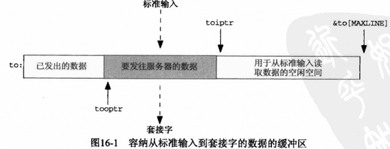
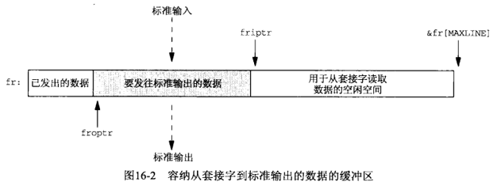
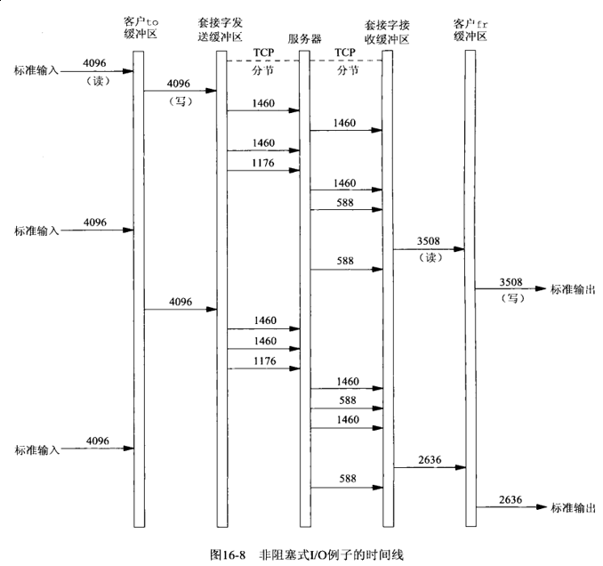
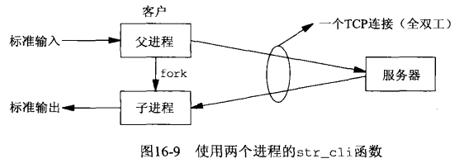
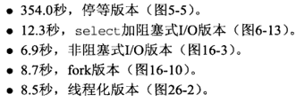

## 第十六章 非阻塞式I/O

#### 16.1 概述

可能阻塞的套接字可分为以下四类：

- 输入操作：*read*, *readv*, *recv*, *recvfrom*, *recvmsg*

- 输出操作：*write*, *writev*, *send*, *sendto*, *sendmsg*

- 接受外来连接，即 *accept* 函数。

- 发起外出连接，即用于TCP的 *accept* 函数。

#### 16.2 非阻塞读和写：[str_cli](strclinonb.c) 函数（修订版）







```c
#include <errno.h>
#include <fcntl.h>
#include <stdio.h>
#include <sys/select.h>
#include <sys/socket.h>
#include <unistd.h>
#include "../lib/error.h"

#define MAXLINE     4096        /* max text line length */
#define max(a, b)   ((a) > (b) ? (a) : (b))

char *gf_time(void);

void str_cli(FILE *fp, int sockfd)
{
    // 1
    // ----------------------------------------------
    int      maxfdp1, val, stdineof = 0;
    ssize_t  n, nwritten;
    fd_set   rset, wset;
    char     to[MAXLINE], fr[MAXLINE];
    char    *toiptr, *tooptr, *friptr, *froptr;

    // sockfd
    if ((val = fcntl(sockfd, F_GETFL, 0)) < 0) {
        err_sys("fcntl error");
    }
    if (fcntl(sockfd, F_SETFL, val | O_NONBLOCK) < 0) {
        err_sys("fcntl error");
    }

    // stdin
    if ((val = fcntl(STDIN_FILENO, F_GETFL, 0)) < 0) {
        err_sys("fcntl error");
    }
    if (fcntl(STDIN_FILENO, F_SETFL, val | O_NONBLOCK) < 0) {
        err_sys("fcntl error");
    }

    // stdout
    if ((val = fcntl(STDOUT_FILENO, F_GETFL, 0)) < 0) {
        err_sys("fcntl error");
    }
    if (fcntl(STDOUT_FILENO, F_SETFL, val | O_NONBLOCK) < 0) {
        err_sys("fcntl error");
    }

    toiptr = tooptr = to;
    friptr= froptr = fr;

    maxfdp1 = max(max(STDIN_FILENO, STDOUT_FILENO), sockfd) + 1;
    for (;;) {
        FD_ZERO(&rset);
        FD_ZERO(&wset);
        if (stdineof == 0 && toiptr < &to[MAXLINE]) {
            FD_SET(STDIN_FILENO, &rset); // read from stdin
        }
        if (friptr < &fr[MAXLINE]) {
            FD_SET(sockfd, &rset); // read from socket
        }
        if (tooptr != toiptr) {
            FD_SET(sockfd, &wset); // data to write to socket
        }
        if (froptr != friptr) {
            FD_SET(STDOUT_FILENO, &wset); // data to write to stdout
        }
        if (select(maxfdp1, &rset, &wset, NULL, NULL) < 0) {
            err_sys("select error");
        }
        // 2
        // ----------------------------------------------
        if (FD_ISSET(STDIN_FILENO, &rset)) {
            if ((n = read(STDIN_FILENO, toiptr, &to[MAXLINE] - toiptr)) < 0) {
                if (errno != EWOULDBLOCK) {
                    err_sys("read error on stdin");
                }
            } else if (n == 0) {
                fprintf(stderr, "%s: EOF on stdin\n", gf_time());
                stdineof = 1; // all done white stdin
                if (tooptr == toiptr) {
                    shutdown(sockfd, SHUT_WR); // send FIN
                }
            } else {
                fprintf(stderr, "%s: read %ld bytes from stdin\n", gf_time(), n);
                toiptr += n; // just read
                FD_SET(sockfd, &wset); // try and write to socket below
            }
        }
        if (FD_ISSET(sockfd, &rset)) {
            if ((n = read(sockfd, friptr, &fr[MAXLINE] - friptr)) < 0) {
                if (errno != EWOULDBLOCK) {
                    err_sys("read error on socket");
                }
            } else if (n == 0) {
                fprintf(stderr, "%s: EOF on socket\n", gf_time());
                if (stdineof) {
                    return ; // normal termination
                } else {
                    err_quit("str_cli: server terminated prematurely");
                }
            } else {
                fprintf(stderr, "%s: read %ld bytes from socket\n", gf_time(), n);
                friptr += n; // just read
                FD_SET(STDOUT_FILENO, &wset); // try and write below
            }
        }
        // 3
        // ----------------------------------------------
        if (FD_ISSET(STDOUT_FILENO, &wset) && ((n = friptr - froptr) > 0)) {
            if ((nwritten = write(STDOUT_FILENO, froptr, n)) < 0) {
                if (errno != EWOULDBLOCK) {
                    err_sys("write error to stdout");
                }
            } else {
                fprintf(stderr, "%s: wrote %ld bytes to stdout\n", gf_time(), nwritten);
                froptr += nwritten;
                if (froptr == friptr) {
                    froptr = friptr = fr; // back to begining of buffer
                }
            }
        }
        if (FD_ISSET(sockfd, &wset) && ((n = toiptr - tooptr) > 0)) {
            if ((nwritten = write(sockfd, tooptr, n)) < 0) {
                if (errno != EWOULDBLOCK) {
                    err_sys("write error to socket");
                }
            } else {
                fprintf(stderr, "%s: wrote %ld bytes to socket\n", gf_time(), nwritten);
                tooptr += nwritten;
                if (tooptr == toiptr) {
                    tooptr = toiptr = to; // back to begining of buffer
                    if (stdineof) {
                        shutdown(sockfd, SHUT_WR); // send FIN
                    }
                }
            }
        }
    }
}
```

16.2.1 [str_cli](strclifork.c) 的较简单版本

以上例子给出的 *str_cli* 函数非阻塞版本比较复杂，相比之下使用 *select* 和阻塞式I/O的版本更简单。然而最初版本（5.5小节）的停－等方式比批量模式（6.7小节）更慢，批量模式效率提高的更大。

考虑到结果代码的复杂性，是否有必要吧应用程序编写成使用非阻塞I/O的方式？

这是没有必要的，我们完全可以利用多进程（使用 *fork*）或多线程（第26章）的方式来解决。

下述代码为 *str_cli* 的[另一个版本（多进程）](strclifork.c)

```c
#include <signal.h>
#include <stdio.h>
#include <stdlib.h>
#include <string.h>
#include <sys/socket.h>
#include <sys/types.h>
#include <unistd.h>
#include "../lib/error.h"

#define MAXLINE     4096        /* max text line length */

// Chapter03/readline.c
ssize_t readline(int fd, void *vptr, size_t maxlen);

void str_cli(FILE *fp, int sockfd)
{
    pid_t pid;
    char sendline[MAXLINE], recvline[MAXLINE];

    if ((pid = fork()) < 0) {
        err_sys("fork error");
    } else if (pid == 0) { //child
        while (readline(sockfd, recvline, MAXLINE) > 0) {
            fputs(recvline, stdout);
        }
        kill(getppid(), SIGTERM); // in case parent still running
        exit(0);
    }
    // parent: stdin -> server
    while (fgets(sendline, MAXLINE, fp) != NULL) {
        write(sockfd, sendline, strlen(sendline));
    }
    shutdown(sockfd, SHUT_WR); // 这里不能使用close，close之后子进程可能无法从sockfd读取数据，数据可能丢失。
    pause();
    return;
}
```



16.2.2 str_cli执行时间

摘录原书内容：



#### 16.3 非阻塞 *connect*

非阻塞的 *connect* 有三个用途：

- 我们可以吧三路握手叠加在其他处理上

- 我们可以使用这个技术同时建立多个连接

- 既然使用 *select* 等待连接的建立，我们可以给 *select* 指定一个时间限制，使得我们能够缩短 *connect* 的超时

非阻塞虽然听起来简单，但我们有一些必须处理的细节：

- 尽管套接字是非阻塞的，如果连接到的服务器在同一个主机上，那么当我们调用 *connect* 时，连接通常立即建立。我们必须处理这种情况

- 源自Berkeley的实现（和POSIX）有关于 *select* 和非阻塞 *connect* 的以下两个规则：(1)当连接成功建立时，描述符变为可写; (2)当连接建立遇到错误时，描述符变为既可读有可写（TCPv2）

    关于select的这两个规则出自6.3节关于描述符就绪条件的相关规则。一个TCP套接字变为可写的条件是：
    其发送缓冲区有可写空间（对于连接建立中的套接字而言本字条件总为真，因为尚未往其中写出任何数据），
    并且套接字已建立连接（本字条件为真发生在三路握手完成之后）。一个TCP套接字上发生某个错误时， 这个
    待处理错误总是导致该套接字变为可读又可写。

#### 16.4 非阻塞 *connect*：[时间获取客户程序](connect_nob.c)

```c
#include <sys/socket.h>
#include <sys/select.h>
#include <errno.h>
#include <fcntl.h>
#include <stdio.h>
#include <unistd.h>
#include "../lib/error.h"

int connect_nonb(int sockfd, const struct sockaddr *saptr, socklen_t salen, int nsec)
{
    int             flags, n, error;
    socklen_t       len;
    fd_set          rset, wset;
    struct timeval  tval;

    if ((flags = fcntl(sockfd, F_GETFL, 0)) < 0) {
        err_sys("fcntl error");
    }
    if (fcntl(sockfd, F_SETFL, flags | O_NONBLOCK) < 0) {
        err_sys("fcntl error");
    }

    error = 0;
    if ((n = connect(sockfd, saptr, salen)) < 0) {
        if (errno != EINPROGRESS) { // 连接建立已经启动但尚未完成
            return(-1);
        }
    }

    // Do whatever we want while the connect is taking palce.
    if (n == 0) {
        goto done;  // connect completed immediately，无错误
    }
    FD_ZERO(&rset);
    FD_SET(sockfd, &rset);
    wset = rset;
    tval.tv_sec = nsec;
    tval.tv_usec = 0;
    if ((n = select(sockfd + 1, &rset, &wset, NULL, nsec ? &tval : NULL)) < 0) {
        err_sys("select error");
    } else if (n == 0) { // 超时且没有描述符准备好
        close(sockfd); // 关闭socket，三次握手没必要进行下去
        errno = ETIMEDOUT;
        return(-1);
    }
    if (FD_ISSET(sockfd, &rset) || FD_ISSET(sockfd, &wset)) {
        len = sizeof(error);
        // connect 出错，sockfd描述符可读＆可写，通过getsockopt获取错误信息
        if (getsockopt(sockfd, SOL_SOCKET, SO_ERROR, &error, &len) < 0) {
            return(-1);
        }
    } else {
        err_quit("select error: sockfd not set");
    }

done:
    if (fcntl(sockfd, F_SETFL, flags) < 0) { // restore file status flags
        err_sys("fcntl error");
    }
    if (error) {
        close(sockfd); // just in case
        errno = error;
        return(-1);
    }
    return(0);
}
```

套接字的各种实现以及非阻塞 *connect* 会带来移植性问题。

首先，调用 *select* 之前有可能连接已经建立并有来自对端的数据到达，这种情况下套接字既可读又可写，这和连接失败情况下套接字的读写条件一样。我们使用 *getsocketopt* 并检查套接字上是否存在待处理错误来解决此种情况。

其次，既然我们不能假设套接字的可写（而不可读）条件是 *select* 返回套接字操作成功条件的唯一方法，下一个移植性问题就是怎样判断连接建立是否成功：

- 调用 *getpeername* 代替 *getsocket*

- 以值为0的长度参数调用 *read*

- 再调用 *connect* 一次

#### 16.5 非阻塞 *connect*：Web客户程序
