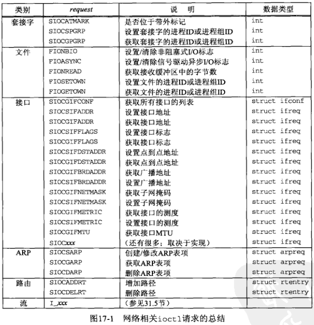
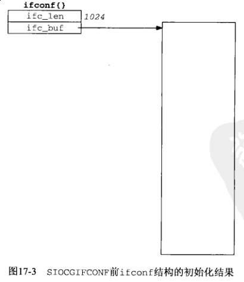
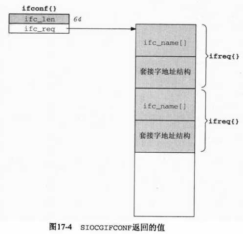

## 第十七章 ioctl操作

#### 17.1 概述

#### 17.2 [ioctl](http://man7.org/linux/man-pages/man3/ioctl.3p.html) 函数

```c
#include <unistd.h>

int ioctl(int fd, int request, ... /* void *arg */);
```

第三个参数为指针，指针类型依赖于 *request*

网络相关请求(*request*)可划分为6类：

- 套接字操作

- 文件操作

- 接口操作

- ARP 高速缓存操作

- 路由表操作

- 流系统



#### 17.3 套接字操作

#### 17.4 文件操作

#### 17.5 接口配置

*SIOCGIFCONF*：获取所有接口的列表

用于接口类各个 *ioctl* 请求的 *ifconf* 结构和 *ifreq* 结构

```go
// <net/if.h>
struct ifconf {
    lint ifc_len;                   /* sizeo of buffer, value-result */
    union {
        caddr_t         ifcu_buf;   /* input from user -> kernel */
        struct ifreq   *ifcu_req;   /* return from kernel -> user */
    } ifc_ifcu;
};
#define ifc_buf     ifc_ifcu.ifcu_buf   /* buffer address */
#define ifc_req     ifc_ifcu.ifcu_req   /* array of structures returned */

#define IFNAMSIZ    16

struct ifreq {
    char    ifr_name[IFNAMSIZ];         /* interface name, e.g., "le0" */
    union {
        struct sockaddr     ifru_addr;
        struct sockaddr     ifru_dstaddr;
        struct sockaddr     ifru_broadaddr;
        short               ifru_flags;
        int                 ifru_metric;
        caddr_t             ifru_data;
    } ifr_ifru;
};
#define ifr_addr        ifr_ifru.ifru_addr      /* address */
#define ifr_dstaddr     ifr_ifru.ifru_dstaddr   /* other end of p-to-p link */
#define ifr_broadaddr   ifr_ifru.ifru_broadaddr /* broadcast address */
#define ifr_flags       ifr_ifru.ifru_flags     /* flags */
#define ifr_metric      ifr_ifru.ifru_metric    /* metric */
#define ifr_data        ifr_ifru.ifru_data      /* for use by interface */
```




#### 17.6 [get\_ifi\_info](get_ifi_info.c) 函数

微型 `ifconfig` 程序

```c
#include "../lib/error.h"
#include "../lib/unpifi.h"
#include <arpa/inet.h>
#include <stdio.h>
#include <stdlib.h>
#include <string.h>

// ../lib/sock_ntop_host.c
char * sock_ntop_host(const struct sockaddr *sa, socklen_t salen);

int main(int argc, char **argv)
{
    struct ifi_info *ifi, *ifihead;
    struct sockaddr *sa;
    u_char          *ptr;
    int              i, doaliases;
    int              family = AF_INET;

    if (argc != 3) {
        err_quit("usage: prifinfo <inet4|inet6> <doaliases>");
    }

    if (strcmp(argv[1], "inet4") == 0) {
        family = AF_INET;
    } else if (strcmp(argv[1], "inet6") == 0) {
        family = AF_INET6;
    } else {
        err_quit("invalid <address-family>");
    }
    doaliases = atoi(argv[2]);

    for (ifihead = ifi = get_ifi_info(family, doaliases); ifi != NULL; ifi = ifi->ifi_next) {
        printf("%s: ", ifi->ifi_name);
        if (ifi->ifi_index != 0) {
            printf("(%d) ", ifi->ifi_index);
        }
        printf("<");
        if (ifi->ifi_flags & IFF_UP)            printf("UP ");
        if (ifi->ifi_flags & IFF_BROADCAST)     printf("BCAST ");
        if (ifi->ifi_flags & IFF_MULTICAST)     printf("MCAST ");
        if (ifi->ifi_flags & IFF_LOOPBACK)      printf("LOOP ");
        if (ifi->ifi_flags & IFF_POINTOPOINT)   printf("P2P ");
        printf(">\n");

        if ((i = ifi->ifi_hlen) > 0) {
            ptr = ifi->ifi_haddr;
            do {
                printf("%s%x", (i == ifi->ifi_hlen) ? "  " : ":", *ptr++);
            } while (--i > 0);
        }
        if (ifi->ifi_mtu != 0) {
            printf("  MTU: %d\n", ifi->ifi_mtu);
        }
        if ((sa = ifi->ifi_addr) != NULL) {
            printf("  IP addr: %s\n", sock_ntop_host(sa, sizeof(*sa)));
        }
        if ((sa = ifi->ifi_brdaddr) != NULL) {
            printf("  broadcast addr: %s\n", sock_ntop_host(sa, sizeof(*sa)));
        }
        if ((sa = ifi->ifi_dstaddr) != NULL) {
            printf("  destination addr: %s\n", sock_ntop_host(sa, sizeof(*sa)));
        }
    }
    free_ifi_info(ifihead);
    exit(0);
}
```

```sh
$ gcc prifinfo.c ../lib/error.c ../lib/sock_ntop_host.c get_ifi_info.c -o prifinfo
$ ./prifinfo inet4 0
lo: <UP LOOP >
  IP addr: 127.0.0.1
```

#### 17.7 接口操作

**请求的获取(SIOCGxxx)通常由 netstata 程序发出，请求的设置(SIOCSxxx)通常由 ifconfig 程序发出。**

#### 17.8 ARP 高速缓存操作

ARP 高速缓存类 *ioctl* 请求所用的 *arpreq* 结构

```c
#include <net/if_arp.h>

struct arpreq {
    struct sockaddr arp_pa;     /* protocol address */
    struct sockaddr arp_ha;     /* hardware address */
    int             arp_flags;  /* flags */
};

#define ATF_INUSE   0x01    /* entry in use */
#define ATF_COM     0x02    /* completed entry (hardware addr valid) */
#define ATF_PERM    0x04    /* permanent entry */
#define ATF_PUBL    0x08    /* published entry (respond for other host) */
```

*SIOCSARP*: 把一个新的表项加到 *ARP* 告诉缓存，或者修改其中已经存在的一个表项。

*SIOCDARP*: 从 *ARP* 高速缓存中删除一个表项。

*SIOCGARP*: 从 *ARP* 高速缓存中获取一个表项。

例子：[输出主机的硬件地址](prmac.c)

对每个 IP 地址发出一个 *SIOCGARP* 请求以获取并显示它的硬件地址。

```c
#include "../lib/error.h"
#include "../lib/unpifi.h"
#include <net/if_arp.h>
#include <netinet/in.h>
#include <stdio.h>
#include <stdlib.h>
#include <string.h>
#include <sys/ioctl.h>

// ../lib/sock_ntop.c
char * sock_ntop(const struct sockaddr *sa, socklen_t salen);

int main(int argc, char **argv)
{
    int                 sockfd;
    struct ifi_info    *ifi;
    unsigned char      *ptr;
    struct arpreq       arpreq;
    struct sockaddr_in *sin;

    if ((sockfd = socket(AF_INET, SOCK_DGRAM, 0)) < 0) {
        err_sys("socket failed");
    }
    for (ifi = get_ifi_info(AF_INET, 0); ifi != NULL; ifi = ifi->ifi_next) {
        printf("%s: ", sock_ntop(ifi->ifi_addr, sizeof(struct sockaddr_in)));
        sin = (struct sockaddr_in *) &arpreq.arp_pa;
        memcpy(sin, ifi->ifi_addr, sizeof(struct sockaddr_in));
        if (ioctl(sockfd, SIOCGARP, &arpreq) < 0) {
            err_ret("ioctl SIOCGARP");
            continue;
        }
        ptr = &arpreq.arp_ha.sa_data[0];
        printf("%x:%x:%x:%x:%x:%x\n", *ptr, *(ptr+1), *(ptr+2), *(ptr+3), *(ptr+4), *(ptr+5));
    }
    exit(0);
}
```

```sh
$ gcc prmac.c ../lib/error.c ../lib/sock_ntop.c get_ifi_info.c -o prmac
$ ./prmac
127.0.0.1: ioctl SIOCGARP: No such device
```

`TODO`: 这里不知为什么只返回了 `127.0.0.1` 的查询结果

#### 17.9 路由表操作

*SIOCADDRT*: 往路由表中增加一个表项

*SIOCDELRT*: 从路由表中删除一个表项

#### 17.10 小结

用于网络编程的 *ioctl* 命令可划分为6类：

- 套接字操作（是否位于带外标记等）

- 文件操作（设置或清除非阻塞标志等）

- 接口操作（返回接口列表，获取广播地址等）

- ARP 表操作（创建，修改，获取或删除）

- 路由表操作（增加或删除）

- 流系统（第31章）
