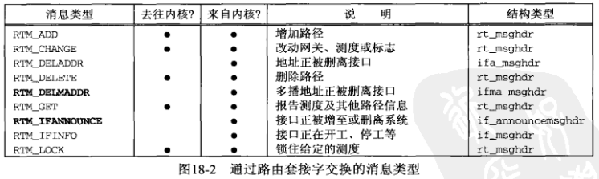
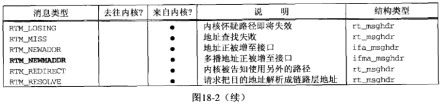
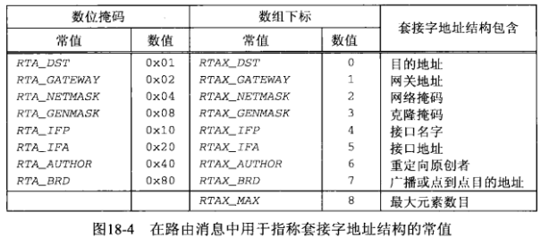
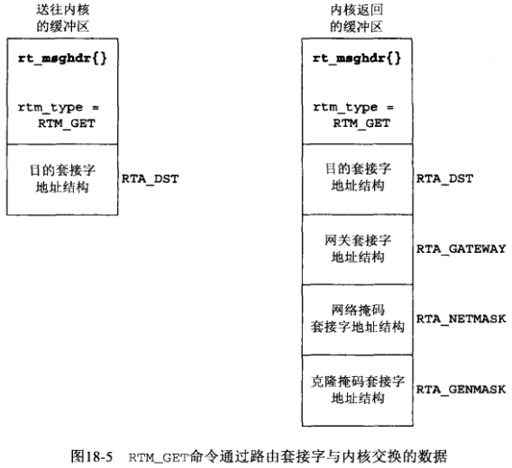
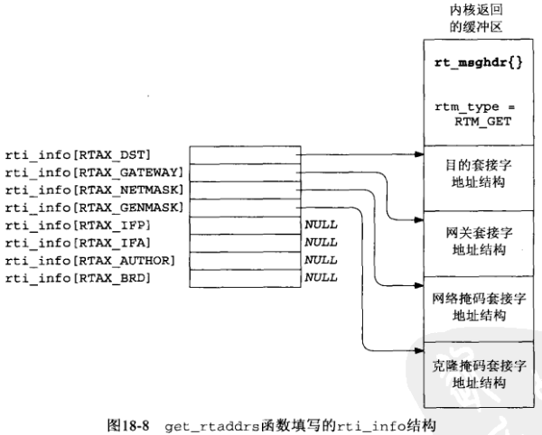
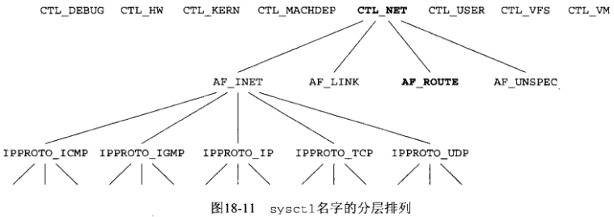
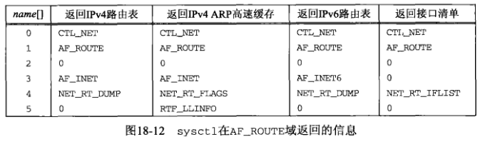
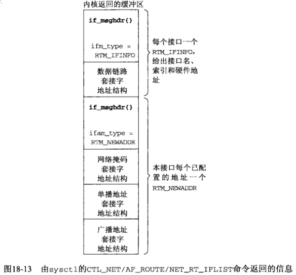

## 第十八章 路由套接字

**NOTE: support 4.4BSD style routing sockets**

[What package do i need to install for using routing sockets?](https://stackoverflow.com/questions/1520649/what-package-do-i-need-to-install-for-using-routing-sockets)

#### 18.1 概述

路由套接字上支持3中类型的操作：

1) 进程可以通过写出到路由套接字而往内核发送消息。

2) 进程可以通过从路由套接字读入而自内核接收消息。

3) 进程可以使用 *sysctl* 函数倾泻出路由表或列出所有已配置的接口。

#### 18.2 数据链路套接字地址结构

```c
#include <net/if_dl.h>

struct sockaddr_dl {
    uint8_t     sdl_len;
    sa_family_t sdl_family;     /* AF_LINK */
    uint16_t    sdl_index;      /* system assigned index, if > 0 */
    uint8_t     sdl_type;       /* IFT_ETHER, ect. from <net/if_types.h> */
    uint8_t     sdl_nlen;       /* name length, starting in sdl_data[0] */
    uint8_t     sdl_alen;       /* link-layer address length */
    uint8_t     sdl_slen;       /* link-layer selector length */
    char        sdl_data[12];   /* minium work area, can be larger;
                                   contains i/f name and link-layer address */
};
```

#### 18.3 读和写





`struct rt_msghdr`

```c
#include <net/route.h>

struct rt_msghdr {
    u_short             rtm_msglen;     /* to skip over non-understood messages */
    u_char              rtm_version;    /* future binary compatibility */
    u_char              rtm_type;       /* message type */
    u_short             rtm_index;      /* index for associated ifp */
    int                 rtm_flags;      /* flags, incl. kern & message, e.g., DONE */
    int                 rtm_addrs;      /* bitmask identifying sockaddrs in msg */
    pid_t               rtm_pid;        /* identify sender */
    int                 rtm_seq;        /* for sender to identify action */
    int                 rtm_errno;      /* why failed */
    int                 rtm_use;        /* from rtentry */
    u_long              rtm_inits;      /* which metrics we are initializing */
    struct rt_metrics   rtm_rmx;        /* metrics themselves;
};
```

`struct if_msghdr`

```c
#include <net/if.h>

struct if_msghdr {
    u_short         ifm_msglen;     /* to skip over non-understood message */
    u_char          ifm_version;    /* future binary compatibility */
    u_char          ifm_type;       /* message type */
    int             ifm_addrs;      /* like rtm_addrs */
    int             ifm_flags;      /* value of if_flags */
    u_short         ifm_index;      /* index for associated ifp */
    struct if_data  ifm_data;       /* statistics and other data about if */
};
```

`struct ifa_msghdr`

```c
#include <net/if.h>

struct ifa_msghdr {
    u_short     ifam_msglen;    /* to skip over non-understood messages */
    u_char      ifam_version;   /* future binary compatibility */
    u_char      ifam_type;      /* message type */
    int         ifam_addrs;     /* like rtm_addrs */
    int         ifam_flags;     /* value of ifa_flags */
    u_short     ifam_index;     /* index for associated ifp */
    int         ifam_metric;    /* value of ifa_metric */
};
```

`struct ifma_msghdr`

```c
#include <net/if.h>

struct ifma_msghdr {
    u_short     ifmam_msglen;   /* to skip over non-understood messages */
    u_char      ifmam_version;  /* future binary compatibility */
    u_char      ifmam_type;     /* message type */
    int         ifmam_addrs;    /* like rtm_addrs */
    int         ifmam_flags;    /* value of ifa_flags */
    u_short     ifmam_index;    /* index for associated ifp */
};
```

`struct if_announcemsghdr`

```c
#include <net/if.h>

struct if_announcemsghdr {
    u_short     ifan_msglen;            /* to skip over non-understood messages */
    u_char      ifan_version;           /* future binary compatibility */
    u_char      ifan_type;              /* message type */
    u_short     ifan_index;             /* index for associated ifp */
    char        ifan_name[IFNAMSIZ];    /* if name, e.g. "en0" */
    u_short     ifan_what;              /* what type of announcement */
}
```



例子：[获取并输出用户一个路由表项](getrt.c)





```c
#include "../lib/error.h"
#include "unproute.h"
#include <arpa/inet.h>
#include <net/route.h>
#include <stdlib.h>
#include <sys/socket.h>
#include <sys/types.h>
#include <unistd.h>

#define BUFLEN  (sizeof(struct rt_msghdr) + 512)
                /* sizeof (struct sockaddr_in6) * 8 = 192 */
#define SEQ     9999

// ../lib/sock_ntop_host.c
char *sock_ntop_host(const struct sockaddr *sa, socklen_t salen);

int main(int argc, char **argv)
{
    int                 sockfd;
    char               *buf;
    pid_t               pid;
    ssize_t             n;
    struct rt_msghdr   *rtm;
    struct sockaddr    *sa, *rti_info[RTAX_MAX];
    struct sockaddr_in *sin;

    if (argc != 2) {
        err_quit("usage: getrt <IPaddress>");
    }
    sockfd = socket(AF_ROUTE, SOCK_RAW, 0); // 需要超级权限

    buf = calloc(1, BUFLEN);

    // NOTE: figure-18.5
    // 送往内核的结构 rt_msghdr
    rtm = (struct rt_msghdr *) buf;
    rtm->rtm_msglen = sizeof(struct rt_msghdr) + sizeof(struct sockaddr_in);
    rtm->rtm_version = RTM_VERSION;
    rtm->rtm_type = RTM_GET;
    rtm->rtm_addrs = RTA_GET;
    rtm->rtm_pid = pid = getpid();
    rtm->rtm_seq = SEQ;

    // 送往内核的结构 目的套接字结构 RTA_DST
    sin = (struct sockaddr_in *) (rtm + 1);
    sin->sin_len = sizeof(struct sockaddr_in);
    sin->sin_family = AF_INET;
    inet_pton(AF_INET, argv[1], &sin->sin_addr);

    // 发往内核
    write(sockfd, rtm, rtm->rtm_msglen);

    // 从内核中读取响应结果
    do {
        n = read(sockfd, rtm, BUFLEN);
    } while (rtm->rtm_type != RTM_GET || rtm->rtm_seq != SEQ || rtm->rtm_pid != pid);

    // NOTE: figure-18.8
    rtm = (struct rt_msghdr *) buf;
    sa = (struct sockaddr *) (rtm + 1);
    get_rtaddrs(rtm->rtm_addrs, sa, rti_info);
    if ((sa = rti_info[RTAX_DST]) != NULL) {
        printf("dest: %s\n", sock_ntop_host(sa, sa->sa_len));
    }

    if ((sa = rti_info[RTAX_GATEWAY]) != NULL) {
        printf("gateway: %s\n", sock_ntop_host(sa, sa->sa_len));
    }

    if ((sa = rti_info[RTAX_NETMASK]) != NULL) {
        printf("netmask: %s\n", sock_masktop(sa, sa->sa_len));
    }

    if ((sa = rti_info[RTAX_GENMASK]) != NULL) {
        printf("genmask: %s\n", sock_masktop(sa, sa->sa_len));
    }

    exit(0);
}
```

#### 18.4 sysctl 操作

```c
#include <sys/param.h>
#include <sys/sysctl.h>

int sysctl(int *name, u_int namelen, void *oldp, size_t *oldlenp, void *newp, size_t newlen);
```

*name* 参数是指定名字的一个整数数组，该数组中的第一个元素指定本请求定向到内核的哪个子系统，第二个及其后元素逐次细化指定该子系统的某个部分。



*sysctl* 的手册中详细叙述了可使用该函数获取各种系统信息，有文件系统，虚拟内存，内核限制，硬件等各方面的信息，我们感兴趣的是网络子系统，通过把 *name* 数组的第一个元素设置为 *CTL_NET* (`<sys/sysctl.h>` 头文件中定义)来指定。

第二个元素可以是以下几种：

- *AF_INET*: 获取或设置影响网际网协议的变量

- *AF_LINK*: 获取或设置链路层信息

- *AF_ROUTE*: 返回路由表或接口列表的信息

- *AF_UNSPEC*: 获取或设置一些套接字层变量，譬如套接字发送或接受缓冲区最大大小





检查 *UDP* 校验和是否开启

```c
#include "../lib/error.h"
#include "unproute.h"
#include <netinet/ip_var.h>
#include <netinet/udp.h>
#include <netinet/udp_var.h>    // for UDPCTL_xxx constants
#include <stdlib.h>

int main(int argc, char **argv)
{
    int     mib[3], val;
    size_t  len;

    mib[0] = CTL_NET;
    mib[1] = AF_INET;
    mib[2] = IPPROTO_UDP;
    mib[3] = UDPCTL_CHECKSUM;
    len = sizeof(val);
    if (sysctl(mib, 4, &val, &len, NULL, 0) < 0) {
        err_sys("sysctl error");
    }
    printf("udp checksum flag: %d\n", val);
    exit(0);
}
```

#### 18.5 [get\_ifi\_info 函数](get_ifi_info.c)

使用 *sysctl* 实现的 *get_ifi_info* ，区别于第十七章用 *SIOCGIFCONF ioctl* 实现的版本

```c
#include "../Chapter17/unpifi.h"
#include "../lib/error.h"
#include "unproute.h"
#include <stdlib.h>

struct ifi_info *get_ifi_info(int family, int doaliases)
{
    int                  flags;
    char                *buf, *next, *lim;
    size_t               len;
    struct if_msghdr    *ifm;
    struct ifa_msghdr   *ifam;
    struct sockaddr     *sa, *rti_info[RTAX_MAX];
    struct sockaddr_dl  *sdl;
    struct ifi_info     *ifi, *ifisave, *ifihead, **ifipnext;

    // 获取列表
    buf = net_rt_iflist(family, 0, &len);

    ifihead = NULL;
    ifipnext = &ifihead;

    lim = buf + len;
    for (next = buf; next < lim; next += ifm->ifm_msglen) {
        // 获取路由消息，忽略非UP接口
        ifm = (struct if_msghdr *) next;
        if (ifm->ifm_type == RTM_IFINFO) {
            if (((flags = ifm->ifm_flags) & IFF_UP) == 0) {
                continue;       // ignore if interface not up
            }
        }
        // 判断存在那些套接字地址结构
        sa = (struct sockaddr *) (ifm + 1);
        get_rtaddrs(ifm->ifm_addrs, sa, rti_info);
        if ((sa = rti_info[RTAX_IFP]) != NULL) {
            // 处理接口名字
            ifi = clloc(1, sizeof(struct ifi_info));
            *ifipnext = ifi;            // prev points to this new one
            ifipnext = &ifi->ifi_next;  // ptr ot next one goes here

            ifi->ifi_flags = flags;
            if (sa->sa_family == AF_LINK) {
                sdl = (struct sockaddr_dl *) sa;
                ifi->ifi_index = sdl->sdl_index;
                if (sdl->sdl_nlen > 0) {
                    snprintf(ifi->ifi_name, IFI_NAME, "%*s", sdl->sdl_nlen, &sdl->sdl_data[0]);
                } else {
                    snprintf(ifi->ifi_name, IFI_NAME, "index %d", sdl->sdl_index);
                }
                if ((ifi->ifi_hlen = sdl->sdl_alen) > 0) {
                    memcpy(ifi->ifi_haddr, LLADDR(sdl), min(IFI_HADDR, sdl->sdl_alen));
                }
            }
        } else if (ifm->ifm_type == RTM_NEWADDR) {
            // 返回IP地址
            if (ifi->ifi_addr) { // already have an IP addr for i/f */
                if (doaliases == 0) {
                    continue;
                }
                // we have a new IP addr for existing interface
                ifisave = ifi;
                ifi = calloc(1, sizeof(struct ifi_info));
                *ifipnext = ifi;            // prev points to this new one
                ifipnext = &ifi->ifi_next;  // ptr to next to goes here
                ifi->ifi_flags = ifisave->ifi_flags;
                ifi->ifi_index = ifisave->ifi_index;
                ifi->ifi_hlen = ifisave->ifi_hlen;
                memcpy(ifi->ifi_name, ifisave->ifi_name, IFI_NAME);
                memcpy(ifi->ifi_haddr, ifisave->ifi_haddr, IFI_HADDR);
            }

            ifam = (struct ifa_msghdr *) next;
            sa = (struct sockaddr *) (ifam + 1);
            get_rtaddrs(ifam->ifam_addrs, sa, rti_info);

            if ((sa = rti_info[TRAX_IFA]) != NULL) {
                ifi->ifi_addr = calloc(1, sa->sa_len);
                memcpy(ifi->ifi_addr, sa, sa->sa_len);
            }

            // 返回广播地址和目的地址
            if ((flags & IFF_BROADCAST) && (sa = rti_info[RTAX_BRD]) != NULL) {
                ifi->ifi_brdaddr = calloc(1, sa->sa_len);
                memcpy(ifi->ifi_brdaddr, sa, sa->sa_len);
            }

            if ((flags & IFF_POINTOPOINT) && (sa = rti_info[RTAX_BRD]) != NULL) {
                ifi->ifi_dstaddr = calloc(1, sa->sa_len);
                memcpy(ifi->ifi_dstaddr, sa, sa->sa_len);
            }
        } else {
            err_quit("unexpected message type %d", ifm->ifm_type);
        }
    }
    // "ifihead" points to the first structure in the linked list
    return(ifihead); // ptr to first structure in linked list
}
```

#### 18.6 接口名字和索引函数

每个接口都有唯一的名字和一个唯一的正值索引（0从不用作索引）

```c
#include <net/if.h>

// 获取接口的索引
unsigned int if_nametoindex(const char *ifname);

// 获取索引为 ifindex 的接口名
char *if_indextoname(unsigned int ifindex, char *ifname);

// 获取网络接口名称及索引(所有)
struct if_nameindex *if_nameindex(void);

// 归还内存空间
void if_freenameindex(struct if_nameindex *ptr);

struct if_nameindex {
    unsigned int    if_index;   // 1,2,3,....
    char           *if_name;    // null terminated name: "le0", ...
};
```

我们使用路由套接字来实现以上4个函数

1) [if\_nametoindex](if_nametoindex.c) 函数

2) [if\_indextoname](if_indextoname.c) 函数

3) [if\_nameindex](if_nameindex.c) 函数

```c
#include "../Chapter17/unpifi.h"
#include "unproute.h"
#include <string.h>

struct if_nameindex *if_nameindex(void)
{
    char                *buf, *next, *lim;
    size_t               len;
    struct if_msghdr    *ifm;
    struct sockaddr     *sa, *rti_info[RTAX_MAX];
    struct sockaddr_dl  *sdl;
    struct if_nameindex *result, *ifptr;
    char                *nameptr;

    // 获取接口列表
    if ((buf = net_rt_iflist(0, 0, &len)) == NULL) {
        return(NULL);
    }

    // 为结果分配空间
    if ((result = malloc(len)) == NULL) {
        return(NULL);
    }
    ifptr = result;
    nameptr = (char *) result + len;

    lim = buf + len;
    for (next = buf; next < lim; next += ifm->ifm_msglen) {
        ifm = (struct if_msghdr *) next;
        if (ifm->ifm_type == RTM_IFINFO) {
            sa = (struct sockaddr *) (ifm + 1);
            get_rtaddrs(ifm->ifm_addrs, sa, rti_info);
            if ((sa = rti_info[RTAX_IFP]) != NULL) {
                if (sa->sa_family == AF_LINK) {
                    sdl = (struct sockaddr_dl *) sa;
                    nameptr -= sdl->sdl_nlen + 1;
                    strncpy(nameptr, &sdl->sdl_data[0], sdl->sdl_nlen);
                    nameptr[sdl->sdl_nlen] = 0; // null terminate
                    ifptr->if_name = nameptr;
                    ifptr->if_index = sdl->sdl_index;
                    ifptr++;
                }
            }
        }
    }
    ifptr->if_name = NULL; // mark end of array of structs
    ifptr->if_index = 0;
    free(buf);
    return(result); // caller must free this when done
}
```

4) [if\_freenameindex](if_nameindex.c) 函数

```c
void if_freenameindex(struct if_nameindex *ptr)
{
    free(ptr);
}
```

此函数极其简单，因为在 *if_nameindex* 函数中我们把结构数组和名字放在了同一个缓冲区内。**该方法内存布局十分紧凑，值得学习。**

#### 18.7 小结
