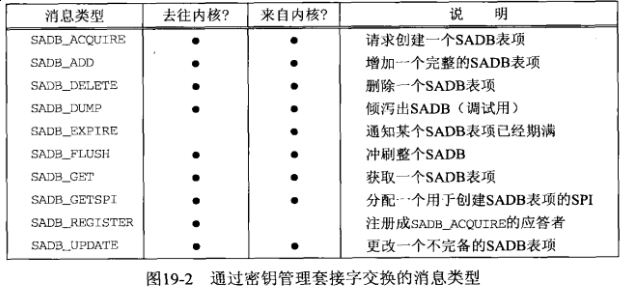
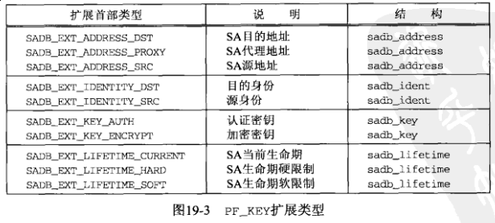
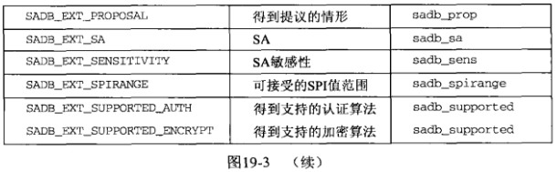
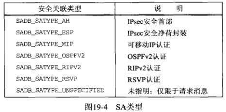

## 第十九章 密钥管理套接字

#### 19.1 概述

密钥管理套接字上支持3中类型的操作：

- 通过写出到密钥管理套接字，进程可以往内核以及打开着密钥管理套接字的所有其他进程发送消息

- 通过从密钥管理套接字读入，进程可以自内核（或其他进程）接收消息

- 进程可以往内核发送一个倾泻(dumping)请求消息，内核作为应答倾泻出当前的 SADB(security association database, SADB)

#### 19.2 读和写

穿越密钥管理套接字的所有消息都有同样的基本首部

```c
#include <net/pfkeyv2.h>

struct sadb_msg {
    u_int8_t    sadb_msg_version;   /* PF_KEY_V2 */
    u_int8_t    sadb_msg_type;      /* see Figure 19.2 */
    u_int8_t    sadb_msg_errno;     /* error indication */
    u_int8_t    sadb_msg_satype;    /* see Figure 19.3 */
    u_int16_t   sadb_msg_len;       /* length of header + extension / 8 */
    u_int16_t   sadb_msg_reserved;  /* zero on transmit, ignored on receive */
    u_int32_t   sadb_msg_seq;       /* sequence number */
    u_int32_t   sadb_msg_pid;       /* process ID of source or dest */
};
```







#### 19.3 倾泻安全关联数据库



通过密钥管理套接字发出的 *SADB_DUMP* 命令的程序

```c
#include "../lib/error.h"
#include <net/pfkeyv2.h>
#include <stdio.h>
#include <strings.h>
#include <sys/socket.h>
#include <sys/types.h>

void sadb_dump(int type)
{
    int             s;
    char            buf[4096];
    struct sadb_msg msg;
    int             goteof;

    // 获取密钥管理套接字
    if ((s = socket(PF_KEY, SOCK_RAW, PF_KEY_V2)) < 0) {
        err_sys("socket error");
    }

    // build and write SADB_DUMP request
    bzero(&msg, sizeof(msg));
    msg.sadb_msg_version = PF_KEY_V2;
    msg.sadb_msg_type = SADB_DUMP;
    msg.sadb_msg_satype = type;
    msg.sadb_msg_len = sizeof(msg) / 8;
    msg.sadb_msg_pid = getpid();

    printf("sending dump message:\n");
    print_sadb_msg(&msg, sizeof(msg));
    write(s, &msg, sizeof(msg));
    printf("\nmessages returned:\n");

    // read and print SADB_DUMP replies until done
    goteof = 0;
    while (goteof == 0) {
        int              msglen;
        struct sadb_msg *msgp;
        msglen = read(s, &buf, sizeof(buf));
        msgp = (struct sadb_msg *) &buf;
        print_sadb_msg(msgp, msglen);
        if (msgp->sadb_msg_seq == 0) {
            goteof = 1;
        }
    }
    close(s);
}

int main(int argc, char **argv)
{
    int satype = SADB_SATYPE_UNSPEC;
    int c;

    opterr = 0; // don't want getopt() writing to srderr
    while ((c = getopt(argc, argv, "t:")) != -1) {
        switch (c) {
            case 't':
                if ((satype == getsatypebyname(optarg)) == -1) {
                    err_quit("invalid -t option %s", optarg);
                }
                break;
            default:
                err_quit("unrecognized option: %c", c);
        }
    }
    sadb_dump(satype);
}
```

#### 19.4 创建静态安全关联

**TODO**

#### 19.5 动态维护安全关联

**TODO**

#### 19.6 小结

**TODO**
