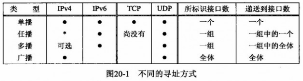
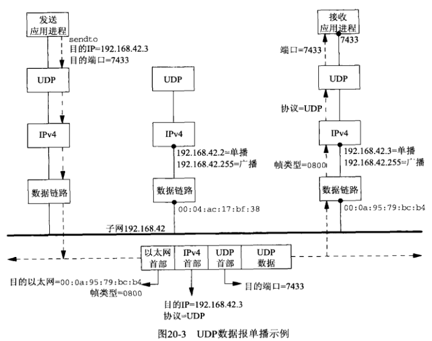
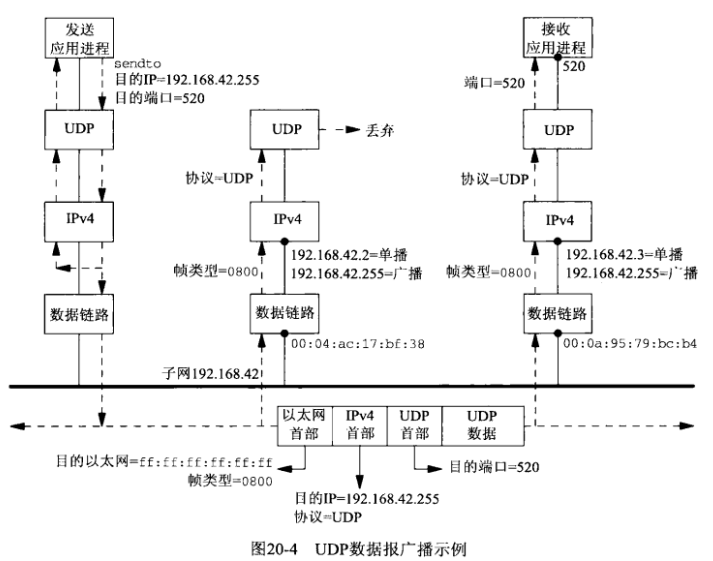

## 第二十章 广播

#### 20.1 概述



- 多播支持在IPv4中是可选的，在IPv6中确实必需的

- IPv6不支持广播。使用广播的任何IPv4应用程序一旦移植到IPv6就必须改用多播重新编写

- 广播和多播要求用于UDP或原始IP, 他们不能用于TCP

广播的用途

1) 在本地子网定位一个服务器主机，前提是已知或认定这个服务器主机位于本地子网，但是不知道它的单播IP地址，这种操作称为 *资源发现* (resource discovery)

2) 在有多个客户主机与单个服务器主机通信的局域网环境中尽量减少分组流通

- ARP(Address Resolution Protocol, 地址解析协议)，ARP使用链路层广播而不是IP层广播

- DHCP(Dynamic Host Configration Protocol, 动态主机配置协议)

- NTP(Network Time Protocol, 网络时间协议)

- 路由守护进程

#### 20.2 广播地址

#### 20.3 单播和广播的比较

定向单播，主机 --> 192.168.42.3:7433



同一子网内，广播 --> 192.168.42.255



**示例展示了广播存在的根本问题，子网上未参加广播应用的所有主机也不得不沿协议栈一路向上完整地处理收取的UDP广播数据报，直到该数据报历经UDP层时被丢弃为止。**

**另外，子网上所有非IP的主机也不得不在数据链路层接收完整的帧，然后再丢弃它。**

#### 20.4 使用广播的 [dg\_cli]() 函数

先查看在第八章实现的 [dg\_cli](../Chapter08/dg_cli.c) 函数，修改 [udpcli01.c](../Chapter08/udpcli01.c) `servaddr.sin_port = htons(SERV_PORT)` 为 `servaddr.sin_port = htons(13)`，并重新编译，查看运行结果

环境：vm{1,2,3,4}, xinetd, subnet: 10.0.4.0/26

```sh
$ sudo yum install xinet.d
# 将配置文件 /etc/xinetd.d/daytime-dgram 中的 disabled = yes -> disabled = no

$ sed -i 's/htons(SERV_PORT)/htons(13)/g' ../Chapter08/udpcli01.c
$ gcc ../Chapter08/udpcli01.c ../lib/error.c ../Chapter08/dg_cli.c -o udpcli
$ sed -i 's/htons(13)/htons(SERV_PORT)/g' ../Chapter08/udpcli01.c
$ ./udpcli 10.0.4.63
[dg_cli.c]: sendto, recvfrom.
nihao
sendto error: Permission denied
```

使用设置 *SO_BROADCAST* 套接字选项的程序

```sh
$ sed -i 's/htons(SERV_PORT)/htons(13)/g' ../Chapter08/udpcli01.c
$ gcc ../Chapter08/udpcli01.c ../lib/error.c ../lib/sock_ntop_host.c dgclibcast1.c -o udpcli
$ sed -i 's/htons(13)/htons(SERV_PORT)/g' ../Chapter08/udpcli01.c
$ ./udpcli 10.0.4.63
nihao
from 10.0.4.11: 16 APR 2018 10:35:37 CST
from 10.0.4.15: 16 APR 2018 10:35:37 CST
from 10.0.4.6: 16 APR 2018 10:35:37 CST
from 10.0.4.14: 16 APR 2018 10:35:37 CST
hello
hello               # 已阻塞
```

#### 20.5 竞争状态

1) 阻塞和解阻塞信号（不正确）, [dgclibcast3.c](dgclibcast3.c)

```c
void dg_cli(...)
{
    ...
    sigset_t         sigset_alrm;
    ...
    sigemptyset(&sigset_alrm);
    if (signal(SIGALRM, recvfrom_alarm) < 0) {
        err_sys("signal fail");
    }
    ...

    while (...) {
        ...
        for ( ; ; ) {
            ...
            sigprocmask(SIG_UNBLOCK, &sigset_alrm, NULL);
            n = recvfrom(sockfd, recvline, MAXLINE, 0, preply_addr, &len);
            sigprocmask(SIG_BLOCK, &sigset_alrm, NULL);
            ...
        }
    }
    ...
}
```

在大多数情况下仍然正常，但在解阻塞信号，调用 recvfrom 和阻塞信号都是相互独立的系统调用。如果SIGALRM信号恰在 recvfrom 返回最后一个应答数据报之后与接着阻塞该信号之间递交，那么下一个效用 recvfrom 将永远阻塞

这种办法的一个变体是在信号被递交后让信号处理函数设置一个全局标志。

```c
static void recvfrom_alarm(int signo)
{
    had_alarm = 1;
    reutrn;
}
```

每次调用 *alarm* 之前把该标志初始化为0，我们的 *dg_cli* 函数在调用 *recvfrom* 之前检查这个标志

```c
...
for ( ; ; ) {
    ...
    sigprocmask(SIG_UNBLOCK, &sigset_alrm, NULL);
    if (had_alrm == 1) { // 信号递交与变量测试几乎同时发生，竞争状态的时序问题就会发生
        break;
    }
    // 这里仍然有一个时间窗口，SIGALRM 信号仍然可能再次出现
    n = recvfrom(sockfd, recvline, MAXLINE, 0, preply_addr, &len);
    ...
}
...
```

```sh
$ sed -i 's/htons(SERV_PORT)/htons(13)/g' ../Chapter08/udpcli01.c
$ gcc ../Chapter08/udpcli01.c ../lib/error.c ../lib/sock_ntop_host.c dgclibcast3.c -o udpcli
$ sed -i 's/htons(13)/htons(SERV_PORT)/g' ../Chapter08/udpcli01.c
$ ./udpcli 127.0.0.1
1
from 127.0.0.1: 16 APR 2018 14:05:47 CST
2
3               # 已阻塞
```

2) 用 *pselect* 阻塞和解除阻塞信号（正确），[dgclibcast4.c](dgclibcast4.c)

```c
...
FD_ZERO(&rset);
sigemptyset(&sigset_empty);
sigemptyset(&sigset_alrm);
siaaddset(&sigset_alrm, SIGALRM);
if (signal(SIGALRM, recvfrom_alarm) < 0) {
    err_sys("signal fail");
}

while (...) {
    ...
    sigprocmask(SIG_BLOCK, &sigset_alrm, NULL);
    alarm(5);
    for ( ; ; ) {
        FD_SET(sockfd, &rset);
        n = pselect(sockfd + 1, &rset, NULL, NULL, NULL, &sigset_empty);
        if (n < 0) {
            if (errno == EINTR) {
                break;
            }
            err_sys("pselect error");
        } else if (n != 1) {
            err_sys("pselect error: returned %d", n);
        }
        len = servlen;
        n = recvfrom(sockfd, recvline, MAXLINE, 0, preply_addr, &len);
        recvline[n] = 0;
        printf("from %s: %s", sock_ntop_host(preply_addr, len), recvline);
    }
}
```

```sh
$ sed -i 's/htons(SERV_PORT)/htons(13)/g' ../Chapter08/udpcli01.c
$ gcc ../Chapter08/udpcli01.c ../lib/error.c ../lib/sock_ntop_host.c dgclibcast4.c -o udpcli
$ sed -i 's/htons(13)/htons(SERV_PORT)/g' ../Chapter08/udpcli01.c
$ ./udpcli 10.0.4.63
1
from 10.0.4.11: 16 APR 2018 14:31:05 CST
from 10.0.4.14: 16 APR 2018 14:31:05 CST
from 10.0.4.15: 16 APR 2018 14:31:05 CST
from 10.0.4.6: 16 APR 2018 14:31:05 CST
2
from 10.0.4.11: 16 APR 2018 14:31:06 CST
from 10.0.4.14: 16 APR 2018 14:31:06 CST
from 10.0.4.15: 16 APR 2018 14:31:06 CST
from 10.0.4.6: 16 APR 2018 14:31:06 CST
```

3) 使用 *sigsetjmp* 和 *siglongjmp*（正确），[dgclibcast5.c](dgclibcast5.c)

```c
#include <setjmp.h>
...

static sigjmp_buf jmpbuf;

void dg_cli(...)
{
    while (...) {
        ...
        for ( ; ; ) {
            if (sigsetjmp(jmpbuf, 1) != 0) {
                break;
            }
            ...
        }
    }
    ...
}

static void recvfrom_alarm(int signo)
{
    siglongjmp(jmpbuf, 1);
}
```

```sh
$ sed -i 's/htons(SERV_PORT)/htons(13)/g' ../Chapter08/udpcli01.c
$ gcc ../Chapter08/udpcli01.c ../lib/error.c ../lib/sock_ntop_host.c dgclibcast5.c -o udpcli
$ sed -i 's/htons(13)/htons(SERV_PORT)/g' ../Chapter08/udpcli01.c
$ ./udpcli 10.0.4.63
1
from 10.0.4.11: 16 APR 2018 14:31:40 CST
from 10.0.4.14: 16 APR 2018 14:31:40 CST
from 10.0.4.15: 16 APR 2018 14:31:40 CST
from 10.0.4.6: 16 APR 2018 14:31:40 CST
2
from 10.0.4.11: 16 APR 2018 14:31:41 CST
from 10.0.4.14: 16 APR 2018 14:31:41 CST
from 10.0.4.6: 16 APR 2018 14:31:41 CST
from 10.0.4.15: 16 APR 2018 14:31:41 CST
```

以这种方式使用 *sigsetjmp* 和 *siglongjmp* 确保我们不会因为信号递交时间不当而永远阻塞在 *recvfrom* 调用中。

发生问题的唯一潜在条件是信号在 *printf* 处理输出的过程中被提交。我们可以从 *printf* 中跳出，并返回 *sigsetjmp*。不过这可能会使 *printf* 的私有数据结构前后不一致。为了防止出现这种情况，把信号阻塞和解阻塞办法结合非局部跳转办法一起使用。

但上述解决办法变得很不灵便，任何可能从中中断的低性能函数周围都可能发生信号阻塞。

4) 使用从信号处理函数到主控制函数的IPC（正确），[dgclibcast6.c](dgclibcast6.c)

```c
#include <sys/select.h>
...

static int pipefd[2];
...

void dg_cli()
{
    ...
    if (pipe(pipefd) < 0) {
        err_sys("pipe failed");
    }
    maxfdp1 = max(sockfd, pipefd[0]) + 1;
    FD_ZERO(&rset);
    ...
    while (...) {
        ...
        for ( ; ; ) {
            FD_SET(sockfd, &rset);
            FD_SET(pipefd[0], &rset);
            if ((n = select(maxfdp1, &rset, NULL, NULL, NULL)) < 0) {
                if (errno == EINTR) {
                    continue;
                }
                err_sys("select error");
            }
            if (FD_ISSET(sockfd, &rset)) {
                len = servlen;
                n = recvfrom(sockfd, recvline, MAXLINE, 0, preply_addr, &len);
                recvline[n] = 0;
                printf("from %s: %s", sock_ntop_host(preply_addr, len), recvline);
            }
            if (FD_ISSET(pipefd[0], &rset)) {
                read(pipefd[0], &n, 1); // timer expired
                break;
            }
        }
    }
    free(preply_addr);
}

static void recvfrom_alarm(int signo)
{
    write(pipefd[1], "", 1);    // write one null byte to pipe
}
```

```sh
$ sed -i 's/htons(SERV_PORT)/htons(13)/g' ../Chapter08/udpcli01.c
$ gcc ../Chapter08/udpcli01.c ../lib/error.c ../lib/sock_ntop_host.c dgclibcast6.c -o udpcli
$ sed -i 's/htons(13)/htons(SERV_PORT)/g' ../Chapter08/udpcli01.c
$ ./udpcli 10.0.4.63
1
from 10.0.4.11: 16 APR 2018 14:38:45 CST
from 10.0.4.14: 16 APR 2018 14:38:45 CST
from 10.0.4.15: 16 APR 2018 14:38:45 CST
from 10.0.4.6: 16 APR 2018 14:38:45 CST
2
from 10.0.4.11: 16 APR 2018 14:38:46 CST
from 10.0.4.14: 16 APR 2018 14:38:46 CST
from 10.0.4.15: 16 APR 2018 14:38:46 CST
from 10.0.4.6: 16 APR 2018 14:38:46 CST
```

#### 20.6 小结

广播发送的数据报由发送主机某个所在子网上的所有主机接收。广播的劣势在于同一子网上的所有主机都必须处理数据报，若是 *UDP* 数据报则需沿着协议栈向上一直处理到 *UDP* 层，即使不参与广播应用的主机也不能避免。

要是运行诸如音频，视频等以较高速率工作的应用，这些非必要的处理会给这些主机带来过度的处理负担。

下一章我们使用多播来解决本问题，多播发送的数据报只会由对相应多播应用感兴趣的主机接收。
