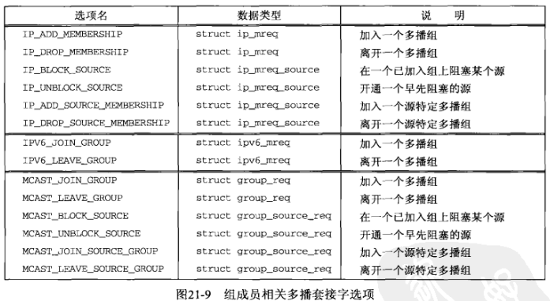

## 第二十一章 多播

#### 21.1 概述

单播地址标识单个IP接口，广播地址标识某个子网的所有IP接口，多播地址标识一组IP接口。

#### 21.2 多播地址

1) IPv4 的D类地址

IPv4的D类地址（从224.0.0.0到239.255.255.255）是IPv4多播地址。D类地址的低序28位构成多播组ID，整个32位地址则称为组地址。


下面是若干个特殊的IPv4多播地址：

- 224.0.0.1是所有主机（all-hosts）组。子网上所有具有多播能力的节点（主机，路由器，打印机等）必须在所有具有多播能力的接口上加入该组。

- 224.0.0.2是所有路由器（all-routers）组。子网上所有多播路由器必须在所有具有多播能力的接口上介入该组。

介于224.0.0.0到224.0.0.255之间的地址（也可以写成224.0.0.0/24）成为链路局部的多播地址。这些地址是为低级拓扑发现和维护协议保留的。多播路由器从不转发以这些地址为目的的地址的数据报。

2) IPv6 多播地址


3) 多播地址的范围


4) 多播会话

特别是在流式多媒体应用中，一个多播地址（IPv4或IPv6地址）和一个传输层端口（通常是UDP端口）的组合称为一个会话（session）。

例如：一个音频/视频电话会议可能由两个会话构成，一个用于音频，一个用于视频。这些会话几乎总是使用不同的端口，有时还使用不同的多播组，以便接收时灵活地选取。

#### 21.3 局域网上多播和广播的比较


**发送多播数据报无需任何特殊处理，发送应用进程不必为此加入多播组。**

假设中间主机不具备IPv4多播能力，它将完全忽略该帧，因为：

- 该帧的目的以太网地址不匹配该主机的接口地址

- 该帧的目的以太网地址不是以太网广播地址

- 该主机的接口未被告知接受任何组地址（高序字节的低序位被置为1的以太网地址）

#### 21.4 广域网上的多播


当某个主机上的一个进程加入一个多播组时，该主机向所有直接连接的多播路由器发送一个 *IGMP* 消息，告知它们本主机以加入了那个多播组。多播路由器随后使用 *MRP* (multicast routing protocol) 交换这些信息，这样每个多播路由器就知道在收到目的地为所加入多播地址的分组时该如何处理。


#### 21.5 源特定多播

    广域网上的多播因为多个原因而难以部署。
    最大的问题是运行 MRP 要求每个多播路由器接收来自所有本地接收主机的多播组加入及其他请求，并在所有多播路由器之间交换这些信息;多播路由器的转发功能要求把来自网络中任何发送主机的数据复制并发傲松到网络中任何接收主机。
    另一个大问题是多播地址的分配：IPv4没有足够数量的多播地址可以静态分配给想用的任何多播应用系统使用。
    源特定多播（source-specific multicast, SSM）给出了这些问题的一个务实的解决办法。SSM把应用系统的源地址结合到组地址上，从而在有限程度上如下地解决了这些问题：
    - 接收进程向多播路由器提供发送进程的源地址作为多播加入操作的一部分。
    - **把多播组的标识从单纯多播组地址细化为单播源地址和多播目的地址之组合（SSM称之为通道）**。

#### 21.6 多播套接字选项




1) *IP_ADD_MEMBERSHIP*, *IPV6_JOIN_GROUP* 和 *MCAST_JOIN_GROUP*

在一个指定的本地接口上加入一个不限源的多播组。

```c
struct ip_mreq {
    struct in_addr  imr_multiaddr;      // IPv4 class D multicast addr
    struct in_addr  imr_interface;      // IPv4 addr of local interface
};

struct ipv6_mreq {
    struct in6_addr ipv6mr_multiaddr;   // IPv6 multicast addr
    unsigned int    ipv6mr_interface;   // interface index, or 0
};

struct group_req {
    unsigned int            gr_interface;   // interface index, or 0
    struct sockaddr_storage gr_group;       // IPv4 or IPv6 multicast addr
};
```

2) *IP_DROP_MEMBERSHIT*, *IPV6_LEAVE_GROUP* 和 *MCAST_LEAVE_GROUP*

离开指定的本地接口上不限源的多播组。

3) *IP_BLOCK_SOURCE* 和 *MCAST_BLOCK_SOURCE*

对于一个所指定本地接口上已存在的一个不限源的多播组，在本套接字上阻塞接收来自某个源的多播分组。

如果加入同一个多播组的所有套接字都阻塞了相同的源，那么主机系统可以通知多播路由器这种分组流通不再需要，并可能由此影响网络中的多播路由。

```c
struct ip_mreq_source {
    struct in_addr  imr_multiaddr;      // IPv4 class D multicast addr
    struct in_addr  imr_sourceaddr;     // IPv4 source addr
    struct in_addr  imr_interface;      // IPv4 addr of local interface
};

struct group_source_req {
    unsigned int            gsr_interface;      // interface index, or 0
    struct sockaddr_storage gsr_group;          // IPv4 or IPv6 multicast addr
    struct sockaddr_storage gsr_source;         // IPv4 or IPv6 source addr
};
```

4) *IP_UNBLOCK_SOURCE* 和 *MCAST_UNBLOCK_SOURCE*

开通一个先前被阻塞的源。

5) *IP_ADD_SOURCE_MEMBERSHIP* 和 *MCAST_JOIN_SOURCE_GROUP*

在一个指定的本地接口上加入一个特定于源的多播组。

6) *IP_DROP_SOURCE_MEMBERSHIP* 和 *MCAST_LEAVE_SOURCE_GROUP*

在一个指定的本地接口上离开一个特定于源的多播组。

7) *IP_MULTICAST_IF* 和 *IPV6_MULTICAST_IF*

指定通过本套接字发送的多播数据报的外出接口。

8) *IP_MULTICAST_TTL* 和 *IPV6_MULTICAST_HOPS*

给外出的多播数据报设置IPv4的TTL或IPv6的跳限。

9) *IP_MULTICAST_LOOP* 和 *IPV6_MULTICAST_LOOP*

开启或禁止多播数据报的本地自环（即回馈）。

#### 21.7 *mcast_join* 和相关函数

避免充斥大量 `#ifdef` 伪代码，使用如下自定义函数来隐藏区别

```c
int mcast_join(int sockfd, const struct sockaddr *grp, socklen_t grplen, 
               const char *ifname, u_int ifindex);

int mcast_leave(int sockfd, const struct sockaddr *grp, socklen_t grplen);

int mcast_block_source(int sockfd,
                       const struct sockaddr *src, socklen_t srclen,
                       const struct sockaddr *grp, socklen_t grplen);

int mcast_unblock_source(int sockfd,
                         const struct sockaddr *src, socklen_t srclen,
                         const struct sockaddr *grp, socklen_t grplen);

int mcast_join_source_group(int sockfd,
                            const struct sockaddr *src, socklen_t srclen,
                            const struct sockaddr *grp, socklen_t grplen,
                            const char *ifname, u_int ifindex);

int mcast_leave_source_group(int sockfd,
                             const struct sockaddr *src, socklen_t srclen,
                             const struct sockaddr *grp, socklen_t grplen);

int mcast_set_if(int sockfd, const char *ifname, u_int ifindex);

int mcast_set_loop(int sockfd, int flag);

int mcast_set_ttl(int sockfd, int ttl);

int mcast_get_if(int sockfd);

int mcast_get_loop(int sockfd);

int mcast_get_ttl(int sockfd);
```

很多结构不存在，原因在于宏 *__USE_MISC* [What is \_\_USE\_MISC macro used for?](https://stackoverflow.com/questions/10231885/what-is-use-misc-macro-used-for)

```c
// /usr/include/features.h
#if defined _BSD_SOURCE || defined _SVID_SOURCE
# define __USE_MISC     1
#endif
```

#### 21.8 使用多播的 dg\_cli 函数

```sh
$ sed -i 's/htons(SERV_PORT)/htons(7)/g' ../Chapter08/udpcli01.c
$ sed -i 's/setsockopt(.*)/0)/g' ../Chapter20/dgclibcast1.c

$ gcc ../Chapter08/udpcli01.c ../lib/error.c ../lib/sock_ntop_host.c ../Chapter20/dgclibcast1.c -o udpcli

$ sed 's/(0)/(setsockopt(sockfd, SOL_SOCKET, SO_BROADCAST, \&on, sizeof(on)) < 0)/g' ../Chapter20/dgclibcast1.c
$ sed -i '/#3/s/htons(7)/htons(SERV_PORT)/g' ../Chapter08/udpcli01.c
```

TODO: 未运行出结果

#### 21.9 接收IP多播基础设施会话声明

IP多播基础设施（IP multicast infrastructure）是具备域间多播能力的因特网之一部分。多播并未在整个因特网上开通。

[SAP/SDP声明接收程序](./mysdr/main.c)

```sh
$ gcc mysdr/main.c mysdr/loop.c ../lib/error.c ../lib/sock_ntop.c ../Chapter11/udp_client.c mcast_join.c mcast.c -o sdr
```

TODO: 未运行出结果

#### 21.10 发送和接收

本节开发一个既发送又接收多播数据报的简单程序。[sendrecv](./mcast/main.c)

```sh
$ gcc mcast/main.c mcast/send.c mcast/recv.c ../lib/error.c ../lib/sock_ntop.c ../Chapter11/udp_client.c mcast_join.c mcast_set_loop.c mcast.c -o sendrecv

[search@client ~]$ ./sendrecv 239.255.1.2 8888
from 10.0.4.14:42788: node1, 27133
from 10.0.4.14:42788: node1, 27133
^C

[search@node1 ~]$ ./sendrecv 239.255.1.2 8888
from 10.0.4.11:36879: client, 26354
from 10.0.4.11:36879: client, 26354
^C
```

#### 21.11 SNTP: 简单网络时间协议

网络时间协议NTP是一个用于跨广域网或局域网同步时钟的复杂协议，往往能够达到毫秒级的精度。

NTP的一个简化版本SNTP，用于那些不需要完整NTP实现之复杂性的主机。通常做法是：让局域网内的少数几个主机跨因特网与其他NTP主机同步时钟，然后由这些主机在局域网内使用广播或多播重新发布时间。

本程序没有考虑服务器和客户之间的网络延时。然而我们假设在局域网内NTP分组通常作为广播或多播数据报接收，这种情况下网络延时应该只有几毫秒。

```sh
$ gcc ssntp/main.c ssntp/sntp_proc.c ssntp/sock_set_wild.c ../lib/error.c ../lib/sock_ntop.c ../Chapter11/udp_client.c ../Chapter17/get_ifi_info.c mcast.c mcast_join.c -o sntp
```

TODO: 未运行出结果

#### 21.12 小结

多播应用进程一开始就通过设置套接字选项请求加入赋予它的多播组。该请求告知IP层加入给定组，IP层再告知数据链路层接收发往相应硬件层多播地址的多播帧。多播利用多数接口卡都提供的硬件过滤减少非期望分组的接收，而且过滤质量越好非期望分组接收量也越少。这种硬件过滤的运用还降低了不参与多播应用系统的其他主机的负荷。

广域网上的多播需要具备多播能力的路由器和多播路由协议。在因特网上所有路由器都具备多播能力之前，多播仅仅在因特网的某些“孤岛”上可用。这些孤岛联接起来构成所谓的IP多播基础设施。
