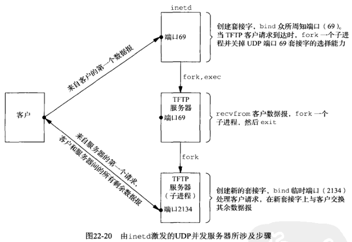

## 第二十二章 高级UDP套接字编程

#### 22.1 概述

#### 22.2 接收标志，目的IP地址和接口索引

历史上 *sendmsg* 和 *recvmsg* 一直只用于通过Unix域套接字传递描述符，而且甚至这种用途也不多见。然而由于以下两个原因，这两个函数的使用情况正在不断改观。

(1) 随4.3BSD Reno加到 *msghdr* 结构的 *msg_flags* 成员返回标志给应用程序。

(2) 辅助数据正被用于在应用进程和内核之间传递越来越多的信息。


例子：输出目的IP地址和数据报截断标志, [dgechoaddr](dgechoaddr.c)

```sh
# server
$ gcc ../Chapter08/udpserv01.c ../lib/error.c ../lib/sock_ntop.c recvfromflags.c dgechoaddr.c -o udpsrv
$ ./udpsrv
20-byte datagram from 127.0.0.1:59537

# client
$ gcc ../Chapter08/udpcli01.c ../lib/error.c ../Chapter08/dg_cli.c -o udpcli
$ ./udpcli 127.0.0.1
[dg_cli.c]: sendto, recvfrom.
123456789012345678901
12345678901234567890
```

#### 22.3 数据报截断

在源自BSD的系统上，当到达的一个UDP数据报超过应用进程提供的缓冲区容量时，*recvmsg* 在其 *msghdr* 结构的 *msg_flags* 成员上设置 *MSG_TRUNC* 标志。所有支持 *msghdr* 结构及其 *msg_flags* 成员的源自 Berkeley 的实现都提供这种通知。

不幸的是，并非所有实现都以这种方式处理超过预期长度的UDP数据报。这里存在以下3个可能的情形。

(1) 丢弃超出部分的字节并向应用进程返回 *MSG_TRUNC* 标志。本处理方式要求进程调用 *recvmsg* 以接收这个标志。

(2) 丢弃超出部分的字节但不告知应用金策划嗯这个事实。

(3) 保留超出部分的字节并在同一套接字上后续的读操作中返回它们。

**既然不同的实现在处理超过应用进程接收缓冲区大小的数据报时存在上述差异，检测本问题的一个有效办法就是：总是分配比应用进程预期接收的最大数据报还多一个字节的应用进程缓冲区。如果受到长度等于该缓冲区的数据报，那就认定它是一个过长数据报。**

#### 22.4 何时用 UDP 替代 TCP

UDP优势：

- UDP支持广播和多播。事实上如果应用程序使用广播或多播，那就必须使用UDP。

- UDP没有连接建立和拆除。

如今良好的TCP实现能够充分发挥网络的带宽容量，而且越来越少的应用系统设计人员愿意在自己的UDP应用中再造TCP，这些事实可能诱使我们说：相比TCP, UDP的用途在递减。然而预期中下一个十年多媒体应用领域的增长将会促成UDP使用的增加，因为多媒体通常意味着需要UDP的多播。

#### 22.5 给 UDP 应用增加可靠性

如果想要让请求－应答式应用程序使用UDP，那么必须在客户程序中增加以下两个特性

(1) 超时和重传：用于处理丢失的数据报。

(2) 序列号：供客户验证一个应答是否匹配相应的请求。

Jacobson的算法，重传定时期满时可能出现的如下3中情形：

- 请求丢失了

- 应答丢失了

- RTO太小了


Jacobson的算法告诉我们每次测得一个RTT后如何计算RTO以及重传时如何增加RTO。然而当我们不得不重传一个分组并随后受到一个应答时，称为”重传二义性问题“的新问题出现了。

Karn的算法可以解决重传二义性问题，即一旦收到重传过的某个请求的一个应答，就应用以下规则：

- 即使测得一个RTT，也不用它更新估算因子，因为我们不知道其中的应答对应哪次重传的请求。

- 既然应答在重传定时器期满前到达，（可能指数回退过的）当前RTO将继续用于下一个分组。只有当我们收到未重传过的某个请求的应答时，我们才更新RTT估算因子并重新计算RTO。

例子：

RTT函数的轮廓以及它们的调用时机

```c
static sigjmp_buf jmpbuf;
{
    ...
    构造请求
    signal(SIGALRM, sig_alrm);  // establish signal handler
    rtt_newpack();              // initialize rexmt counter to 0
sendagain:
    sendto();
    alarm(rtt_start());         // set alarm for RTO seconds
    if (sigsetjmp(jmpbuf, 1) != 0) {
        if (rtt_timeout())      // double RTOP retransmitted enought?
            放弃
        goto sendagain;
    }
    do {
        recvfrom();
    } while (序列号错误);

    alarm(0);                   // turn off alarm
    rtt_stop();                 // calculate RTT and update estimators
    处理应答
    ...
}

void sig_alrm(int signo)
{
    siglongjmp(jmpbuf, 1);
}
```

```sh
# server
$ gcc ../Chapter08/udpserv01.c ../lib/error.c ../Chapter08/dg_echo.c -o udpsrv

# client
$ gcc ../Chapter08/udpcli01.c ../lib/error.c ./rtt/dg_send_recv.c ./rtt/rtt.c ./rtt/dg_cli.c -o udpcli
```

测试程序在一个跨因特网的服务器执行客户程序就行，几乎总有些分组丢失。

#### 22.6 捆绑接口地址

*get_ifi_info* 函数的常见用途之一是用于需要监视本地主机所有接口以便获悉某个数据报在何时及哪个接口上到达UDP应用程序。这种用途允许接收程序获悉该UDP数据报的目的地址，因为决定一个数据报的递送套接字的正是它的目的地址，即使主机不支持 *IP_RECVSDTADDR* 套接字选项也不影响目的地址的获悉。

例子：捆绑所有单播地址，所有广播地址以及通配地址

```c
#include "../Chapter17/unpifi.h"
#include "../lib/error.h"
#include <arpa/inet.h>
#include <errno.h>
#include <netinet/in.h>
#include <stdio.h>
#include <stdlib.h>
#include <strings.h>
#include <sys/socket.h>
#include <sys/types.h>
#include <unistd.h>

#define SERV_PORT       9877    /* TCP and UDP */
#define MAXLINE         4096    /* max text line length */

// ../lib/sock_ntop.c
char *sock_ntop(const struct sockaddr *sa, socklen_t salen);
void mydg_echo(int sockfd, struct sockaddr *pcliaddr, socklen_t clilen, struct sockaddr *myaddr);

int main(int argc, char **argv)
{
    int                  sockfd;
    const int            on = 1;
    pid_t                pid;
    struct ifi_info     *ifi; // , *ifihead;
    struct sockaddr_in  *sa, cliaddr, wildaddr;

    for (/* ifihead = */ifi = get_ifi_info(AF_INET, 1); ifi != NULL; ifi = ifi->ifi_next) {
        // 绑定单播地址
        sockfd = socket(AF_INET, SOCK_DGRAM, 0);
        if(setsockopt(sockfd, SOL_SOCKET, SO_REUSEADDR, &on, sizeof(on)) < 0) {
            err_sys("setsockopt error");
        }

        sa = (struct sockaddr_in *) ifi->ifi_addr;
        sa->sin_family = AF_INET;
        sa->sin_port = htons(SERV_PORT);
        if (bind(sockfd, (struct sockaddr *) sa, sizeof(*sa)) < 0) {
            err_sys("bind error");
        }
        printf("bound %s\n", sock_ntop((struct sockaddr *) sa, sizeof(*sa)));

        if ((pid = fork()) == 0) { //child
            // 子进程相应单播echo
            mydg_echo(sockfd, (struct sockaddr *) &cliaddr, sizeof(cliaddr), (struct sockaddr *) sa);
            exit(0);    // never executed
        }
        if (ifi->ifi_flags & IFF_BROADCAST) {
            // 绑定广播地址
            sockfd = socket(AF_INET, SOCK_DGRAM, 0);
            if(setsockopt(sockfd, SOL_SOCKET, SO_REUSEADDR, &on, sizeof(on)) < 0) {
                err_sys("setsockopt error");
            }

            sa = (struct sockaddr_in *) ifi->ifi_brdaddr;
            sa->sin_family = AF_INET;
            sa->sin_port = htons(SERV_PORT);
            if (bind(sockfd, (struct sockaddr *) sa, sizeof(*sa)) < 0) {
                if (errno == EADDRINUSE) {
                    printf("EADDRINUSE: %s\n", sock_ntop((struct sockaddr *) sa, sizeof(*sa)));
                    close(sockfd);
                    continue;
                }
                err_sys("bind error for %s", sock_ntop((struct sockaddr *) sa, sizeof(*sa)));
            }
            printf("bound %s\n", sock_ntop((struct sockaddr *) sa, sizeof(*sa)));

            if ((pid = fork()) == 0) { // child
                // 子进程相应广播echo
                mydg_echo(sockfd, (struct sockaddr *) &cliaddr, sizeof(cliaddr), (struct sockaddr *) sa);
                exit(0);    // never executed
            }
        }
    }
    // 绑定通配地址
    sockfd = socket(AF_INET, SOCK_DGRAM, 0);
    if (setsockopt(sockfd, SOL_SOCKET, SO_REUSEADDR, &on, sizeof(on)) < 0) {
        err_sys("setsockopt error");
    }

    bzero(&wildaddr, sizeof(wildaddr));
    wildaddr.sin_family = AF_INET;
    wildaddr.sin_addr.s_addr = htonl(INADDR_ANY);
    wildaddr.sin_port = htons(SERV_PORT);
    if (bind(sockfd, (struct sockaddr *) &wildaddr, sizeof(wildaddr)) < 0) {
        err_sys("bind error");
    }
    printf("bound %s\n", sock_ntop((struct sockaddr *) &wildaddr, sizeof(wildaddr)));

    if ((pid = fork()) == 0) { // child
        // 子进程通配地址的响应
        mydg_echo(sockfd, (struct sockaddr *) &cliaddr, sizeof(cliaddr), (struct sockaddr *) sa); // sa ?? un init
        exit(0);    // never executed
    }
    exit(0);
}

void mydg_echo(int sockfd, struct sockaddr *pcliaddr, socklen_t clilen, struct sockaddr *myaddr)
{
    int         n;
    char        mesg[MAXLINE];
    socklen_t   len;

    for ( ; ; ) {
        len = clilen;
        n = recvfrom(sockfd, mesg, MAXLINE, 0, pcliaddr, &len);
        printf("child %d, datagram from %s", getpid(), sock_ntop(pcliaddr, len));
        printf(", to %s\n", sock_ntop(myaddr, clilen));
        sendto(sockfd, mesg, n, 0, pcliaddr, len);
    }
}
```

```sh
$ gcc udpserv03.c ../lib/error.c ../lib/sock_ntop.c ../Chapter17/get_ifi_info.c -o udpserv03
$ ./udpserv03
bound 127.0.0.1:9877        # 环回接口
bound 0.0.0.0:9877          # 通配地址

$ netstat -na | grep 9877       # 检查所有这些套接字确实绑定了所指出的IP地址和端口号。
udp        0      0 0.0.0.0:9877            0.0.0.0:*
udp        0      0 127.0.0.1:9877          0.0.0.0:*
```

此例子中每个套接字均派生出一个子进程的设计只为简单期间，也可以采用其他的设计。

如：为了减少进程数目，程序可以使用 *select* 管理所有描述符，而不必调用 *fork*。该设计的问题在于代码复杂性增长。尽管使用 *select* 可以很容易地检测所有描述符的可访问条件，我们却不得不维护从每个描述符到它的绑定IP地址的某类映射（可能是一个结构数组），这样当某个套接字读入一个数据报时，我们能够显示它的目的IP地址。

为每个操作或描述符使用单独的进程或线程往往比由单个进程多路处理多个不同的操作或描述符来得简单。

#### 22.7 并发UDP服务器

对于UDP，我们必须应对两种不同类型的服务器。

(1) 第一种UDP服务器比较简单，读入一个客户请求并发送一个应答后，与这个客户就不再相关了。

(2) 第二种UDP服务器与客户交换多个数据报。解决办法是让服务器为每个客户创建一个新的套接字，在其上 *bind* 一个临时端口，然后使用该套接字发送对该客户的所有应答。




#### 22.8 IPv6分组信息

IPv6允许应用进程为每个外出数据报指定最多5条信息：

(1) 源IPv6地址 (2) 外出接口索引 (3) 外出跳限 (4) 下一跳地址 (5) 外出流通类别

这些辅助数据使用 *sendmsg* 发送。

IPv6还允许为每个接收分组返回4条类似的信息，它们同样作为辅助数据由 *recvmsg* 返回：

(1) 目的IPv6地址 (2) 到达接口索引 (3) 到达跳限 (4) 到达流通类别


*in6_pktinfo* 结构对于外出数据报含有源IPv6地址和外出接口索引，对于接收数据报含有目的IPv6地址和到达接口索引。

```c
#include <netinet/in.h>

struct in6_pktinfo {
    struct in6_addr ipi6_addr;      // src/dst IPv6 address
    int             ip6_ifiindex;   // send/recv interface index
};
```
该结构包含在辅助数据的 *cmsghdr* 结构中 `cmsg_level = IPPROTO_IPV6`, `cmsg_type = IPV6_PKTINFO`

1) 外出和到达接口

指定外出接口时，如果 *ipp6_ifindex* 成员值为0，那就由内核选择外出接口。如果应用进程为某个多播数据报指定了外出接口，那么单就这个数据报而言，由辅助数据指定的接口将覆写由 *IPV6_MULTICAST_IF* 套接字选项指定的任意接口。

2) 源和目的IPv6地址

源IPv6地址通常通过调用 *bind* 指定。

当作为辅助数据指定源IPv6地址时，如果 *in6_pktinfo* 结构的 *ipi6_addr* 成员是 *IN6ADDR_ANY_INIT*，那么：

(a) 如果该套接字上已绑定某个地址，那么就把它用作源地址

(b) 如果该套接字上未绑定任何地址，那就由内核选择源地址

当 *in6_pktinfo* 结构由 *recvmsg* 作为辅助数据返回时，其 *ipi6_addr* 成员含有取自所接收分组的目的IPv6地址。

3) 指定和接收跳限

对于单播数据报，外出跳限通常使用 *IPV6_UNICAST_HOPS* 套接字选项指定（7.8节）

对于多播数据报，外出跳限通常使用 *IPV6_MULTICAST_HOPS* 套接字选项指定（21.6节）

接收跳限由 *recvmsg* 作为辅助数据返回的前提是应用进程已经开启 *IPV6_RECVHOPLIMIT* 套接字选项。本辅助函数的 *cmsghdr* 结构中，`cmsg_level = IPPROTO_IPV6`，`cmsg_type = IPV6_HOPLIMIT`

要控制给定分组的外出跳限，只要把控制信息指定为 *sendmsg* 的辅助数据。跳限的正常值在 0 ~ 255 之间（含），若为 -1 则告知内核使用默认值。

4) 指定下一跳地址

*IPV6_NEXTHOP* 辅助数据对象将数据报的下一跳指定为一个套接字地址结构。本辅助函数的 *cmsghdr* 结构中，`cmsg_level = IPPROTO_IPV6`, `cmsg_type = IPV6_NEXTHOP`

5) 指定和接收流通类别

*IPV6_TCLASS* 辅助数据对象指定数据报的流通类别。本辅助函数的 *cmsghdr* 结构中，`cmsg_level = IPPROTO_IPV6`, `cmsg_type = IPV6_TCLASS`

#### IPv6路径MTU控制

IPv6为应用程序提供了若干路径MTU发现控制手段。

1) 以最小MTU发送

IPv6定义了值为1280字节的最小MTU，所有链路都必须支持。有两种类型的应用程序可能想要使用最小MTU发送分组：一种使用多播，另一种与多个目的地简短地交互。

使用最小MTU由 *IPV6_USE_MIN_MTU* 套接字选项控制。该选项有3个已定义的值：

-1(默认值)：对多播目的地使用最小MTU，对单播目的地执行路径MTU发现

0：对所有目的地都执行路径MTU发现

1：对所有目的地都使用最小MTU

*IPV6_USE_MIN_MTU* 选项值也可以作为辅助数据发送。本辅助函数的 *cmsghdr* 结构中，`cmsg_level = IPPROTO_IPV6`, `cmsg_type = IPV6_USE_MIN_MTU`

2) 接收路径MTU变动指示

应用进程可以开启 *IPV6_RECVPATHMTU* 套接字选项以接收路径MTU变动通知。本标志值使得任何时候路径MTU发生变动时作为辅助数据由 *recvmsg* 返回变动后的路径MTU。由 *recvmsg* 这样返回的数据报长度可能为0，不过含有指示路径MTU的辅助数据。本辅助函数的 *cmsghdr* 结构中，`cmsg_level = IPPROTO_IPV6`, `cmsg_type = IPV6_PATHMTU`，数据将是 *ip6_mtuinfo* 结构

```c
#include <netinet/in.h>

struct in6_mtuinfo {
    struct sockaddr_in6 ip6m_addr;  // destination address
    uint32_t            ip6m_mtu;   // path MTU in host byte order
};
```

3) 确定当前路径MTU

如果一个应用进程并没有使用 *IPV6_RECVPATHMTU* 套接字选项一直在跟踪路径MTU的变动，那么可以使用 *IPV6_PATHMTU* 套接字选项确定某个已连接套接字的当前路径MTU。

4) 避免分片

默认情况下IPv6协议栈将按照路径MTU对外出IP数据报执行分片。*IPV6_DONTFRAG* 套接字选项用于关闭自动分片特性：其值为0（默认值）表示允许自动分片，为1则关闭自动分片。

*IPV6_DONTFRAG* 选项也可以作为辅助数据发送，本辅助函数的 *cmsghdr* 结构中，`cmsg_level = IPPROTO_IPV6`, `cmsg_type = IPV6_DONTFRAG`

#### 22.10 小结

有些应用程序需要知道某个UDP数据报的目的IPv4地址和接收接口。开启 *IP_RECVDSTADDR* 和 *IP_RECVIF* 套接字选项可以作为辅助数据随每个数据报返回这些信息。对于IPv6套接字，类似IPv4的信息以及接收跳限和接收流通类别可以通过开启 *IPV6_RECVPKTINFO*, *IPV6_RECVHOPLIMIT* 或 *IPV6_RECVTCLASS* 套接字选项返回。

尽管UDP无法提供TCP提供的众多特性，需要使用UDP的场合依然不少。广播或多播应用必须使用UDP。简单的请求－应答情形也可以使用UDP，不过必须在应用程序中增加某种形式的可靠性。UDP不应该用于海量数据的传送。
