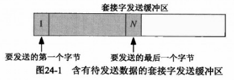
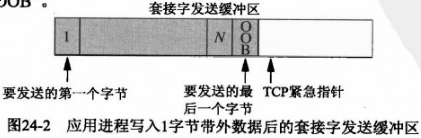
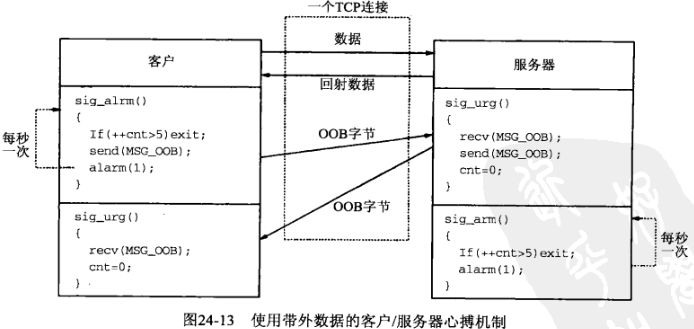

## 第二十四章 带外数据

#### 24.1 概述

带外数据被认为具有比普通数据更高的优先级，带外数据并不要求在客户和服务器之间再使用一个连接，而是被映射到已有的连接中。

#### 24.2 TCP带外数据

TCP并没有真正的带外数据，不过提供了我们紧急模式。



该进程接着以 *MSG_OOB* 标志调用 *send* 函数写出一个含有ASCII字符 `a` 的单字节带外数据：

`send(fd, "a", 1, MSG_OOB);`



如果我们发送多字节的带外数据，情况又会如何呢？例如：

`send(fd, "abc", 3, MSG_OOB);`

在这个例子中，TCP的紧急指针指向最后那个字节紧后的位置，也就是说最后那个字节（字母 `c`）被认为是带外数据。

**NOTE: 本小结请仔细阅读原书内容**

1) 使用 *SIGURG* 的简单例子, [tcpsend01.c](tcpsend01.c), [tcprecv01.c](tcprecv01.c)

```sh
$ gcc tcpsend01.c ../lib/error.c ../Chapter11/tcp_connect.c -o tcpsend01
$ ./tcpsend01 127.0.0.1 9999
wrote 3 bytes of normal data
wrote 1 byte of OOB data
wrote 2 bytes of normal data
wrote 1 byte of OOB data
wrote 2 bytes of normal data

$ gcc tcprecv01.c ../lib/error.c ../Chapter11/tcp_listen.c -o tcprecv01
$ ./tcprecv01 127.0.0.1 9999
read 3 bytes: 123
SIGURG received(23)
read 1 OOB byte: 4
read 2 bytes: 56
SIGURG received(23)
read 1 OOB byte: 7
read 2 bytes: 89
received EOF
```

结果与我们预期的一致，发送进程带外数据的每次发送产生递交给接收进程的 *SIGURG* 信号，后者接着读入单个带外字节。

2) 使用 *select* 的简单例子, [tcprecv02.c](tcprecv02.c), [tcprecv03.c](tcprecv03.c)

```sh
$ gcc tcpsend01.c ../lib/error.c ../Chapter11/tcp_connect.c -o tcpsend01
$ ./tcpsend01 127.0.0.1 9999
wrote 3 bytes of normal data
wrote 1 byte of OOB data
wrote 2 bytes of normal data
wrote 1 byte of OOB data
wrote 2 bytes of normal data

# （不正确地）使用select得到带外数据通知的接收程序
$ gcc tcprecv02.c ../lib/error.c ../Chapter11/tcp_listen.c -o tcprecv02
$ ./tcprecv02 127.0.0.1 9999
read 3 bytes: 123
read 1 OOB byte: 4
read 2 bytes: 56
read 1 OOB byte: 7
read 2 bytes: 89
received EOF

# 正确地select异常条件的修订版本
$ gcc tcprecv03.c ../lib/error.c ../Chapter11/tcp_listen.c -o tcprecv03
$ ./tcprecv03 127.0.0.1 9999
read 3 bytes: 123
read 1 OOB byte: 4
read 2 bytes: 56
read 1 OOB byte: 7
read 2 bytes: 89
received EOF
```

在我使用的环境中，并没有测试出 *tcprecv02.c* 中出现的问题（原书内容说明的问题）

    我们先运行本程序，接着运行早先的发送程序（tcpsend01.c），结果碰到如下错误：
    freebsd4 % tcprecv02 9999
    read 3 bytes: 123
    read 1 OOB byte: 4
    recv error: Invalid argument
    问题是select一直指示一个异常条件，直到进程的读入越过带外数据。同一个带外数据不能读入多次，因为首次读入之后，内核就清空这个单字节的缓冲区。再次指定MSG_OOB标志调用recv时，它将返回EINVAL。

#### 24.3 *sockatmark* 函数

每当收到一个带外数据时，就有一个与之关联的带外标记（out-of-band mark）。这是发送进程发送带外字节时该字节在发送端普通数据流中的位置。在从套接字读入期间，接收进程通过调用 *sockatmark* 函数确定是否处于带外标记。

```c
#include <sys/socket.h>

int sockatmark(int sockfd);
```

使用 *SIOCATMARK ioctl* 完成的此函数的一个实现

```c
#include <stropts.h>

int sockatmark(int fd)
{
    int flag;

    if (ioctl(fd, SIOCATMARK, &flag) < 0) {
        return(-1);
    }
    return(flag != 0);
}
```

1) 例子, [tcpsend04.c](tcpsend04.c), [tcprecv04.c](tcprecv04.c)

用此例子说明带外标记的如下两个特性：

(1) 带外标志总是指向普通数据最后一个字节紧后的位置。

(2) 读操作总是停在带外标记上。

```c
$ gcc tcpsend04.c ../lib/error.c ../Chapter11/tcp_connect.c -o tcpsend04
$ ./tcpsend04 127.0.0.1 9999
wrote 3 bytes of normal data
wrote 1 byte of OOB data
wrote 1 byte of normal data

$ gcc tcprecv04.c ../lib/error.c ../Chapter11/tcp_listen.c -o tcprecv04
$ ./tcprecv04 127.0.0.1 9999
read 3 bytes: 123
read 2 bytes: 45
received EOF
```

这里没有使用 *SIGURG* 和 *select*，而是调用 *sockatmark* 来确定何时碰到带外数据。

2) 例子，[tcpsend05.c](tcpsend05.c), [tcprecv05.c](tcprecv05.c)

另外一个例子，用于说明之前提到的另外两个带外数据的特性：

(1) 即使因为流量控制而停止发送数据了，TCP仍然发送带外数据的通知（即它的紧急指针）。

(2) 在带外数据到达之前，接收进程可能被通知说发送进程已经发送了带外数据（使用 *SIGURG* 信号或通过 *select*）。如果接收进程接着指定 *MSG_OOB* 调用 *recv*，而带外数据却尚未到达，*recv* 将返回 *EWOULDBLOCK* 错误。

```c
$ gcc tcpsend05.c ../lib/error.c ../Chapter11/tcp_connect.c -o tcpsend05
$ ./tcpsend05 127.0.0.1 9999
wrote 16384 bytes of normal data
wrote 1 byte of OOB data
wrote 1024 bytes of normal data

$ gcc tcprecv05.c ../lib/error.c ../Chapter11/tcp_listen.c -o tcprecv05
$ ./tcprecv05 127.0.0.1 9999
SIGURG received(23)
recv error: Resource temporarily unavailable
```

由 *err_sys* 函数显示的出错消息对应于 *EAGAIN*，*EAGAIN* 等同于 FreeBSD 中的 *EWOULDBLOCK*。发送端TCP向接收端TCP发送了带外通知，由此产生递交给接收进程的 *SIGURG* 信号。然而当接收进程指定 *MSG_OOB* 标志调用 *recv* 时，相应带外字节不能读入。

解决办法是让接收进程通过读入已排队的普通数据，在套接字接收缓冲区中腾出空间。这将导致接收端TCP向发送端通告一个非零的窗口，最终允许发送端发送带外字节。

3) 例子，[tcpsend06.c](tcpsend06.c)

给定TCP连接只有一个带外标记，如果在接收进程读入某个现有带外数据之前有新的带外数据到达，先前的标记就丢失。

```sh
$ gcc tcpsend06.c ../lib/error.c ../Chapter11/tcp_connect.c -o tcpsend06
$ ./tcpsend06 127.0.0.1 9999
wrote 3 bytes of normal data
wrote 1 byte of OOB data
wrote 1 byte of normal data
wrote 1 byte of OOB data
wrote 1 byte of normal data

$ gcc tcprecv04.c ../lib/error.c ../Chapter11/tcp_listen.c -o tcprecv04
$ ./tcprecv04 127.0.0.1 9999
read 5 bytes: 12345
read 2 bytes: 67
received EOF
```

第二个带外字节（`6`）的到来覆写了第一个带外字节（`4`）到来时存放的带外标记。正像我们所说，每个TCP连接最多只有一个带外标记。

#### 24.4 TCP带外数据小结

以上例子都是简易的，当我们考虑可能出现的定时问题时，带外数据将变得繁杂起来。首先要考虑的一点是带外数据概念实际上向接收端传达三个不同的信息。

(1) 发送端进入紧急模式这个事实。接收进程得以通知这个事实的手段不外乎 *SIGURG* 信号或 *select* 调用。

(2) 带外字节的位置，也就是它相对于来自发送端的其余数据的发送位置：带外标记。

(3) 带外字节的实际值。既然TCP是一个不解释应用程序所发送数据的字节流协议，带外字节就可以是任何8位值。

**对于TCP的紧急模式，我们可以认为URG标志是通知，紧急指针是带外标记，数据字节是其本身。**

(a) 每个连接只有一个TCP紧急指针

(b) 每个连接只有一个带外标记

(c) 每个连接只有一个单字节的带外缓冲区（该缓冲区只有在数据非在线读入时才需考虑）

带外数据是否有用取决于应用程序使用它的目的。如果目的是告知对端丢弃直到标记处的普通数据，那么丢失一个中间带外字节及其相应的标记不会有什么不良后果。但是如果不丢失带外字节本身很重要，那么必须在线接收这些数据。另外，作为带外数据发送的数据字节应该区别于普通数据，因为当有新的标记到达时，中间的标记将被覆写，从而事实上把带外字节混杂在普通数据之中。

#### 24.5 客户/服务器心搏函数



```sh
# server
$ gcc ../Chapter05/tcpserv04.c ../lib/error.c ../Chapter05/sigchildwaitpid.c strecho.c ../Chapter03/writen.c ../Chapter03/readline.c heartbeatserv.c -o tcpserv04.c
$ ./tcpserv04.c             # 心跳检测
SIGURG(23)
SIGALRM(14)
SIGURG(23)
SIGALRM(14)

# client
$ gcc ../Chapter05/tcpcli01.c ../lib/error.c strcliselect02.c ../Chapter03/writen.c ../Chapter03/readline.c heartbeatcli.c -o tcpcli01
$ ./tcpcli01 127.0.0.1      # 心跳检测
SIGALRM(14)
SIGURG(23)
SIGALRM(14)
SIGURG(23)
```

#### 24.6 小结

TCP没有真正的带外数据，不过提供紧急模式和紧急指针。一旦发送端进入紧急模式，紧急指针就出现在发送到对端的分节中的TCP首部中。连接的对端收取该指针是在告知接收进程发送端已经进入紧急模式，而且该指针指向紧急数据的最后一个字节。然后所有数据的发送仍然受TCP正常的流量控制支配。

套接字API把TCP的紧急模式映射成所谓的带外数据。发送进程通过指定 *MSG_OOB* 标志调用 *send* 让发送端进入紧急模式。该调用中的最后一个数据字节被认为是带外字节。接收端TCP收到新的紧急指针后，或者通过发送 *SIGURG* 信号，或者通过由 *select* 返回套接字有异常条件待处理的指示，让接收进程得以通知。默认情况下，接收端TCP把带外字节从普通数据流中取出存放到自己的单字节带外缓冲区，供接收进程通过指定 *MSG_OOB* 标志调用 *recv* 读取。接收进程也可以开启 *SO_OOBINLINE* 套接字选项，这种情况下，带外字节被留在普通数据流中。不管接收进程使用哪种方法读取带外字节，套接字层都在数据流中维护一个带外标记，并且不允许单个输入操作读过这个标记。接收进程通过调用 *sockatmark* 函数确定它是否已经达到该标记。
