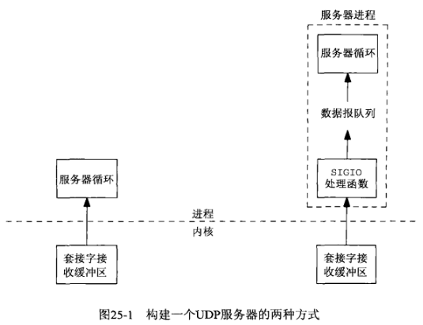
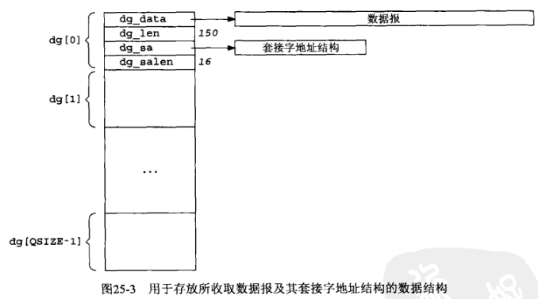

## 第二十五章 信号驱动式I/O

#### 25.1 概述

信号驱动式I/O是指进程预先告知内核，使得当某个描述符上发生某事时，内核使用信号通知相关进程。它在历史上曾被称为异步I/O（saynchronous I/)），不过信号驱动式I/O不是真正的异步I/O。

#### 25.2 套接字的信号驱动式I/O

针对一个套接字使用信号驱动I/O（*SIGIO*）要求进程执行以下3个步骤。

(1) 建立 *SIGIO* 信号的信号处理函数

(2) 设置该套接字的属主，通常使用 *fcntl* 的 *F_SETOWN* 命令设置

(3) 开启该套接字的信号驱动式I/O，通常通过使用 *fcntl* 的 *F_SETFL* 命令打开 *O_ASYNC* 标志完成

尽管很容易把一个套接字设置成以信号驱动式I/O模式工作，确定哪些条件导致内核产生递交给套接字属主的 *SIGIO* 信号却殊非易事。这种判定取决于支撑协议。

1) 对于UDP套接字的 *SIGIO* 信号

*SIGIO* 信号发生在以下事件时产生：

- 数据报到达套接字

- 套接字上发生异步错误

2) 对于TCP套接字的 *SIGIO* 信号

不幸的是，信号驱动式I/O对于TCP套接字近乎无用。问题在于该信号产生得过于频繁，并且它的出现并没有告诉我们发生了什么事情。下列条件均导致TCP套接字产生 *SIGIO* 信号

- 监听套接字上某个连接请求已经完成

- 某个断连请求已经发送

- 某个断连请求已经完成

- 某个连接之半已经关闭

- 连接到达套接字

- 数据已经从套接字发送走（即输出缓冲区有空闲空间）

- 发生某个异步错误

我们应该考虑只对监听TCP套接字使用 *SIGIO*，因为对于监听套接字产生 *SIGIO* 的唯一条件是某个新连接的完成。

作者能够找到的信号驱动I/O对于套接字的唯一实现用途是基于UDP的NTP服务区程序。



#### 25.3 使用 *SIGIO* 的UDP回射服务器程序



```c
#include "../lib/error.h"
#include <errno.h>
#include <fcntl.h>
#include <signal.h>
#include <stdio.h>
#include <stdlib.h>
#include <stropts.h>
#include <sys/ioctl.h>
#include <sys/socket.h>
#include <sys/types.h>
#include <unistd.h>

static int sockfd;

#define QSIZE       8       // size of input queue
#define MAXDG       4096    // max datagram size

typedef struct {
    void            *dg_data;       // ptr to actual datagram
    size_t           dg_len;        // length of datagram
    struct sockaddr *dg_sa;         // ptr to sockaddr{} w/client's address
    socklen_t        dg_salen;      // length of sockaddr{}
} DG;

static DG dg[QSIZE];            // queue of datagrams to process
static long cntread[QSIZE+1];   // diagnostic counter

static int iget;            // next one for main loop to process
static int iput;            // next one for signal handler to read into
static int nqueue;          // # on queue for main loop to process
static socklen_t clilen;    // max length of sockaddr{}

static void sig_io(int signo);
static void sig_hup(int signo);

void dg_echo(int sockfd_arg, struct sockaddr *pcliaddr, socklen_t clilen_arg)
{
    int         i;
    const int   on = 1;
    sigset_t    zeromask, newmask, oldmask;

    sockfd = sockfd_arg;
    clilen = clilen_arg;

    for (i = 0; i < QSIZE; i++) {   // init queue of buffers
        dg[i].dg_data = malloc(MAXDG);
        dg[i].dg_sa = malloc(clilen);
        dg[i].dg_salen = clilen;
    }
    iget = iput = nqueue = 0;

    signal(SIGHUP, sig_hup);
    signal(SIGIO, sig_io);
    fcntl(sockfd, F_SETOWN, getpid());
    ioctl(sockfd, FIOASYNC, &on);
    ioctl(sockfd, FIONBIO, &on);

    sigemptyset(&zeromask);
    sigemptyset(&oldmask);
    sigemptyset(&newmask);
    sigaddset(&newmask, SIGIO);

    sigprocmask(SIG_BLOCK, &newmask, &oldmask);
    for ( ; ; ) {
        while (nqueue == 0) {
            sigsuspend(&zeromask);  // wait for datagram to process
        }
        // unblock SIGIO
        sigprocmask(SIG_SETMASK, &oldmask, NULL);
        sendto(sockfd, dg[iget].dg_data, dg[iget].dg_len, 0, dg[iget].dg_sa, dg[iget].dg_salen);
        if (++iget >= QSIZE) {
            iget = 0;
        }
        // block SIGIO
        sigprocmask(SIG_BLOCK, &newmask, &oldmask);
        nqueue--;
    }
}

// sig_io SIGIO信号处理函数，当连接有数据到达时，此函数运行，通过使用 QSIZE 来
//        控制接收队列大小
static void sig_io(int signo)
{
    ssize_t     len;
    int         nread;
    DG         *ptr;

    for (nread = 0; ; ) {
        if (nqueue >= QSIZE) {
            err_quit("receive overflow");
        }

        ptr = &dg[iput];
        ptr->dg_salen = clilen;
        len = recvfrom(sockfd, ptr->dg_data, MAXDG, 0, ptr->dg_sa, &ptr->dg_salen);
        if (len < 0) {
            if (errno == EWOULDBLOCK) {
                break;  // all done; no more queued to read
            }
            err_sys("recvfrom error");
        }
        ptr->dg_len = len;

        nread++;
        nqueue++;
        if (++iput >= QSIZE) {
            iput = 0;
        }
    }
    cntread[nread]++;   // historgram of # datagrams read per signal
}

static void sig_hup(int signo)
{
    int i;

    for (i = 0; i <= QSIZE; i++) {
        printf("cntread[%d] = %ld\n", i, cntread[i]);
    }
}
```

```sh
$ gcc ../Chapter08/udpcli01.c ../lib/error.c ../Chapter08/dg_cli.c -o udpcli01
$ ./udpcli01 127.0.0.1
[dg_cli.c]: sendto, recvfrom.
hello
hello
world
world
hello world
hello world
$ pgrep udpserv01 | xargs -I {} kill -s HUP {}  # 向udpserv01发送SIGHUP信号

$ gcc ../Chapter08/udpserv01.c ../lib/error.c dgecho01.c -o udpserv01
$ ./udpserv01
cntread[0] = 0
cntread[1] = 3
cntread[2] = 0
cntread[3] = 0
cntread[4] = 0
cntread[5] = 0
cntread[6] = 0
cntread[7] = 0
cntread[8] = 0
```

#### 25.4 小结

信号驱动式I/O就是让内核在套接字上发生的”某事“时使用 *SIGIO* 信号通知进程。

- 对于已连接TCP套接字，可以导致这种通知的条件为数众多，反而使得这个特性几近无用

- 对于监听TCP套接字，这种通知发生在有一个新连接已准备好接受之时

- 对于UDP套接字，这种通知意味着或者达到一个数据报，或者达到一个异步错误，这两种情况下我们都调用 *recvfrom*
