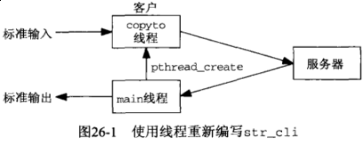
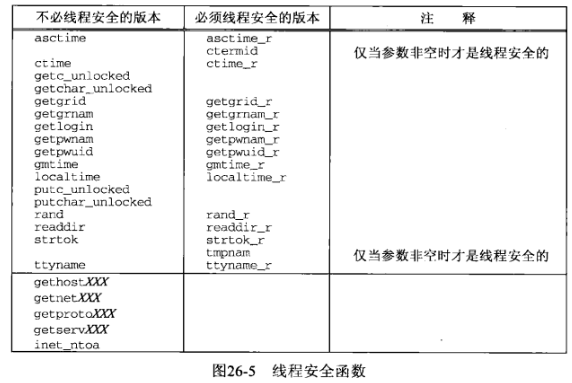
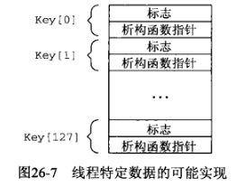
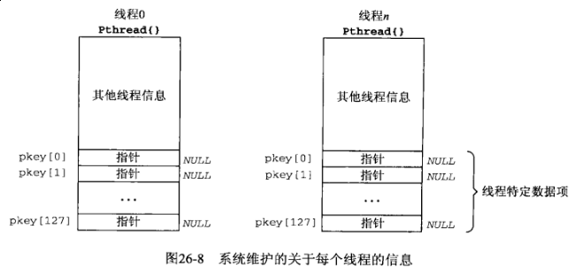
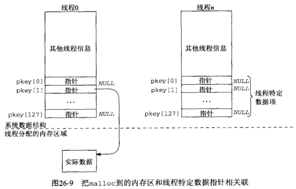
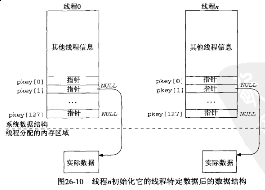

## 第二十六章 线程

#### 26.1 概述

*fork* 调用存在的一些问题：

- *fork* 是昂贵的。*fork* 要把父进程的内存映像复制到子进程，并在子进程中复制所有描述符，如此等等。当今的实现使用称为写时复制的技术，用以避免在子进程切实需要自己的副本之前把父进程的数据空间复制到子进程。然而即便有这样的优化措施，*fork* 仍然是昂贵的。

- *fork* 返回之后父子进程之间信息的传递需要进程间通信（IPC）机制。调用 *fork* 之前父进程向尚未存在的子进程传递信息相当容易，因为子进程将从父进程数据空间及所有描述符的一个副本开始运行。然而从子进程往父进程返回信息却比较费力。

线程有助于解决这两个问题。同一进程内的哦所有线程共享相同的全局内存。这使得线程之间易于共享信息，然而伴随这种简易性而来的却是同步问题。

同一进程内的所有线程除了共享全局变量外还共享：

- 进程指令

- 大多数数据

- 打开的文件（即描述符）

- 信号处理函数和信号处理

- 当前工作目录

- 用户ID和组ID

不过每个线程有各自的：

- 线程ID

- 寄存器集合，包括程序计数器和栈指针

- 栈（用于存放局部变量和返回地址）

- errno

- 信号掩码

- 优先级

#### 26.2 基本线程函数：创建和终止

1) *pthread_create* 函数

```c
#include <pthread.h>

int pthread_create(pthread_t *tid, const pthread_attr_t *attr, void *(*func)(void *), void *arg);
```

2) *pthread_join* 函数

```c
#include <pthread.h>

int pthread_join(pthread_t *tid, void **status);
```

3) *pthread_self* 函数

```c
#include <pthread.h>

pthread_t pthread_self(void);
```

4) *pthread_detach* 函数

```c
#include <pthread.h>

int pthread_detach(pthread_t tid);
```

5) *pthread_exit* 函数

```c
#include <pthread.h>

void pthread_exit(void *status);
```

让线程终止的另外两个方法：

- 启动线程的函数（即 *pthread_create* 的第三个参数）可以返回。既然该函数必须声明成返回一个 *void* 指针，它的返回值就是相应线程的终止状态。

- 如果进程的 *main* 函数返回或者任何线程调用了 *exit*，整个进程就终止，其中包括它的任何线程

#### 26.3 使用线程的 *str_cli* 函数



```c
#include "../lib/error.h"
#include <errno.h>
#include <pthread.h>
#include <stdio.h>
#include <string.h>
#include <sys/socket.h>
#include <unistd.h>

#define MAXLINE     4096        /* max text line length */

static int   sockfd;
static FILE *fp;

void *copyto(void *arg);   // global for both threads to access
// ../Chapter03/readline.c
ssize_t readline(int fd, void *vptr, size_t maxlen);
// ../Chapter03/writen.c
ssize_t writen(int fd, const void *vptr, size_t n);

void str_cli(FILE *fp_arg, int sockfd_arg)
{
    char        recvline[MAXLINE];
    pthread_t   tid;
    int         n;

    sockfd = sockfd_arg;    // copy arguments to externals
    fp = fp_arg;

    if ((n = pthread_create(&tid, NULL, copyto, NULL)) != 0) {
        errno = n;
        err_sys("pthread_create error");
    }

    while (readline(sockfd, recvline, MAXLINE) > 0) {
        fputs(recvline, stdout);
    }
}

void *copyto(void *arg)
{
    char sendline[MAXLINE];

    while (fgets(sendline, MAXLINE, fp) != NULL) {
        writen(sockfd, sendline, strlen(sendline));
    }
    shutdown(sockfd, SHUT_WR);  // EOF on stdin, send FIN
    return(NULL);       // return (i.e., thread terminates) when EOF on stdin
}
```

我们在16.2节末尾提供了用于 *str_cli* 函数不同版本的5个实现技术的性能测量结果。对比非阻塞式I/O版本的复杂性和线程版本的简单性，我们依然推荐使用线程而不是非阻塞式I/O。

#### 26.4 使用线程的TCP回射服务器程序

```c
#include "../lib/error.h"
#include <errno.h>
#include <pthread.h>
#include <stdlib.h>
#include <sys/socket.h>
#include <sys/types.h>
#include <unistd.h>

static void *doit(void *arg);  // each thread executes this function
// ../Chapter11/tcp_listen.c
int tcp_listen(const char *host, const char *serv, socklen_t *addrlenp);
// ../Chapter05/str_echo.c
void str_echo(int sockfd);

int main(int argc, char **argv)
{
    int              listenfd, connfd, n;
    pthread_t        tid;
    socklen_t        addrlen, len;
    struct sockaddr *cliaddr;

    if (argc == 2) {
        listenfd = tcp_listen(NULL, argv[1], &addrlen);
    } else if (argc == 3) {
        listenfd = tcp_listen(argv[1], argv[2], &addrlen);
    } else {
        err_quit("usage: tcpserv01 [ <host> ] <service or port>");
    }

    cliaddr = (struct sockaddr *) malloc(addrlen);

    for ( ; ; ) {
        len = addrlen;
        // 可能存在问题：多线程执行时connfd指向了同一个内存空间
        connfd = accept(listenfd, cliaddr, &len);
        if ((n = pthread_create(&tid, NULL, &doit, (void *) connfd)) != 0) {
            errno = n;
            err_sys("pthread_create error");
        }
    }
}

static void *doit(void *arg)
{
    int n;
    if ((n = pthread_detach(pthread_self())) != 0) {
        errno = n;
        err_sys("pthread_detach error");
    }
    str_echo((int)arg);
    close((int)arg);
    return(NULL);
}
```

```c
gcc tcpserv01.c ../lib/error.c ../Chapter05/str_echo.c ../Chapter11/tcp_listen.c -lpthread -o tcpserv01
$ ./tcpserv01 127.0.0.1 9877

$ gcc ../Chapter05/tcpcli01.c ../lib/error.c strclithread.c ../Chapter03/readline.c ../Chapter03/writen.c -lpthread -o tcpcli01
$ ./tcpcli01 127.0.0.1
hello world
hello world
world
world
```

1) 给新线程传递参数

前述例子中把整数变量 *connfd* 类型强制转换成 *void* 指针并不保证在所有系统上都能起作用。

主线程中只有一个整数变量 *connfd*，每次调用 *accept* 该变量都会被覆写以一个新值（已连接描述符）。因此可能发生下述情况：

- *accept* 返回，主线程把返回值存入 *connfd* 后调用 *pthread_create*。*pthread_create* 的最后一个参数是指向 *connfd* 的指针而不是 *connfd* 的内容

- *Pthread* 函数库创建一个线程，并准备调度 *doit* 函数启动执行

- 另一个连接就绪且主线程在新创建的线程开始运行之前再次运行。*accept* 返回，主线程把返回值存入 *connfd* 后调用 *pthread_create*

如下程序给出了解决本问题的更好的办法：

```c
#include "../lib/error.h"
#include <errno.h>
#include <pthread.h>
#include <stdlib.h>
#include <sys/socket.h>
#include <sys/types.h>
#include <unistd.h>

static void *doit(void *arg);  // each thread executes this function
// ../Chapter11/tcp_listen.c
int tcp_listen(const char *host, const char *serv, socklen_t *addrlenp);
// ../Chapter05/str_echo.c
void str_echo(int sockfd);

int main(int argc, char **argv)
{
    int              listenfd, *iptr, n;
    pthread_t        tid;
    socklen_t        addrlen, len;
    struct sockaddr *cliaddr;

    if (argc == 2) {
        listenfd = tcp_listen(NULL, argv[1], &addrlen);
    } else if (argc == 3) {
        listenfd = tcp_listen(argv[1], argv[2], &addrlen);
    } else {
        err_quit("usage: tcpserv01 [ <host> ] <service or port>");
    }

    cliaddr = (struct sockaddr *) malloc(addrlen);

    for ( ; ; ) {
        len = addrlen;
        iptr = (int *) malloc(sizeof(int));
        *iptr = accept(listenfd, cliaddr, &len);
        if ((n = pthread_create(&tid, NULL, &doit, (void *) iptr)) != 0) {
            errno = n;
            err_sys("pthread_create error");
        }
    }
}

static void *doit(void *arg)
{
    int n, connfd;

    connfd = *((int *) arg);
    free(arg);

    if ((n = pthread_detach(pthread_self())) != 0) {
        errno = n;
        err_sys("pthread_detach error");
    }
    str_echo(connfd);
    close(connfd);
    return(NULL);
}
```

```sh
$ gcc tcpserv02.c ../lib/error.c ../Chapter05/str_echo.c ../Chapter11/tcp_listen.c -lpthread -o tcpserv02
$ ./tcpserv02 127.0.0.01 9877

$ gcc ../Chapter05/tcpcli01.c ../lib/error.c strclithread.c ../Chapter03/readline.c ../Chapter03/writen.c -lpthread -o tcpcli01
$ ./tcpcli01 127.0.0.1
hello world
hello world
world
world
```

2) 线程安全函数



#### 26.5 线程特定数据

把一个未线程化的程序转换成使用线程的版本时，有时会碰到因其中有函数使用静态变量而引起的一个常见编程错误。和许多与线程相关的其他编程错误一样，这个错误造成的故障也是非确定的。在无需考虑重入的环境下编写使用静态变量的函数无可非议，然而当同一进程内的不同线程（信号处理函数也视为线程）几乎同时调用这样的函数时就可能会有问题发生，因为这些函数使用的静态变量无法为不同的线程保存各自的值。

每个系统支持有限数量的线程特定数据元素。POSIX要求这个限制不小于128（每个进程），在后面的例子中我们就采用128这个限制。系统（可能是线程函数库）为每个进程维护一个我们称之为Key结构的结构数组



Key结构中的标志指示这个数组元素是否正在使用，所有的标志初始化为“不在使用”。当一个线程调用 *pthread_key_create* 创建一个新的线程特定数据元素时，系统搜索其Key结构数组找出第一个不再使用的元素。该元素的索引（0～127）称为键，返回给调用线程的正是这个索引。

除了进程范围的Key结构数组外，系统还在进程内维护关于每个线程的多条信息。这些特定于线程的信息我们称之为 *Pthread* 结构，其部分内容是我们称之为 *pkey* 数组的一个128个元素的指针数组。



看一下如何使用线程特定数据的例子





例子：使用线程特定数据的 *readline* 函数（线程安全版本）

```c
#include "../lib/error.h"
#include <errno.h>
#include <pthread.h>
#include <stdlib.h>
#include <unistd.h>

#define MAXLINE     4096        /* max text line length */

static pthread_key_t    rl_key;
static pthread_once_t   rl_once = PTHREAD_ONCE_INIT;

static void readline_destructor(void *ptr)
{
    free(ptr);
}

// readline_once 一次性函数
static void readline_once(void)
{
    int n;
    if ((n = pthread_key_create(&rl_key, readline_destructor)) < 0) {
        errno = n;
        err_sys("pthread_key_create error");
    }
}

typedef struct {
    int     rl_cnt;     // initialize to 0
    char   *rl_bufptr;  // initialize to rl_buf
    char    rl_buf[MAXLINE];
} Rline;

static ssize_t my_read(Rline *tsd, int fd, char *ptr)
{
    if (tsd->rl_cnt <= 0) {
again:
        if ((tsd->rl_cnt = read(fd, tsd->rl_buf, MAXLINE)) < 0) {
            if (errno == EINTR) {
                goto again;
            }
            return(-1);
        } else if (tsd->rl_cnt == 0) {
            return(0);
        }
        tsd->rl_bufptr = tsd->rl_buf;
    }

    tsd->rl_cnt--;
    *ptr = *tsd->rl_bufptr++;
    return(1);
}

// readline 线程安全版本
ssize_t readline(int fd, void *vptr, size_t maxlen)
{
    size_t  n, rc;
    char    c, *ptr;
    Rline   *tsd;

    if ((n = pthread_once(&rl_once, readline_once)) < 0) {
        errno = n;
        err_sys("pthread_once error");
    }
    if ((tsd = pthread_getspecific(rl_key)) == NULL) {
        tsd = (Rline *) calloc(1, sizeof(Rline));   // init to 0
        if ((n = pthread_setspecific(rl_key, tsd)) < 0) {
            errno = n;
            err_sys("pthread_setspecific error");
        }
    }

    ptr = vptr;
    for (n = 1; n < maxlen; n++) {
        if ((rc = my_read(tsd, fd, &c)) == 1) {
            *ptr++ = c;
            if (c == '\n') {
                break;
            }
        } else if (rc == 0) {
            *ptr = 0;
            return(n - 1);  // EOF, n -1 bytes read
        } else {
            return(-1);
        }
    }
    *ptr = 0;
    return(n);
}
```

#### 26.6 Web客户与同时连接

```c
#include "../lib/error.h"
#include <errno.h>
#include <pthread.h>
#include <unistd.h>
#include <stdio.h>
#include <stdlib.h>

#define MAXLINE     4096        /* max text line length */
#define MAXFILES     20
#define SERV        "80"

#define min(a, b)   ((a) < (b) ? (a) : (b))

struct file {
    char      *f_name;  // filename
    char      *f_host;  // hostname or IP address
    int        f_fd;    // descriptor
    int        f_flags; // F_xxx below
    pthread_t  f_tid;   // thread ID
} file[MAXFILES];

#define F_CONNECTING 1  // connect() in progress
#define F_READING    2  // connect() complete; now reading
#define F_DONE       4  // all done

#define GET_CMD      "GET %s HTTP/1.0\r\n\r\n"

int nconn, nfiles, nlefttoconn, nlefttoread;

void *do_get_read(void *vptr);
// ../Chapter16/home_page.c
void home_page(const char *, const char *);
// ../Chapter16/write_get_cmd.c
void write_get_cmd(struct file *);
// ../Chapter11/tcp_connect.c
int tcp_connect(const char *host, const char *serv);

int main(int argc, char **argv)
{
    int          i, n, maxnconn, e;
    pthread_t    tid;
    struct file *fptr;

    if (argc < 5) {
        err_quit("usage: web <#conns> <IPaddr> <homepage> file1 ...");
    }
    maxnconn = atoi(argv[1]);

    nfiles = min(argc - 4, MAXFILES);
    for (i = 0; i < nfiles; i++) {
        file[i].f_name = argv[i + 4];
        file[i].f_host = argv[2];
        file[i].f_flags = 0;
    }
    printf("nfiles = %d\n", nfiles);

    home_page(argv[2], argv[3]);

    nlefttoread = nlefttoconn = nfiles;
    nconn = 0;
    while (nlefttoread > 0) {
        while (nconn < maxnconn && nlefttoconn > 0) {
            // find a file to read
            for (i = 0; i < nfiles; i++) {
                if (file[i].f_flags == 0) {
                    break;
                }
            }
            if (i == nfiles) {
                err_quit("nlefttoconn = %d but nothing found", nlefttoconn);
            }
            file[i].f_flags = F_CONNECTING;
            if ((e = pthread_create(&tid, NULL, &do_get_read, &file[i])) < 0) {
                errno = e;
                err_sys("pthread_create error");
            }
            file[i].f_tid = tid;
            nconn++;
            nlefttoconn--;
        }
        // TODO: Solaris thread.h
        // 在Salaris环境下可以混用pthreah线程和Solaris线程
        if ((n = thr_join(0, &tid, (void **) &fptr)) != 0) {
            errno = n, err_sys("thr_join error");
        }

        nconn--;
        nlefttoread--;
        printf("thread id %d for %s done\n", (int) tid, fptr->f_name);
    }
    exit(0);
}

void *do_get_read(void *vptr)
{
    int          fd, n;
    char         line[MAXLINE];
    struct file *fptr;

    fptr = (struct file *) vptr;

    fd = tcp_connect(fptr->f_host, SERV);
    fptr->f_fd = fd;
    printf("do_get_read for %s, fd %d, thread %d\n", fptr->f_name, fd, (int)fptr->f_tid);

    write_get_cmd(fptr);    // write() the GET command

    // read server's reply
    for ( ; ; ) {
        if ((n = read(fd, line, MAXLINE)) == 0) {
            break;  // server closed connection
        }
        printf("read %d bytes from %s\n", n, fptr->f_name);
    }
    printf("end-of-file on %s\n", fptr->f_name);
    close(fd);
    fptr->f_flags = F_DONE; // clears F_READING
    return(fptr);
}
```

#### 26.7 互斥锁

我们称线程编程为并发编程或并行编程，因为多个线程可以并发地（或并行地）运行却访问相同的变量。

多线程更改同一个共享变量的问题是最简单的问题。其解决办法是使用一个互斥锁（mutex，代表mutual exclusion）保护这个共享变量，访问变量的前提条件是持有该互斥锁。

```c
#include <pthread.h>

int pthread_mutex_lock(pthread_mutex_t *mptr);
int pthread_mutex_unlock(pthread_mutex_t *mptr);
```

未使用互斥锁 [example01.c](example01.c)，使用互斥锁 [example02.c](example02.c)

#### 26.8 条件变量

互斥锁适合用于防止同时访问某个共享变量，但是我们需要另外某种在等待某个条件发生期间能让我们进入睡眠的东西。

**互斥锁提供互斥机制，条件变量提供信号机制。**

```c
#include <pthread.h>

int pthread_cond_wait(pthread_cond_t *cptr, pthread_mutex_t *mptr);
int pthread_cond_signal(pthread_cond_t *cptr);

int pthread_cond_broadcast(pthread_cond_t *cptr);
int pthread_cond_timedwait(pthread_cond_t *cptr, pthread_mutex_t *mptr, const struct timespec *abstime);
```

**NOTE: 本小节请看原书具体分析**

#### 26.9 Web客户与同时连接（续）

```sh
$ sudo systemctl start nginx
$ sudo systemctl start php-fpm

$ gcc web03.c ../Chapter16/home_page.c ../Chapter16/write_get_cmd.c ../Chapter11/tcp_connect.c ../Chapter03/writen.c ../lib/error.c -lpthread -o web03

$ ls -alh /data/www/
-rw-r--r-- 1 fanbin fanbin  134 Jul 11 17:16 index.php
$ ./web03 3 127.0.0.1 / index.php index.php abc.txt
nfiles = 3
read 325 bytes of home page
end-of-file on home page
do_get_read for index.php, fd 3, thread -195139840
do_get_read for index.php, fd 4, thread -186747136
wrote 27 bytes for index.php
wrote 27 bytes for index.php
do_get_read for abc.txt, fd 5, thread -203532544
read 325 bytes from index.php
end-of-file on index.php
wrote 25 bytes for abc.txt
read 325 bytes from index.php
end-of-file on index.php
read 325 bytes from abc.txt
end-of-file on abc.txt
thread id -203532544 for index.php done
thread id -203532544 for index.php done
thread id -203532544 for abc.txt done
```

与第十六章使用非阻塞 *connect* 的Web客户程序版本一道给出了本版本的时间性能。

#### 26.10 小结

创建一个新线程通常比使用 *fork* 派生一个新进程快得多。仅仅这一点就能够体现线程在繁重使用的网络服务器上的优势。

同一进程内的所有线程共享全局变量和描述符，从而允许不同线程之间共享这些信息。然而这种共享却引入了同步问题，我们必须使用的 *Pthread* 同步原语是互斥锁和条件变量。共享数据的同步几乎是每个线程化应用程序必不可少的部分。

编写能够被线程化应用程序调用的函数时，这些函数必须做到线程安全。有助于做到这一点的一个技巧是线程特定数据。
