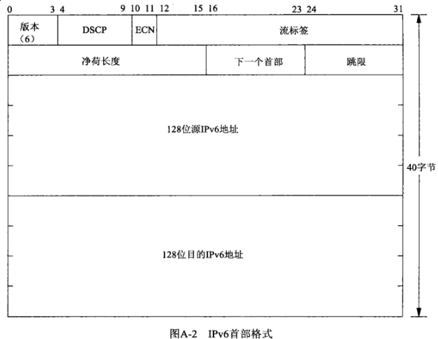

## 第二十七章 IP选项

#### 27.1 概述

IPv4允许在20字节首部固定部分之后跟以最多共40个字节的选项。

IPv6允许固定长度的40字节IPv6首部和传输层首部之间出现扩展首部。

#### 27.2 IPv4选项


#### 27.3 IPv4源路径选项

源路径（source route）是由IP数据报的发送者指定的一个IP地址列表。如果源路径是严格的（strict），那么数据报必须且只能逐一经过所列的节点。也就是说列在源路径中的所有节点必须前后互为邻居。如果源路径是宽松的（loose），那么数据报必须逐一经过所列的节点，不过也可以经过未列在源路径中的其他节点。


```c
#include <netinet/ip_var.h>

#define MAX_IPOPTLEN  40
struct ipoption {
    struct in_addr  ipopt_dst;                  // first_hop dst if source routed
    char            ipopt_list[MAX_IPOPTLEN];   // options proper
}
```

1) 例子

把TCP回射客户程序改为指定一个源路径，把TCP回射服务器程序改为显示一个接收源路径。

**NOTE: 此例子并没有运行成功**

```c
$ gcc tcpserv01.c ../Chapter05/str_echo.c ../Chapter11/host_serv.c ../lib/error.c sourceroute.c -o tcpserv01
$ ./tcpserv01

$ gcc tcpcli01.c ../Chapter05/str_cli.c ../Chapter11/host_serv.c ../Chapter26/readline.c ../lib/error.c sourceroute.c -lpthread -o tcpcli01
$ ./tcpcli01 -g 192.168.20.9 192.168.1.42
```

不幸的是，*IP_OPTIONS* 套接字选项的操作从未有过正式文档，因而在不是源自 *Berkeley* 源代码的系统上可能会碰到一些异变。

2) 删除所收取的源路径

**TODO: 请看原书说明**

#### 27.4 IPv6扩展首部



#### 27.5 IPv6步跳选项和目的地选项

**TODO**

#### 27.6 IPv6路由首部

**TODO**

#### 27.7 IPv6粘附选项

**TODO**

#### 27.8 历史性IPv6高级API

**TODO**

#### 27.9 小结

在10个已定义的IPv4选项中最常用的是源路径选项，不过出于安全考虑，它的使用正在日益萎缩。IPv4首部中选项的访问通过 *IP_OPTIONS* 套接字选项完成。

**IPv6定义了6个扩展首部，不过对它们的支持至今依然鲜见。** IPv6扩展首部的访问通过函数接口完成，因而无需了解它们出现在分组中的真实格式。这些扩展首部作为辅助数据经调用 *sendmsg* 发送，又作为辅助数据由 *recvmsg* 调用返回。
