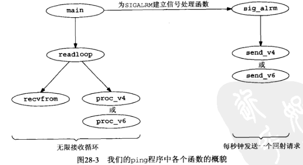
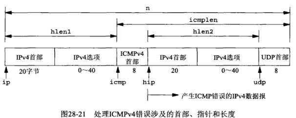
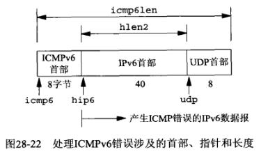
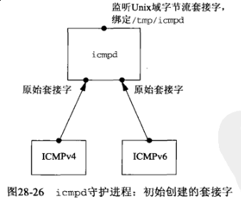
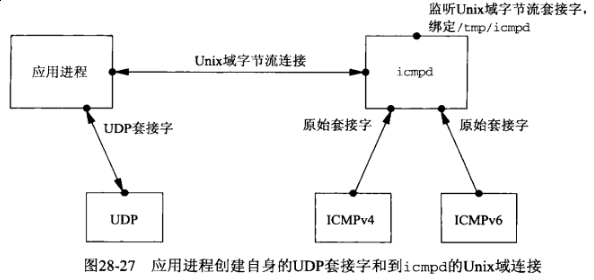
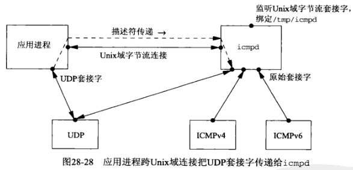
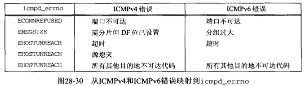

## 第二十八章 原始套接字

#### 28.1 概述

原始套接字提供普通的TCP和UDP套接字所不提供的以下3个能力：

- 有了原始套接字，进程可以读与写ICMPv4, IGMPv4和ICMPv6等分组

- 有了原始套接字，进程可以读写内核不处理其协议字段的IPv4数据报

- 有了原始套接字，进程还可以使用 *IP_HDRINCL* 套接字选项自行构造IPv4首部。这个能力用于构造譬如说TCP或UDP分组

本章介绍原始套接字的创建，输入和输出，并开发在IPv4和IPv6下均可使用的 `ping` 和 `traceroute` 程序。

#### 28.2 原始套接字创建

(1) 把第二个参数指定为 *SOCK_RAW* 并调用 *socket* 函数，以创建一个原始套接字。

```c
int sockfd;

sockfd = socket(AF_INET, SOCK_RAW, {protocol});
```

其中 *protocol* 参数是形如 *IPPROTO_xxx* 的某个常值，定义在 `<netinet/in.h>` 头文件中。

只有超级用户才能创建原始套接字，这么做可防止普通用户往网络写出它们自行构造的IP数据报。

(2) 可以在这个原始套接字上按以下方式开启 *IP_HDRINCL* 套接字选项：

```c
const int on = 1;

setsockopt(sockfd, IPPROTO_IP, IP_HDRINCL, &on, sizeof(on));
```

(3) 可以在这个原始套接字上调用 *bind* 函数，不过比较少见。

(4) 可以在这个原始套接字上调用 *connect* 函数，不过也比较少见。

#### 28.3 原始套接字输出

原始套接字的输出遵循一下规则：

- 普通输出通过调用 *sendto* 或 *sendmsg* 并指定目的IP地址完成。如果套接字已经连接，那么也可以调用 *write*, *writev* 或者 *send*。

- 如果 *IP_HDRINCL* 套接字选项**未开启**，那么由进程让内核发送的数据的起始地址指的是**IP首部之后的第一个字节**，因为内核将构造IP首部并把它置于来自进程的数据之前。

- 如果 *IP_HDRINCL* 套接字选项**已开启**，那么有进程让内核发送的数据的起始地址指的是**IP首部的第一个字节**。

- 内核会对超出外出接口MTU的原始分组执行分片。

1) IPv6的差异

- 通过IPv6原始套接字发送和接收的协议首部中的所有字段均采用网络字节序。

- IPv6不存在与IPv4的 *IP_HDRINCL* 套接字选项类似的东西。

- IPv6原始套接字的校验和处理存在差异

2) *IPV6_CHECKSUM* 套接字选项

对于ICMPv6原始套接字，内核总是计算并存储ICMPv6首部中的校验和。这一点不同于ICMPv4原始套接字，也就是说ICMPv4首部中的校验和必须有应用进程自行计算并存储。

#### 28.4 原始套接字输入

内核把哪些接收到的IP数据报传递到原始套接字？这儿遵循如下规则：

- 接收到的UDP分组和TCP分组绝不传递任何原始套接字。

- 大多数ICMP分组在内核处理完其中的ICMP消息后传递到原始套接字。

- 所有IGMP分组在内核完成处理其中的IGMP消息后传递到原始套接字。

- 内核不认识其协议字段的所有IP数据报传递到原始套接字。

- 如果某个数据报以分片形式到达，那么在它的所有分段均到达且重组出该数据报之前，不传递任何片段分组到原始套接字。

当内核有一个需要传递到原始套接字的IP数据报时，它将检查所有进程上的原始套接字，以寻找所有匹配的套接字。每个匹配的套接字将被递送以该IP数据报的一个副本。内核对原始套接字均执行如下3个测试，只有这3个测试结果均为真，内核才把接收到的数据报递送到这个套接字。

- 如果创建这个原始套接字时指定了**非0**的协议参数（*socket* 的第三个参数），那么接收到的数据报的协议字段必须匹配该值，否则该数据报不递送到这个套接字。

- 如果这个原始套接字已由 *bind* 调用绑定了某个本地IP地址，那么接收到的数据报的目的IP地址必须匹配这个绑定地址，否则该数据报不递送到这个套接字。

- 如果这个原始套接字已由 *connect* 调用指定了某个外地IP地址，那么接收到的数据报的源IP地址必须匹配这个已连接地址，否则该数据报不递送到这个套接字。

**注意，如果一个原始套接字是以0值协议参数创建的，而且既未对它调用过 bind, 也未对它调用过 connect，那么该套接字将接收可由内核传递到原始套接字的每个原始数据报的一个副本。**

#### 28.5 *ping* 程序



```c
# ping v4
$ gcc ping/main.c ../Chapter11/host_serv.c ../lib/error.c ../lib/sock_ntop_host.c ping/readloop.c ping/sig_alrm.c ping/tv_sub.c ping/send_v4.c ping/proc_v4.c ping/in_cksum.c -o pingv4
$ sudo ./pingv4 www.baidu.com
PING www.a.shifen.com (220.181.112.244): 56 data bytes
64 bytes from 220.181.112.244: seq=0, ttl=51, rtt=5.265 ms
64 bytes from 220.181.112.244: seq=1, ttl=51, rtt=4.399 ms
64 bytes from 220.181.112.244: seq=2, ttl=51, rtt=4.973 ms
64 bytes from 220.181.112.244: seq=3, ttl=51, rtt=4.997 ms

# ping v46
$ gcc -DIPV6 ping/main.c ../Chapter11/host_serv.c ../lib/error.c ../lib/sock_ntop_host.c ping/readloop.c ping/sig_alrm.c ping/tv_sub.c ping/send_v4.c ping/proc_v4.c ping/in_cksum.c ping/init_v6.c ping/send_v6.c ping/proc_v6.c -o pingv46
$ sudo ./pingv46 www.baidu.com
[sudo] password for fanbin:
PING www.a.shifen.com (220.181.112.244): 56 data bytes
64 bytes from 220.181.112.244: seq=0, ttl=51, rtt=5.252 ms
64 bytes from 220.181.112.244: seq=1, ttl=51, rtt=5.081 ms
64 bytes from 220.181.112.244: seq=2, ttl=51, rtt=4.891 ms
64 bytes from 220.181.112.244: seq=3, ttl=51, rtt=5.347 ms
64 bytes from 220.181.112.244: seq=4, ttl=51, rtt=4.123 ms
```

#### 28.6 *traceroute* 程序

*traceroute* 允许我们确定IP数据报从本地主机游历到某个远程主机所经过的路径。

*traceroute* 使用IPv4的TTL字段或IPv6的跳限字段以及两种ICMP消息。它一开始向目的地发送一个TTL（或跳限）为1的UDP数据报。这个数据报导致第一跳路由器返送一个ICMP"time exceeded in transmit"（传输超时）错误。接着它每递增TTL一次发送一个UDP数据报，从而逐步确定下一跳路由器。当某个UDP数据报到达最终目的地址时，目标是由这个主机返回一个ICMP "port unreachable（端口不可达）"错误。这个目标通向一个随即选取的（但愿）未被目的主机使用的端口发送UDP数据报得以实现。





```c
$ gcc traceroute/main.c ../Chapter11/host_serv.c ../lib/sock_ntop_host.c ../lib/error.c traceroute/traceloop.c traceroute/sig_alrm.c traceroute/icmpcode_v4.c traceroute/recv_v4.c traceroute/sock_set_port.c traceroute/sock_cmp_addr.c ping/tv_sub.c -o traceroutev4
$ sudo ./traceroutev4 www.baidu.com
traceroute to www.a.shifen.com (220.181.112.244): 30 hops max, 24 data bytes
1  _gateway (192.168.0.1)  20.896 ms  3.876 ms  2.715 ms
2  172.16.20.2 (172.16.20.2)  2.878 ms  9.789 ms  4.438 ms
3  106.38.77.17 (106.38.77.17)  18.711 ms  2.381 ms  2.785 ms
4  10.1.14.189 (10.1.14.189)  2.009 ms  2.924 ms  2.133 ms
5

$ gcc -DIPV6 traceroute/main.c ../Chapter11/host_serv.c ../lib/sock_ntop_host.c ../lib/error.c traceroute/traceloop.c traceroute/sig_alrm.c traceroute/icmpcode_v4.c traceroute/recv_v4.c traceroute/sock_set_port.c traceroute/sock_cmp_addr.c ping/tv_sub.c traceroute/icmpcode_v6.c traceroute/recv_v6.c -o traceroutev46
$ sudo ./traceroutev46 www.baidu.com
traceroute to www.a.shifen.com (220.181.112.244): 30 hops max, 24 data bytes
1  _gateway (192.168.0.1)  3.593 ms  2.458 ms  2.538 ms
2  172.16.20.2 (172.16.20.2)  140.570 ms  3.893 ms  4.514 ms
3  106.38.77.17 (106.38.77.17)  16.573 ms  2.061 ms  3.021 ms
4  10.1.14.189 (10.1.14.189)  2.900 ms  2.176 ms  1.908 ms
5
```

#### 28.7 一个ICMP消息守护程序









1) 使用 *icmpd* 的回射客户程序

```c
#include "../../lib/error.h"
#include "unpicmpd.h"
#include <stdio.h>
#include <string.h>
#include <sys/select.h>
#include <sys/socket.h>
#include <sys/time.h>
#include <sys/types.h>
#include <sys/un.h>
#include <unistd.h>

#define MAXLINE     4096        /* max text line length */
#define max(a, b)   ((a) > (b) ? (a) : (b))

// sock_bind_wild.c
int sock_bind_wild(int sockfd, int family);
// ../../lib/sock_ntop.c
char *sock_ntop(const struct sockaddr *sa, socklen_t salen);

void dg_cli(FILE *fp, int sockfd, const struct sockaddr *pservaddr, socklen_t servlen)
{
    int                 icmpfd, maxfdp1;
    char                sendline[MAXLINE], recvline[MAXLINE + 1];
    fd_set              rset;
    ssize_t             n;
    struct timeval      tv;
    struct icmpd_err    icmpd_err;
    struct sockaddr_un  sun;

    // 绑定通配地址和临时端口
    sock_bind_wild(sockfd, pservaddr->sa_family);

    if ((icmpfd = socket(AF_LOCAL, SOCK_STREAM, 0)) < 0) {
        err_sys("socket error");
    }
    sun.sun_family = AF_LOCAL;
    strcpy(sun.sun_path, ICMPD_PATH);
    if (connect(icmpfd, (struct sockaddr *) &sun, sizeof(sun)) < 0) {
        err_sys("socket error");
    }
    write_fd(icmpfd, "1", 1, sockfd);
    n = read(icmpfd, recvline, 1);
    if (n != 1 || recvline[0] != '1') {
        err_quit("error creating icmp socket, n = %d, char = %c", n, recvline[0]);
    }

    FD_ZERO(&rset);
    maxfdp1 = max(sockfd, icmpfd) + 1;
    while (fgets(sendline, MAXLINE, fp) != NULL) {
        sendto(sockfd, sendline, strlen(sendline), 0, pservaddr, servlen);

        tv.tv_sec = 5;
        tv.tv_usec = 0;
        FD_SET(sockfd, &rset);
        FD_SET(icmpfd, &rset);
        if ((n = select(maxfdp1, &rset, NULL, NULL, &tv)) == 0) {
            fprintf(stderr, "socket timeout\n");
            continue;
        }

        if (FD_ISSET(sockfd, &rset)) {
            n = recvfrom(sockfd, recvline, MAXLINE, 0, NULL, NULL);
            recvline[n] = 0;
            fputs(recvline, stdout);
        }

        // 处理ICMP错误
        if (FD_ISSET(icmpfd, &rset)) {
            if ((n = read(icmpfd, &icmpd_err, sizeof(icmpd_err))) == 0) {
                err_quit("ICMP daemon terminated");
            } else if (n != sizeof(icmpd_err)) {
                err_quit("n = %d, expected %d", n, sizeof(icmpd_err));
            }
            printf("ICMP error: dest = %s, %s, type = %d, code = %d\n", sock_ntop(&icmpd_err.icmpd_dest, icmpd_err.icmpd_len), strerror(icmpd_err.icmpd_errno), icmpd_err.icmpd_type, icmpd_err.icmpd_code);
        }
    }
}
```

2) UDP回射客户程序运行例子

结合`3)`

```c
$ gcc -DIPV6 ../Chapter08/udpcli01.c icmpd/dgcli01.c icmpd/sock_bind_wild.c ../Chapter15/write_fd.c ../lib/error.c ../lib/sock_ntop.c -o udpcli01
$ sudo ./udpcli01 127.0.0.1
hello world
ICMP error: dest = 127.0.0.1:9877, Connection refused, type = 3, code = 3
^C
```


3) icmpd守护进程

```c
$ gcc -DIPV6 icmpd/icmpd.c icmpd/readable_conn.c icmpd/readable_listen.c icmpd/readable_v4.c icmpd/readable_v6.c icmpd/sock_bind_wild.c icmpd/sock_get_port.c ../lib/error.c ../Chapter15/read_fd.c ../lib/sock_ntop_host.c -o icmpdv46
$ sudo ./icmpdv46
new connection, i = 0, connfd = 6
68 bytes ICMPv4 from 127.0.0.1:  type = 3, code = 3
        srcip = 127.0.0.1, dstip = 127.0.0.1, proto = 17
client 0 terminated, recvfd = -1
^C
```

#### 28.8 小结

原始套接字提供一下3个能力：

- 进程可以读写ICMPv4, IGMPv4和ICMPv6等分组

- 进程可以读写内核不处理其协议字段的IP数据报

- 进程可以自行构造IPv4首部，通常用于诊断目的（亦或不幸地被黑客们利用）
