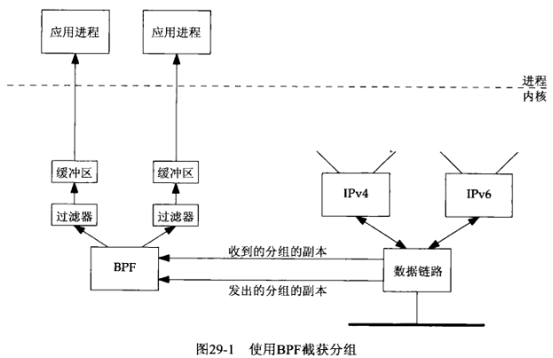
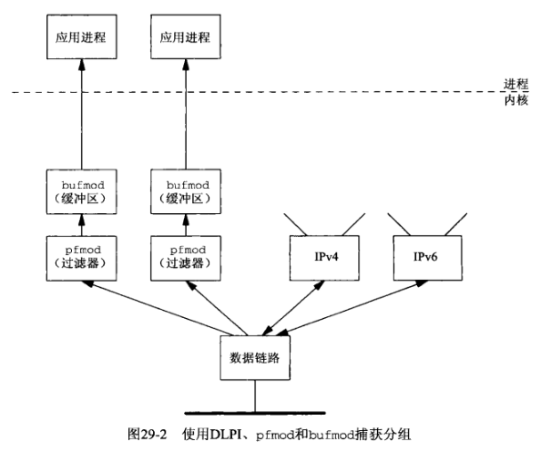
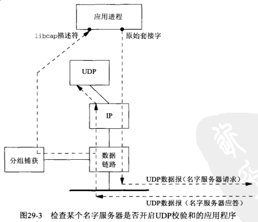
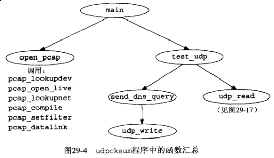
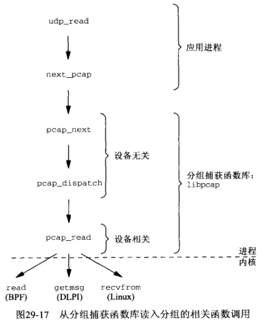

## 第二十九章 数据链路访问

#### 29.1 概述

目前大多数操作系统都为应用程序提供访问数据链路层的强大功能。这种功能可以提供如下能力：

- 能够监视由数据链路层接收的分组，使得诸如 *tcmpdump* 之类的程序能够在普通计算机系统上运行，而无需使用专门的硬件设备来监视分组。如果结合使用网络接口进入混杂模式（promiscuous mode）的能力，那么应用程序甚至能够监视本地电缆上流通的所有分组，而不仅仅是以程序运行所在主机为目的地的分组。

- 能够作为普通应用进程而不是内核的一部分运行某些程序。

Unix上访问数据链路层的3个常用方法是BSD的分组过滤器BPF, SVR4的数据链路提供接口DLPI和Linux的 *SOCK_PACKET* 接口。

#### 29.2 BPF：BSD分组过滤器

*BPF的实现在TCPv2地31章中讲解。*



BPF使用以下3个技术来降低开销

- BPF过滤在内核中进行，依次把从BPF到应用进程的数据复制量减少到最小。这种从内核空间到用户空间的复制开销高昂。要是每个分组都如此复制，BPF可能就跟不上快速的数据链路。

- 由BPF传递到应用进程的只是每个分组的一段定长部分。

- BPF为每个应用进程分别缓冲数据，只有当缓冲区已满或读超时（read timeout）期满时该缓冲区中的数据才复制到应用进程。

虽然上图中只画出单个缓冲区，BPF其实为每个应用进程维护两个缓冲区，在其中一个缓冲区中的数据被复制到应用进程期间，另一个缓冲区被用于装填数据。这就是标准的 *双缓冲* (double buffering) 技术。

#### 29.3 DLPI：数据链路提供者接口



DLPI有两种打开方式：

- 一种是用进程先打开一个统一的伪设备，再使用DLPI的 *DL_ATTACH_REQ* 往其上附接某个数据链路（即网络接口）

- 另一种方式是应用进程直接打开某个网络接口设备（例如*le0*）

无论哪种方式打开DLPI，通常尚需为提高操作效率而压入2个流模块（STREAMS module）：在内核中进行分组过滤的 *pfmod* 模块和为应用进程缓冲数据的 *bufmod* 模块。

#### 29.4 Linux: *SOCK_PACKET* 和 *PF_PACKET*

从数据链路接收所有帧应如下创建套接字：

```c
fd = socket(PF_PACKET, SOCK_RAW, htons(ETH_P_ALL));     // 较新方法

fd = socket(AF_INET, SOCK_PACKET, htons(ETH_P_ALL));    // 较旧方法
```

由数据链路层接收的任何协议的以太网帧将返回到这些套接字。

如果只想捕获IPv4帧，那就用如下创建套接字：

```c
fd = socket(PF_PACKET, SOCK_RAW, htons(ETH_P_IP));      // 较新方法

fd = socket(AF_INET, SOCK_PACKET, htons(ETH_P_IP));     // 较旧方法
```

Linux的数据链路访问方法相比BPF和DLPI存在如下差别：

- Linux方法不提供内核缓冲，而且只有较新的方法才能提供内核过滤（通过设置 *SO_ATTACH_FILTER* 套接字选项安装）。

- Linux 较旧的方法不提供针对设备的过滤。（较新的方法可以通过调用 *bind* 与某个设备关联。）如果调用 *socket* 时指定了 *ETH_P_IP*，那么来自任何设备（例如以太网，PPP链路，SLIP链路和回馈设备）的所有IPv4分组都被传递到所创建的套接字。*recvfrom* 将返回一个通用套接字地址结构，其中的 *sa_data* 成员含有设备名字（例如eth0）。应用进程必须自行丢弃来自任何非所关注设备的数据。这里的问题仍然是可能会有太多的数据返回到应用进程，从而妨碍对于高速网络的监视。

#### 29.5 *libpcap*：分组捕获函数库

*libpcap* 是访问操作系统所提供的分组捕获机制的分组捕获函数库，它是与实现无关的。目前它只支持分组的读入。

#### 29.6 *libnet*：分组构造与输出函数库

*libnet* 函数库提供构造任意协议的分组并将其输出到网络中的接口。

#### 29.7 检查UDP的校验和字段



UDP模块也接收到这个来自名字服务器的应答，并将响应以一个ICMP端口不可达错误，因为UDP模块根本不知道我们为自行构造的UDP数据报选用的源端口号。名字服务器将忽略这个ICMP错误。我们同时指出，使用TCP编写一个如此形式的测试程序比较困难，因为尽管我们很容易把自行构造的TCP分节写出到网络，但是对于我们如此产生的TCP分节的任何应答却通常导致我们的TCP模块响应以一个 *RST*，结果是连三路握手都完成不了。

绕过这个难题的方法之一是以属于所连接子网的某个当前未被使用的IP地址为源地址发送TCP分节，并且事先在发送主机上为这个新IP地址增加一个ARP表项，使得发送主机能够回答对于这个新地址的ARP请求，但是不能把这个新IP地址作为别名地址配置在发送主机上。这将导致发送主机上的IP协议栈丢弃所接收的目的地址为这个新地址的分组，前提是发送主机并不用作路由器。





**NOTE: FreeBSD <netinet/ip_var.h> <netinet/udp_var.h>**

1) 例子

**TODO**

2) *libnet* 输出函数

**TODO**

#### 29.8 小结

原始套接字使得我们有能力读写内核不理解的IP数据报，数据链路层访问则把这个能力进一步扩展成读与写任何类型的数据链路帧，而不仅仅是IP数据报。

不同操作系统有不同的数据链路层访问方法。不过如果使用公开可得的分组捕获函数库 *libpcap*，我们就可以忽略所有这些区别，依然编写出可移植的代码。

在不同系统上编写原始数据报可能各不相同。公开可得的 *libnet* 函数库隐藏了这些差异，所提供的输出接口既可以通过原始套接字访问，也可以在数据链路上直接访问。
