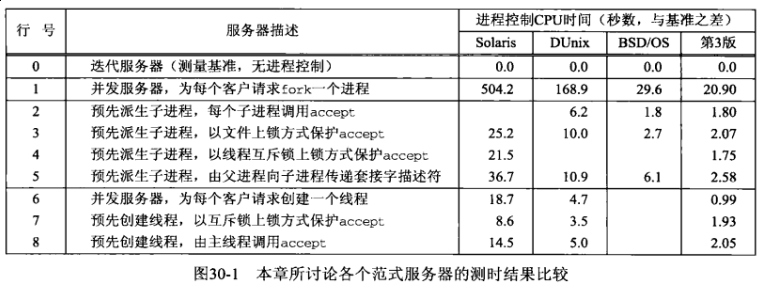
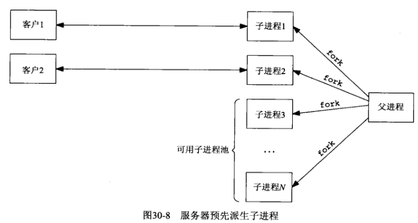
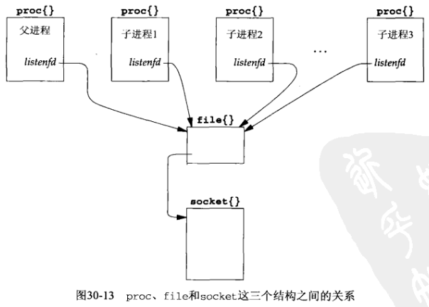
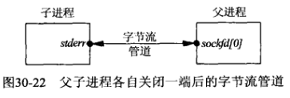
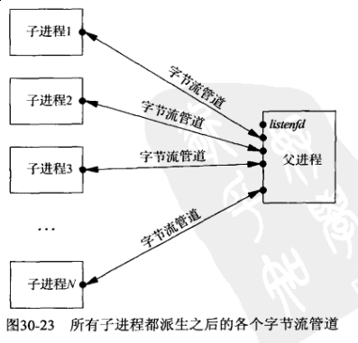

## 第三十章 客户/服务器程序设计范式

#### 30.1 概述

- 迭代服务器（iterative server）程序：第一章，这种类型的适用情形极为有限，这样的服务器在完成对当前客户的服务之前无法处理已等待服务的新客户。

- 并发服务器（concurrent server）程序：第五章，为每个客户调用 *fork* 派生一个子进程。传统上大多数Unix服务器程序属于这种类型。

- 第六章，使用 *select* 处理任意多个客户的单个进程。

- 第二十六章，并发服务器为每个客户创建一个线程，以取代派生一个进程。

本章探究并发服务器设计的另两类变体：

- 预先派生子进程（preforking）是让服务器在启动阶段调用 *fork* 创建一个子进程池。每个客户请求由当前可用子进程池中的某个（闲置）子进程处理。

- 预先创建线程（prethreading）是让服务器在启动阶段创建一个线程池，每个客户由当前可用线程池中的某个（闲置）线程处理。



#### 30.2 TCP客户程序设计范式

NOTE: 请看原书对之前内容的分析

#### 30.3 TCP测试用客户程序

```c
#include "../lib/error.h"
#include <errno.h>
#include <stdio.h>
#include <stdlib.h>
#include <string.h>
#include <sys/socket.h>
#include <sys/types.h>
#include <sys/wait.h>
#include <unistd.h>

#define MAXN    16384  // max # bytes request from server
#define MAXLINE 4096   // max text line length

// ../Chapter03/readn.c
ssize_t readn(int fd, void *vptr, size_t n);
// ../Chapter11/tcp_connect.c
int tcp_connect(const char *host, const char *serv);

int main(int argc, char **argv)
{
    int     i, j, fd, nchildren, nloops, nbytes;
    pid_t   pid;
    ssize_t n;
    char    request[MAXLINE], reply[MAXN];

    if (argc != 6) {
        err_quit("usage: client <hostname or IPaddr> <port> <#children> "
                 "<#loops/child> <#bytes/request>");
    }

    nchildren = atoi(argv[3]);
    nloops = atoi(argv[4]);
    nbytes = atoi(argv[5]);
    snprintf(request, sizeof(request), "%d\n", nbytes); // new line at end

    for (i = 0; i < nchildren; i++) {
        if ((pid = fork()) == 0) {  // child
            for (j = 0; j < nloops; j++) {
                fd = tcp_connect(argv[1], argv[2]);
                write(fd, request, strlen(request));
                if ((n = readn(fd, reply, nbytes)) != nbytes) {
                    err_quit("server returned %d bytes", n);
                }
                close(fd);  // TIME_WAIT on client, not server
            }
            printf("child %d done\n", i);
            exit(0);
        }
        // parent loops around to fork() again
    }
    while (wait(NULL) > 0) { } // now parent waits for all children
    if (errno != ECHILD) {
        err_sys("wait error");
    }
    exit(0);
}
```

```sh
$ gcc client.c ../lib/error.c ../Chapter03/readn.c ../Chapter11/tcp_connect.c -o client
```

#### 30.4 TCP迭代服务器程序, [serv00](serv00.c)

```sh
$ ./client 127.0.0.1 8888 1 5000 4000
child 0 done

$ ./serv00 8888
^C
user time = 0.003737, sys time = 0.040274
```

#### 30.5 TCP并发服务器程序，每个客户一个子进程, [serv01](serv01.c)

```sh
$ ./client 127.0.0.1 8888 1 5000 4000
child 0 done

$ ./serv01 8888
^C
user time = 0.652356, sys time = 0.586551
```

#### 30.6 TCP预先派生子进程服务器程序，accept无上锁保护, [serv02](serv02.c)



优点：无须引入父进程执行 *fork* 的开销就能处理新到的客户

缺点：父进程必须在服务器启动阶段猜测需要预先派生多少个子进程

通过增加一些代码，服务器总能应对客户负载的变动。父进程必须做的就是持续监视可用（即闲置）子进程数，一旦该值降低于某个阈值就派生额外的子进程。同样，一旦该值超过另一个阈值就终止一些过剩的子进程，因为在本章后面我们会发现过多的可用子进程也会导致性能退化。

```sh
$ ./client 127.0.0.1 8888 1 5000 4000
child 0 done

$ ./serv02 8888 4
child 11526 starting
child 11527 starting
child 11528 starting
child 11529 starting
^C
user time = 0.022325, sys time = 0.1481
```

1) 4.4BSD上的实现

父进程在派生任何子进程之前创建监听套接字，而每次调用 *fork* 时，所有描述符也被复制。



描述符只是本进程引用 *file* 结构的 *proc* 结构中的一个数组中某个元素的下标而已。

服务器进程在启动阶段派生N个子进程，它们各自调用 *accept* 并因而均被内核投入睡眠。当第一个客户连接到达时，所有N个子进程均被唤醒。这是因为所有N个子进程所用的监听描述符指向同一个 *socket* 结构，致使它们在同一个等待通道（wait channel）即这个 *socket* 结构的 *so_timeo* 成员上进入睡眠。尽管所有N个子进程均被唤醒，其中只有最先运行的子进程获得那个客户连接，其余N-1个子进程继续恢复睡眠。

**这就是有时候称为惊群（thundering herd）的问题，因为尽管只有一个子进程将获得连接，所有N个子进程却都被唤醒了。**尽管如此，这段代码仍然起作用，只是每当仅有一个连接准备好被接受时却唤醒太多进程的做法会导致性能受损。

2) 子进程过多的影响

3) 连接在子进程中的分布, [serv02m](serv02m.c)

4) select 冲突

**NOTE: 请看原书详解**

#### 30.7 TCP预先派生子进程服务器程序，accept使用文件上锁保护, [serv03.c](serv03.c)

```c
#include "../lib/error.h"
#include <errno.h>
#include <fcntl.h>
#include <stdlib.h>
#include <string.h>
#include <unistd.h>

static struct flock lock_it, unlock_it;
static int lock_fd = -1;

// fcntl() will fail if my_lock_init() not called
void my_lock_init(char *pathname)
{
    char    lock_file[1024];

    // must copy caller's string, in case it's a constant
    strncpy(lock_file, pathname, sizeof(lock_file));
    lock_fd = mkstemp(lock_file);

    unlink(lock_file);  // but lock_fd remains open

    lock_it.l_type = F_WRLCK;
    lock_it.l_whence = SEEK_SET;
    lock_it.l_start = 0;
    lock_it.l_len = 0;

    unlock_it.l_type = F_UNLCK;
    unlock_it.l_whence = SEEK_SET;
    unlock_it.l_start = 0;
    unlock_it.l_len = 0;
}

void my_lock_wait()
{
    int rc;

    while ((rc = fcntl(lock_fd, F_SETLKW, &lock_it)) < 0) {
        if (errno == EINTR) {
            continue;
        }
        err_sys("fcntl error for my_lock_wait");
    }
}

void my_lock_release()
{
    if (fcntl(lock_fd, F_SETLKW, &unlock_it) < 0) {
        err_sys("fcntl error for my_lock_release");
    }
}
```

```c
// serv03.c
+   my_lock_init("/tmp/lock.XXXXXX");   // one lock file for all children
    for (i = 0; i < nchildren; i++) {
        pids[i] = child_make(i, listenfd, addrlen); // parent returns
    }

// clild03.c
    for ( ; ; ) {
        clilen = addrlen;
+       my_lock_wait();
        connfd = accept(listenfd, cliaddr, &clilen);
+       my_lock_release();

        web_child(connfd);  // process the request
        close(connfd);
    }
```

保证每次只有一个子进程阻塞在 *accept* 调用中。

1) 子进程过多的影响

2) 连接在子进程中的分布

同理，可新增一个 *serv03m.c*, *child03m.c*，并获取全体客户连接在可用子进程池上的分布。

#### 30.8 TCP预先派生子进程服务器，accept使用线程上锁保护, [lock\_pthread.c](lock_pthread.c)

上一节使用的POSIX文件上锁方法可移植到所有POSIX兼容系统，不过它涉及文件系统操作，可能比较耗时。本节我们改用线程上锁保护 *accept*，因为这种方法不仅适用于同一进程内各线程之间的上锁，而且适用于不同进程之间的上锁。

在不同进程之间使用线程上锁的要求：

- 互斥锁变量必须存放在由所有进程共享的内存区中

- 必须告知线程函数库这是在不同进程之间共享的互斥锁

同样要求线程库支持 *PTHREAD_PROCESS_SHARED* 属性

```sh
$ gcc client.c ../lib/error.c ../Chapter03/readn.c ../Chapter11/tcp_connect.c -o client
$ ./client 127.0.0.1 8888 1 5000 4000
child 0 done

$ gcc serv03.c ../lib/error.c ../Chapter03/writen.c ../Chapter11/tcp_listen.c ../Chapter26/readline.c pr_cpu_time.c web_child.c child03.c lock_pthread.c -lpthread -o serv03
$ ./serv03 8888 16
child 10292 starting
...
child 10294 starting
^C
user time = 0.013063, sys time = 0.114324

```

#### 30.9 TCP预先派生子进程服务器程序，传递描述符, [serv05.c](serv05.c)

对预先派生子进程服务器的最后一个修改版本是只让父进程调用 *accept*，然后把所接受的已连接套接字“传递”给某个子进程。这么做绕过了为所有子进程的 *accept* 调用提供上锁保护的可能需求，不过需要从父进程到子进程的某种形式的描述符传递。这种技术会使代码多少有点复杂，因为父进程必须跟踪子进程的忙闲状态，以便给空闲子进程传递新的套接字。

描述符传递式预先派生子进程服务器程序的 *child_make* 函数

```c
#include "../lib/error.h"
#include "child.h"
#include <sys/socket.h>
#include <unistd.h>

// 描述符传递式预先派生子进程服务器程序的child_make函数
pid_t child_make(int i, int listenfd, int addrlen)
{
    int     sockfd[2];
    pid_t   pid;
    void    child_main(int, int, int);

    if (socketpair(AF_LOCAL, SOCK_STREAM, 0, sockfd) < 0) {
        err_sys("socketpair error");
    }

    if ((pid = fork()) > 0) {
        close(sockfd[1]);
        cptr[i].child_pid = pid;
        cptr[i].child_pipefd = sockfd[0];
        cptr[i].child_status = 0;
        return(pid);    // parent
    }
    dup2(sockfd[1], STDERR_FILENO); // child's stream pipe to parent
    close(sockfd[0]);
    close(sockfd[1]);
    close(listenfd);    // child does not need this open
    child_main(i, listenfd, addrlen);   // never returns
}
```





```c
$ gcc client.c ../lib/error.c ../Chapter03/readn.c ../Chapter11/tcp_connect.c -o client
$ ./client 127.0.0.1 8888 1 5000 4000
child 0 done

$ gcc serv05.c ../lib/error.c ../Chapter03/writen.c ../Chapter11/tcp_listen.c ../Chapter15/read_fd.c ../Chapter15/write_fd.c ../Chapter26/readline.c pr_cpu_time.c web_child.c child05.c -lpthread -o serv05
$ ./serv05 8888 16
child 22541 starting
...
child 22553 starting
^C
user time = 0.01311, sys time = 0.150998
child 0, 2500 connections
child 1, 2499 connections
child 2, 1 connections
child 3, 0 connections
child 4, 0 connections
child 5, 0 connections
child 6, 0 connections
child 7, 0 connections
child 8, 0 connections
child 9, 0 connections
child 10, 0 connections
child 11, 0 connections
child 12, 0 connections
child 13, 0 connections
child 14, 0 connections
child 15, 0 connections
```

父进程通过字节流管道把描述符传递到各个子进程，并且各个子进程通过字节流管道写回单个字节，无论是比使用共享内存区中的互斥锁，还是与使用文件锁实施的上锁和解锁相比都更费时。

#### 30.10 TCP并发服务器程序，每个客户一个线程, [serv06.c](serv06.c)

```c
#include "../lib/error.h"
#include <errno.h>
#include <pthread.h>
#include <signal.h>
#include <stdlib.h>
#include <sys/socket.h>
#include <sys/types.h>
#include <unistd.h>

// ../Chapter11/tcp_listen.c
int tcp_listen(const char *host, const char *serv, socklen_t *addrlenp);

int main(int argc, char **argv)
{
    int              listenfd, connfd, e;
    void             sig_int(int);
    void            *doit(void *);
    pthread_t        tid;
    socklen_t        clilen, addrlen;
    struct sockaddr *cliaddr;

    if (argc == 2) {
        listenfd = tcp_listen(NULL, argv[1], &addrlen);
    } else if (argc == 3) {
        listenfd = tcp_listen(argv[1], argv[2], &addrlen);
    } else {
        err_quit("usage: serv06 [ <host> ] <port#>");
    }
    cliaddr = (struct sockaddr *) malloc(addrlen);

    signal(SIGINT, sig_int);

    for ( ; ; ) {
        clilen = addrlen;
        if ((connfd = accept(listenfd, cliaddr, &clilen)) < 0) {
            err_sys("accept error");
        }
        if ((e = pthread_create(&tid, NULL, &doit, (void *) connfd)) != 0) {
            errno = e;
            err_sys("pthread_create error");
        }
    }
}

void *doit(void *arg)
{
    int e;
    void web_child(int);

    if ((e = pthread_detach(pthread_self())) != 0) {
        errno = e;
        err_sys("pthread_detach error");
    }
    web_child((int) arg);
    close((int) arg);
    return(NULL);
}

void sig_int(int signo)
{
    void pr_cpu_time(void);

    pr_cpu_time();
    exit(0);
}
```

```sh
$ gcc client.c ../lib/error.c ../Chapter03/readn.c ../Chapter11/tcp_connect.c -o client
$ ./client 127.0.0.1 8888 1 5000 4000
child 0 done

$ gcc serv06.c ../lib/error.c ../Chapter03/writen.c ../Chapter11/tcp_listen.c ../Chapter26/readline.c pr_cpu_time.c web_child.c -lpthread -o serv06
$ ./serv06 8888
^C
user time = 0.021163, sys time = 0.188873
```

#### 30.11 TCP预先创建线程服务器程序，每个线程各自accept, [serv07.c](serv07.c)

```sh
$ gcc client.c ../lib/error.c ../Chapter03/readn.c ../Chapter11/tcp_connect.c -o client
$ ./client 127.0.0.1 8888 1 5000 4000
child 0 done

$ gcc serv07.c ../lib/error.c ../Chapter03/writen.c ../Chapter11/tcp_listen.c ../Chapter26/readline.c pr_cpu_time.c web_child.c pthread07.c -lpthread -o serv07
$ ./serv07 8888 16
thread 0 starting
thread 2 starting
thread 1 starting
thread 3 starting
thread 4 starting
thread 15 starting
thread 14 starting
thread 7 starting
thread 9 starting
thread 12 starting
thread 8 starting
thread 6 starting
thread 11 starting
thread 10 starting
thread 13 starting
thread 5 starting
^C
user time = 0.007875, sys time = 0.090744
thread 0, 315 connections
thread 1, 314 connections
thread 2, 315 connections
thread 3, 317 connections
thread 4, 312 connections
thread 5, 311 connections
thread 6, 314 connections
thread 7, 315 connections
thread 8, 314 connections
thread 9, 313 connections
thread 10, 310 connections
thread 11, 309 connections
thread 12, 310 connections
thread 13, 310 connections
thread 14, 311 connections
thread 15, 310 connections
```

当前的服务器版本快于为每个客户现场创建一个线程的版本。我们预期如此，毕竟我们只是在服务器启动阶段一次性地创建线程池，而不是每来一个客户现场创建一个线程。

*Thread* 结构中 *thread_count* 计数器值的分布，它们由 *SIGINT* 信号处理函数在服务器终止前显示输出。这个分布均衡性是由线程调度算法带来的，该算法在选择由哪个线程接收互斥锁上表现为按顺序轮询所有线程。

#### 30.12 TCP预先创建线程服务器程序，主线程统一accept, [serv08.c](serv08.c)

```sh
$ gcc client.c ../lib/error.c ../Chapter03/readn.c ../Chapter11/tcp_connect.c -o client
$ ./client 127.0.0.1 8888 1 5000 4000
child 0 done

$ gcc serv08.c ../lib/error.c ../Chapter03/writen.c ../Chapter11/tcp_listen.c ../Chapter26/readline.c pr_cpu_time.c web_child.c pthread08.c -lpthread -o serv08
$ ./serv08 8888 16
thread 0 starting
thread 1 starting
thread 9 starting
thread 15 starting
thread 13 starting
thread 14 starting
thread 6 starting
thread 3 starting
thread 8 starting
thread 11 starting
thread 7 starting
thread 12 starting
thread 10 starting
thread 4 starting
thread 5 starting
thread 2 starting
^C
user time = 0.015277, sys time = 0.108708
thread 0, 313 connections
thread 1, 313 connections
thread 2, 312 connections
thread 3, 313 connections
thread 4, 311 connections
thread 5, 312 connections
thread 6, 313 connections
thread 7, 312 connections
thread 8, 312 connections
thread 9, 313 connections
thread 10, 313 connections
thread 11, 312 connections
thread 12, 312 connections
thread 13, 313 connections
thread 14, 313 connections
thread 15, 313 connections
```

测试时数据表明，这个版本的服务器蛮于上一节中先获取一个互斥锁再调用 *accept* 的版本。原因在于本节的例子同时需要互斥锁和条件变量，而前一节中只需要互斥锁。

#### 30.13 小结

本章中讨论了9个不同的服务器程序设计范式，并针对同一个Web风格的客户程序分别运行了它们，以比较它们花在执行进程控制上的CPU时间：

- 迭代服务器（无进程控制，用作测量基准）

- 并发服务器，每个客户请求 *fork* 一个子进程

- 预先派生子进程，每个子进程无保护地调用 *accept*

- 预先派生子进程，使用文件上锁保护 *accept*

- 预先派生子进程，使用线程互斥锁上锁保护 *accept*

- 预先派生子进程，父进程想子进程传递套接字描述符

- 并发服务器，每个客户请求创建一个线程

- 预先创建线程服务器，使用互斥锁上锁保护 *accept*

- 预先创建线程服务器，由主线程调用 *accept*

经过比较，我们可以得出以下几点总结性意见：

- 当系统负载较轻时，每来一个客户请求现场派生一个子进程为之服务的传统并发服务器程序模型就足够了

- 相比传统的每个客户 *fork* 一次设计范式，预先创建一个子进程池或一个线程池的设计范式能够把进程控制CPU时间降低10倍或以上。

- 某些实现允许多个子进程或线程阻塞在同一个 *accept* 调用中，另一些实现却要求包绕 *accept* 调用安置某种类型的锁加以保护

- 让所有子进程或线程自行调用 *accept* 通常比让父进程或主线程独自调用 *accept* 并把描述符传递给子进程或线程来得简单而快速

- 由于潜在 *select* 冲突的原因，让所有子进程或线程阻塞在同一个 *accept* 调用中比让它们阻塞在同一个 *select* 调用中更可取

- 使用线程通常远快于使用进程
