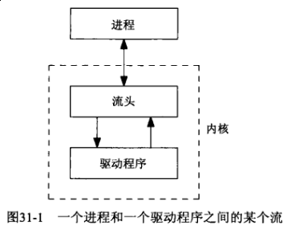
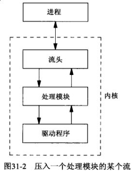
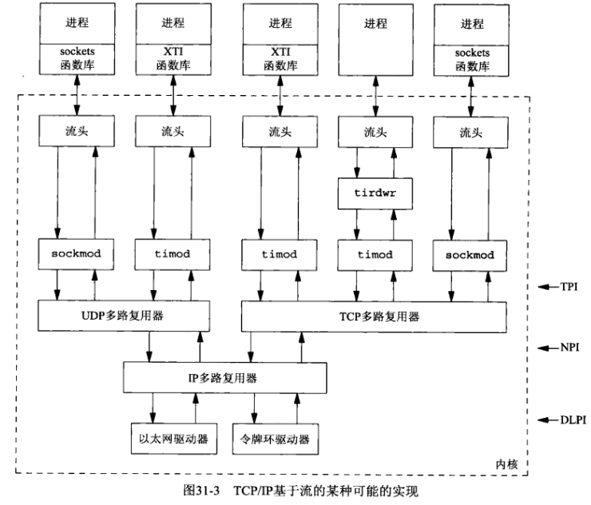
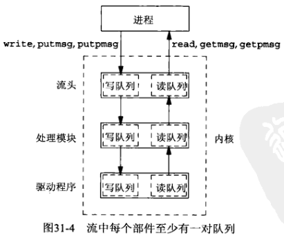
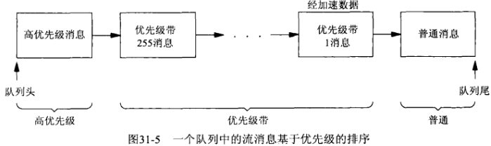
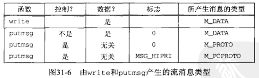

## 第三十一章 流

#### 31.1 概述

传输提供者接口（Transport Provider Interface, TPI）

#### 31.2 概貌

流在进程和驱动程序之间提供全双工的连接。



进程可以在流头和驱动程序之间动态增加或删除中间处理模块。这些模块对顺着一个流上行或下行的消息施行某种类型的过滤。



多路复选器是一种特殊类型的伪设备驱动程序，它从多个源接受数据。举例来说，可在SVR4上找到TCP/IP协议族基于流的某个实现



- 在创建一个套接字时，套接字函数库把模块 *sockmod* 推入流中。向应用进程提供套接字API的正是套接字函数库和 *sockmod* 流模块两者的组合

- 在创建一个XTI端点时，XTI函数库吧模块 *timod* 推入流中。向应用程序提供XTI API的正是XTI函数库和 *timod* 流模块两者的组合

- 为了针对XTI端点使用 *read* 和 *write* 访问网络数据，通常必须把模块 *tirdwr* 推入流中

- 所标的三个服务接口定义顺着流上行和下行交换的网络消息的格式

一个流中的每个部件 - 流头，所有处理模块和驱动程序 - 包含至少一对队列：一个写队列和一个读队列



**消息类型**

流消息可划分为高优先级，优先级带和普通三类。



虽然流系统支持256个不同的优先级带，网络协议往往只用代表经加速数据的带1和代表普通数据的带0



#### 31.3 getmsg 和 putmsg 函数

沿着流上行和下行的数据由消息构成，而且每个消息含有控制或数据亦或两者都有。如果在流上使用 *read* 和 *write*，那么所传送的仅仅是数据。*getmsg* 和 *putmsg* 能够读写数据和控制两部分信息。

```c
#include <stropts.h>

int getmsg(int fd, struct strbuf *ctlptr, struct strbuf *dataptr, int *flagsp);
int putmsg(int fd, const struct strbuf *ctlbuf, const struct strbuf *databuf, int flags);

struct strbuf {
    int   maxlen;   // maximum size of buf
    int   len;      // actual amount of data in buf
    char *buf;      // data
};
```

#### 31.4 getpmsg 和 putpmsg 函数

```c
#include <stropts.h>

int getpmsg(int fd, struct strbuf *ctlptr, struct strbuf *dtaptr, int *bandp, int *flagsp);
int putpmsg(int fd, const struct strbuf *ctlptr, const struct strbuf *databuf, int band, int flags);
```

#### 31.5 ioctl 函数

```c
#include <stropts.h>

int ioctl(int fd, int request, ... /* void *arg */ );
```

#### 31.6 TPI: 传输提供者接口

TPI是一个基于消息的接口。它定义了在应用进程和传输层之间沿着流上行和下行交换的消息，包括消息的格式和每个消息执行的操作。在许多实例中，应用进程向提供者发出一个请求（譬如说“捆绑这个本地地址”），提供者则发回一个响应（“成功”或“出错”）。一些事件在提供者异步地发生（对某个服务器的连接请求的到达），它们导致沿着流向上发送的消息或信号。

**我们在本节改用TPI套接字重新编写我们的简单时间获取客户程序**

**TODO: 需 Solaris 系统**

#### 31.7 小结

XTI一般使用流来实现。为访问流子系统而提供的4个新函数是 *getmsg*, *getpmsg*, *putmsg*, *putpmsg*，已有的 *ioctl* 函数也被流子系统频繁使用。

**TPI是从上层进入传输层的SVR4流接口。** XTI和套接字均使用TPI。
